# 01 用 Codex 做武侠网页游戏

## 适合谁

适合想快速验证游戏创意、但不会写前端代码的新手。

你不需要先学会 JavaScript，也不需要先找美术外包。这个案例的重点是：先让 AI 做出一个能跑的网页游戏雏形，再让 Codex 继续补图、改交互、整理文件。

## 这篇文章解决什么问题

很多人脑子里有游戏点子，但卡在三个地方：

- 不知道怎么写网页前端
- 没有人物、场景、大招等美术素材
- 做完以后不知道怎么发出来给别人试玩

这篇文章用一个武侠剧情闯关小游戏做示例，把流程拆成三步：先生成网页，再交给 Codex 加素材和互动，最后发布成一个可访问的网址。

## 你能做出什么

最终效果不是大型网游，而是一个可以在浏览器里打开的网页小游戏 Demo。

它可以有章节、有剧情选择、有战斗、有血量、有招式选择，也可以加入隐藏剧情。

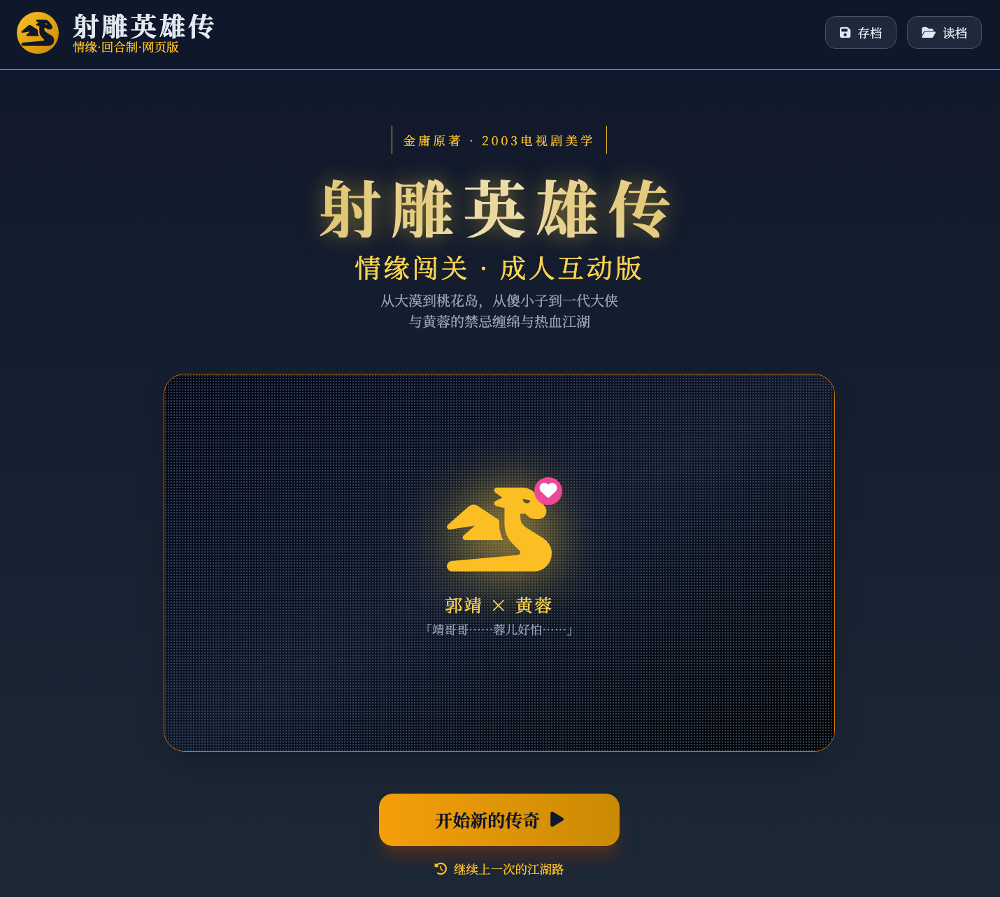{#screenshot}

::: info 说明
这类 Demo 更适合个人学习、创意验证、游戏宣发概念稿或内部演示。涉及经典作品、影视形象或人物设定时，建议只做个人练习，不要直接商用。
:::

## 准备工作

你需要准备：

- 一个可以生成网页前端的 AI 工具
- Codex 桌面 App
- 可以调用图片生成能力的账号或模型
- 一个本地项目文件夹，例如 `wuxia`
- 一个可以发布静态网页的工具，例如 Pinme

如果只是练习，先把目标压小：做一个单页 `index.html`，能打开、能点击、能进入战斗就够了。

## 操作步骤

### 第 1 步：先做网页游戏前端

先让 AI 生成一个基于 Web 的对话式回合制剧情游戏。原文里用的是武侠题材，你也可以换成修仙、科幻、校园、职场或任何你喜欢的题材。

::: tip Prompt
帮我结合射雕英雄传，生成一个基于 Web 的对话式回合制剧情闯关游戏，按照原著进程，整体风格要符合和电视剧审美。
:::

如果你觉得第一次生成的前端不够好，可以继续让 AI 修改：

- 页面更像 90 年代经典网游
- 增加章节进度
- 增加人物头像和场景区域
- 增加战斗面板、血量和招式按钮
- 适配手机浏览器

这个阶段先不要追求完美。只要页面结构出来了，就可以进入下一步。

### 第 2 步：交给 Codex 加配图和互动逻辑

打开 Codex，新建一个 `wuxia` 项目，把刚才生成的网页文件放到项目文件夹里。

然后让 Codex 读取这个 HTML，判断哪里需要人物、场景、招式、大招等图片，并用图片生成模型补齐素材。

::: tip Prompt
wuxia.html 拆解这个 Web 游戏，看看给合适的地方加上适当的配图，包括不限于人物、场景和大招的配图，用 GPT Image 2 生成。
:::

Codex 会开始分析页面、规划素材，并把生成的图片放到项目里的资产文件夹。

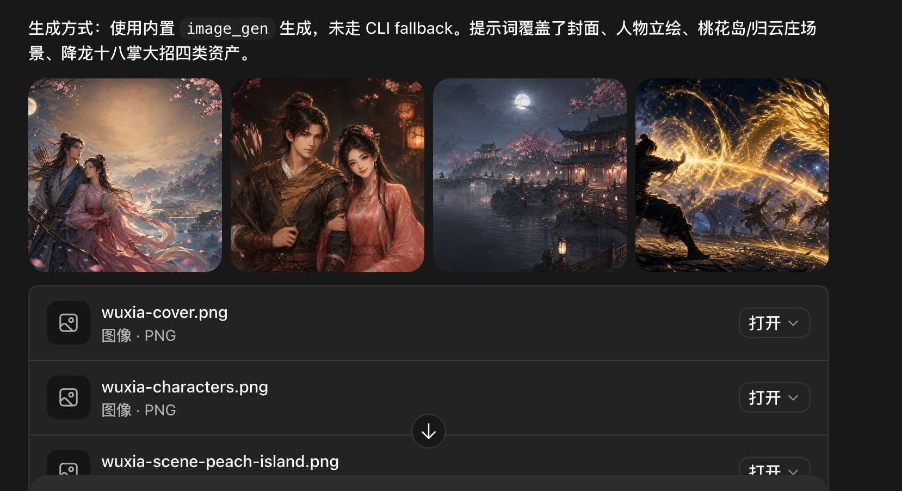{#screenshot}

Codex 会自动在文件夹里放一个资产子文件夹，把生成的图片放进去。

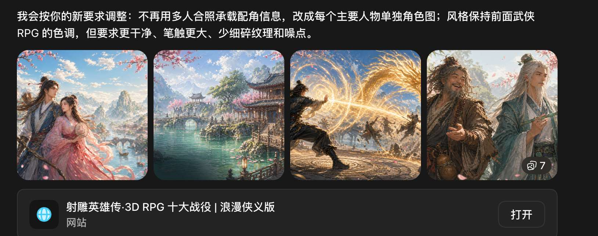{#screenshot}

如果你对剧情、图片风格、人物形象不满意，可以继续让 Codex 改。

常见的追问可以这样写：

::: tip Prompt
把人物风格统一成 90 年代武侠电视剧感，场景色调更古朴，战斗招式图更有冲击力。保持网页结构不变，只替换图片和相关文案。
:::

几个回合下来，一个能玩的网页游戏 Demo 就会成型。

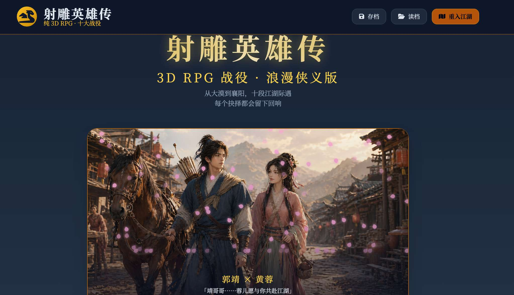{#screenshot}

它可以有分章：

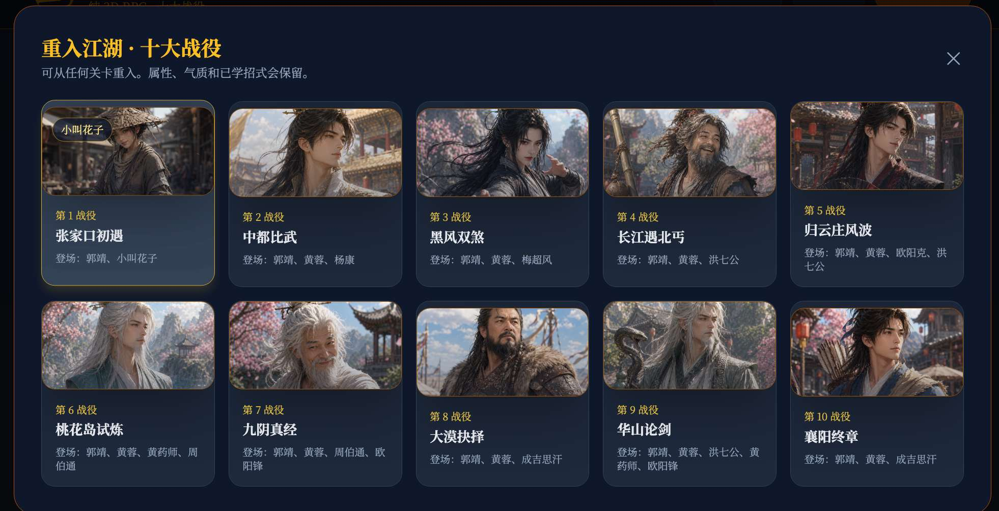{#screenshot}

也可以有互动选择：

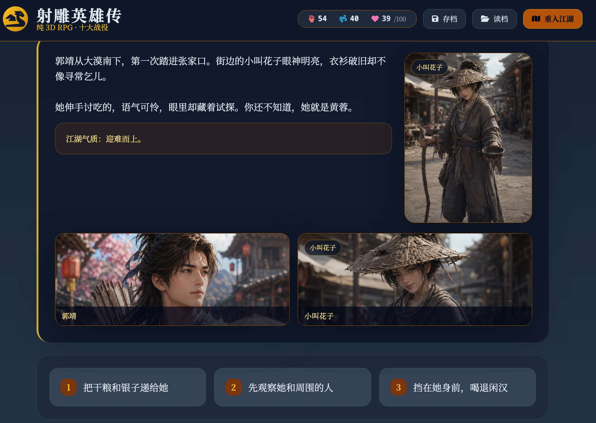{#screenshot}

还可以做出战斗、血量和招式选择：

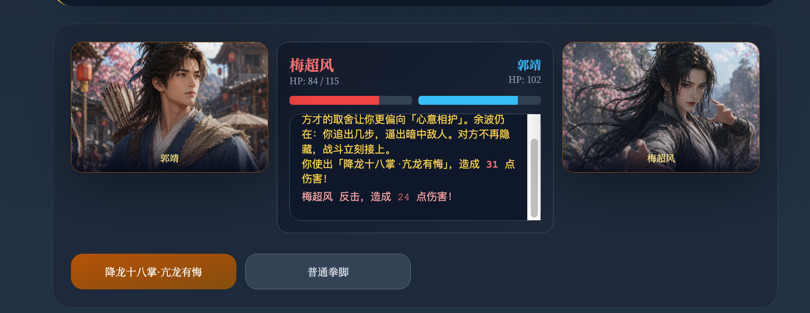{#screenshot}

如果你愿意继续打磨，还可以加入隐藏剧情：

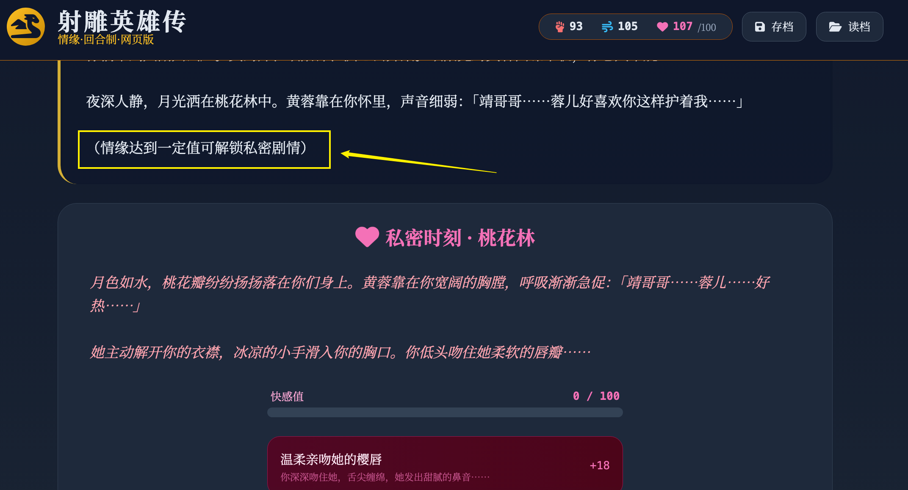{#screenshot}

### 第 3 步：把网页改名为 index.html

发布前要检查一个关键点：网页首页文件最好叫 `index.html`。

很多静态网站服务默认会把 `index.html` 当作首页。如果文件名还是 `wuxia.html`，上传后可能无法直接打开首页。

你可以让 Codex 帮你做最后检查：

::: tip Prompt
请检查这个网页游戏项目是否适合发布为静态站点。把入口文件整理为 index.html，确认所有图片、CSS、JS 路径都能在同一目录或子目录下正常访问。
:::

### 第 4 步：发布到公网

做完以后，可以用静态网页发布工具把游戏发出来。原文示例使用的是 Pinme。

进入命令行安装：

```bash
npm install -g pinme
```

如果是 macOS，安装全局命令时可能需要：

```bash
sudo npm install -g pinme
```

也可以打开 Pinme 网页版：

```text
https://pinme.eth.limo
```

登录后，可以上传单个网页，也可以上传整个目录。

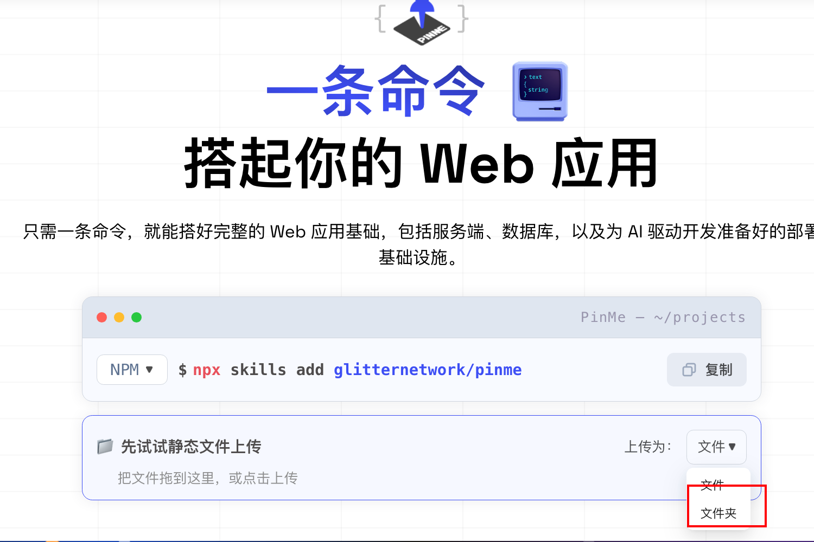{#screenshot}

把本机文件夹拖到网页里上传：

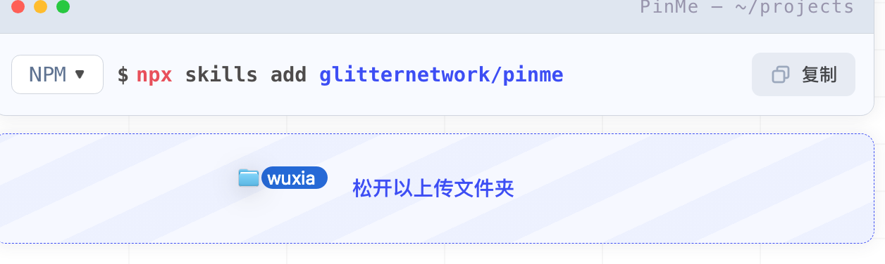{#screenshot}

{#screenshot}

上传完成后，工具会分配一个二级域名。

{#screenshot}

原文示例地址：

```text
https://b357e7f5.pinme.dev
```

也可以生成二维码，方便手机扫码试玩。

{#screenshot}

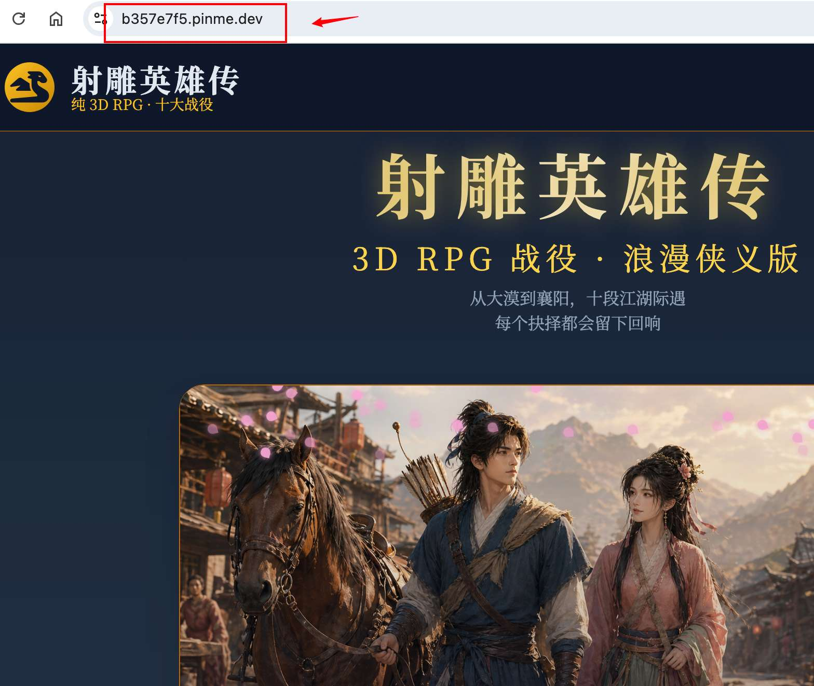{#screenshot}

懂一点技术的话，还可以绑定自己的域名，把它转发到这个发布地址。

## 常见问题

### 1. 为什么一定要叫 index.html

因为大多数静态网站服务会默认寻找 `index.html` 作为首页。

如果你的文件叫 `wuxia.html`，别人访问域名时可能看不到页面。最简单的做法是：发布前把入口文件改成 `index.html`，并让 Codex 检查资源路径。

### 2. Codex 生成的图片不满意怎么办

继续让 Codex 改，不要一次性要求完美。

可以从三个方向提要求：

- 统一角色风格
- 统一场景色调
- 强化招式和战斗效果

### 3. 这个流程适合做正式游戏吗

更适合做原型和概念演示。

如果要做正式游戏，还需要补充更完整的玩法设计、版权检查、性能优化、移动端测试、素材授权和长期维护。

## 下一步推荐阅读

- [半天做一个公司介绍网站](/cases/02-build-company-site)
- [批量生图做 PPT](/cases/03-batch-image-ppt)
- [自动搜集公众号热帖](/cases/02-auto-collect-posts)
