#  用 Codex 桌面 App 写一个 贪吃蛇

目标是在 Codex 桌面 App 中完成一次完整闭环：

```text
写需求 → 让 Codex 修改 → 本地测试 → 继续迭代
```

这个案例用贪吃蛇游戏做示例。

## 准备工作

1. 在电脑上创建项目目录，例如 `snake_game`
2. 登录 Codex 桌面 App
3. 在设置中选择合适的模型、速度、推理强度和权限

原文示例建议：

- 模型：界面中可用的高能力模型
- 速度：标准
- 推理：中
- 权限：自动审查

如果是大项目，也可以选择“计划”模式。这个模式下，AI 只说方案，不直接动手改文件。

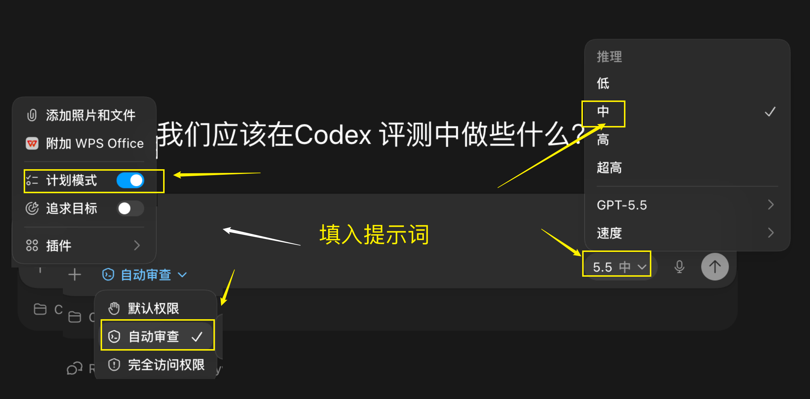{#screenshot}

模型越大，通常效果越好，但速度更慢，也更消耗额度。按自己的任务大小选择即可。

## 操作步骤

### 第 1 步：新建 Codex 项目

进入 Codex，点击新建项目。

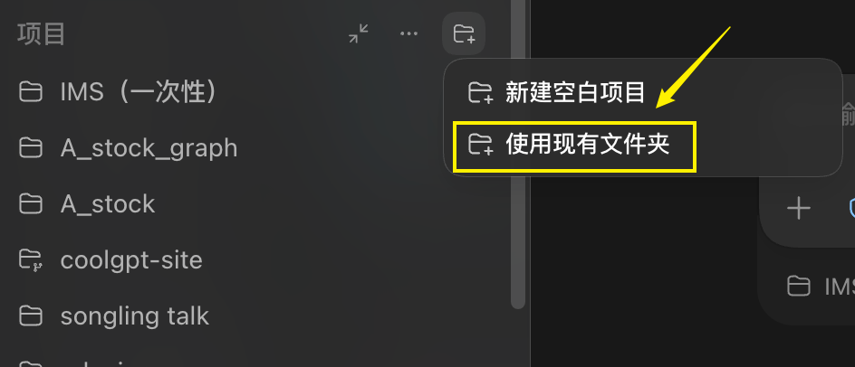{#screenshot}

选中刚才创建的 `snake_game` 文件夹。

### 第 2 步：输入第一条需求

在 Codex 对话窗口中输入：

::: tip Prompt
写一个简单贪吃蛇游戏，方向键控制，吃食物变长，撞墙或碰自己游戏结束，显示得分。
:::

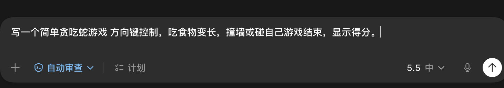{#screenshot}

因为权限设置比较谨慎，Codex 会先写一个实施计划，然后询问是否实施。

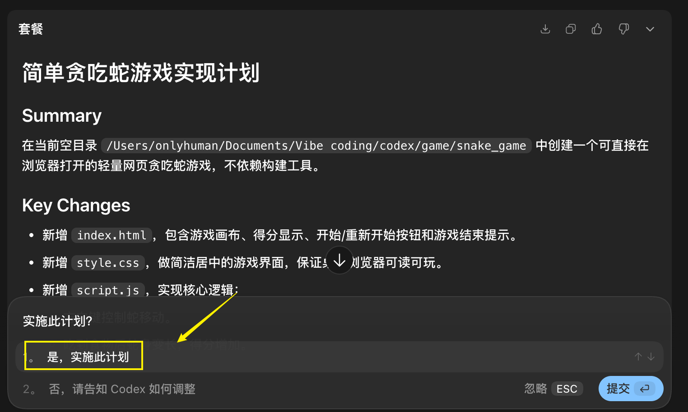{#screenshot}

点击实施后，Codex 会继续写代码。

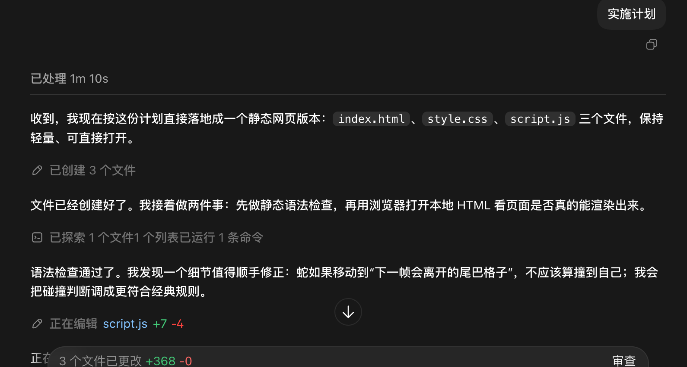{#screenshot}

写完后，界面会显示本次修改：

- 绿色表示新增行数
- 红色表示删除行数

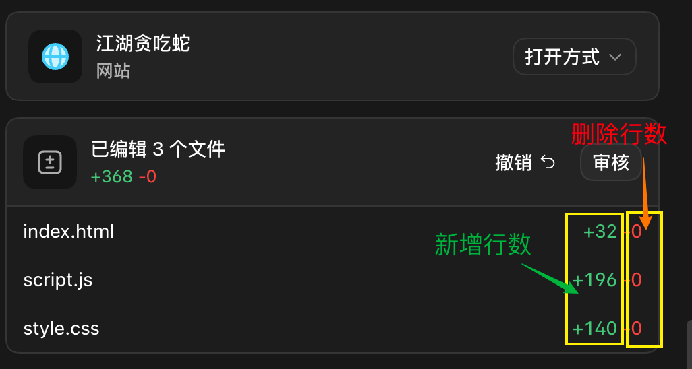{#screenshot}

### 第 3 步：运行和测试

打开 Codex 生成的游戏入口。

如果 Codex 生成的是网页预览，右侧会出现 Codex 浏览器。

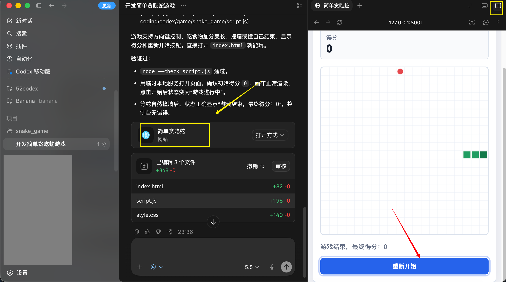{#screenshot}

点击“重新开始”即可试玩。

测试时重点看三件事：

- 方向键能不能控制
- 吃到食物后蛇会不会变长
- 撞墙或碰到自己后是否结束

### 第 4 步：继续迭代优化

发现问题后，继续在 Codex 对话中输入优化指令。

例如：

::: tip Prompt
给一些武侠元素。
:::

Codex 会把游戏改成“江湖贪吃蛇”这类风格。

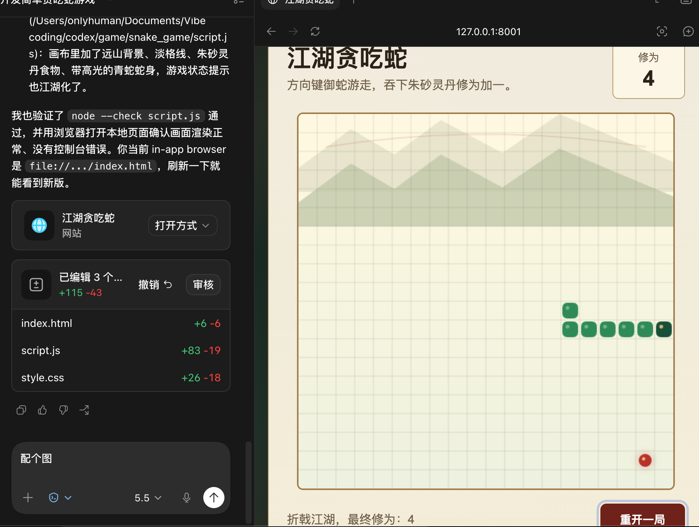{#screenshot}

如果感觉画面少一张图，可以点击右上角的注释按钮，选中需要加图的位置。

输入：

::: tip Prompt
配一张蟒蛇。
:::

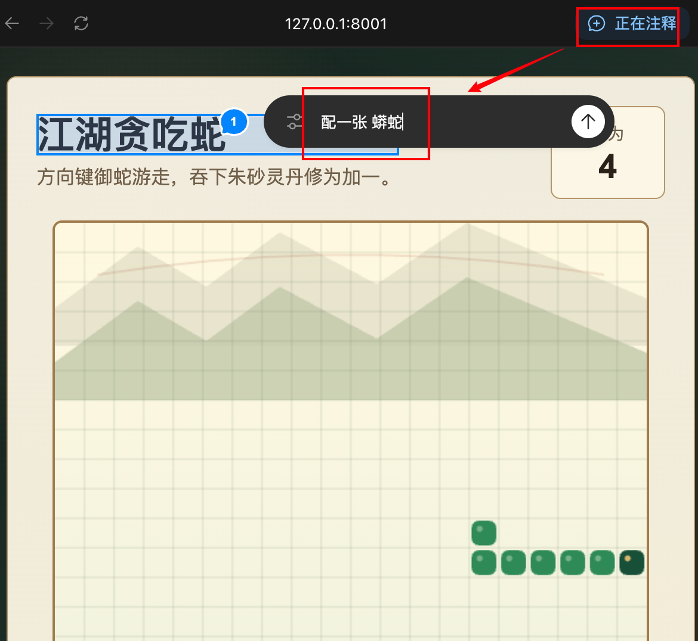{#screenshot}

Codex 会开始生成图片。

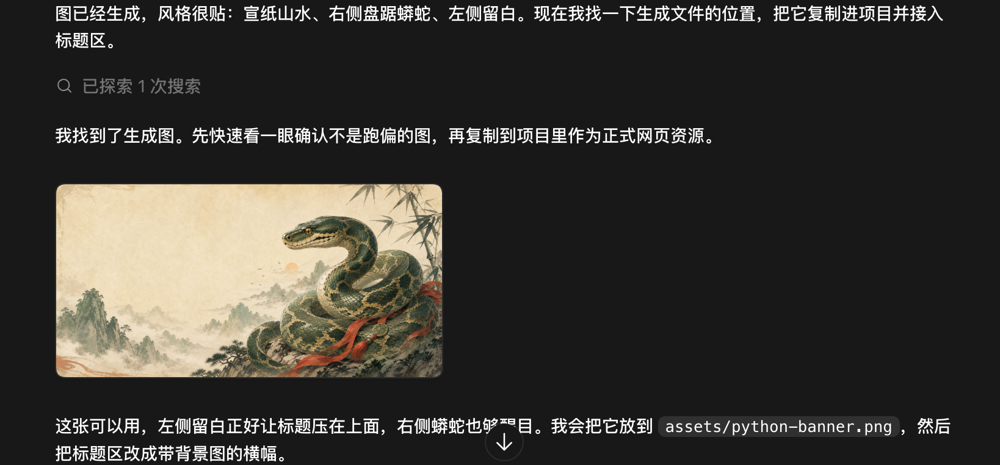{#screenshot}

生成后，它会自动把配图加入游戏。

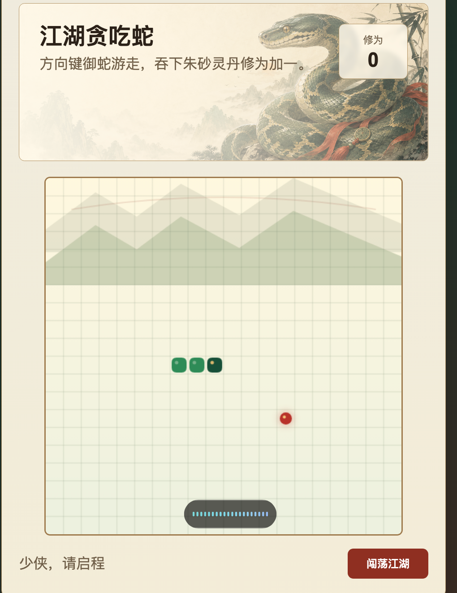{#screenshot}

### 第 5 步：发布给别人玩

项目做完后，可以发布到公网。

发布方法可以看这篇：

[Codex 项目做完后怎么快速发布到公网](/guide/16-publish-project)

Codex 会根据你的指令修改代码。在审核模式下，你可以逐条确认修改。

## 进阶：让 Codex 更懂你的项目

项目变大以后，可以提前告诉 Codex 一些规则。

这类规则能让它生成的代码更贴合你的习惯。

### 放一份 AGENTS.md

AGENTS.md 是给 Codex 看的项目说明书。

内容可以很简单：

```markdown
# 项目说明

## 技术栈
Python 3.11 + Pygame

## 代码习惯
- 变量用 snake_case
- 函数加简单注释说明用途
- 绘制和逻辑分开写

## 特别注意
- 食物不能生成在蛇身上
- 禁止反向掉头
- 分数要显示在左上角
```

使用时，把这份说明放在项目根目录。Codex 进入项目后，会更容易按规则工作。

### 放一份 styleguide.md

如果项目有多个文件，也可以单独放一份风格说明。

例如：

```markdown
# 风格说明
- 统一使用 snake_case
- Pygame 循环内绘制与事件处理分离
- 禁止反向掉头的按键切换：上↔下、左↔右互斥
- 食物随机生成不得落在蛇身
- 必须渲染分数文本，字体最小 16px
```

## 常见问题

### 项目文件太多怎么办？

可以分批让 Codex 处理。

先让它理解目录结构，再逐步修改具体文件。

### AI 写的代码一定可靠吗？

不一定。

最终仍要自己测试，不要完全依赖 AI 的判断。

### 额度不够怎么办？

小项目可以选择速度更快、推理更低的设置。

大项目再切到更强模型或更高推理强度。

### 对话里能不能贴密钥？

不要贴密钥、密码等敏感信息。

如果项目需要配置密钥，优先使用本地环境变量或单独的配置文件。

## 流程小结

这个案例的核心流程是：

```text
明确需求 → Codex 生成初稿 → 发现问题 → 在对话中迭代优化 → 本地运行和测试 → 循环迭代 → 发布
```
