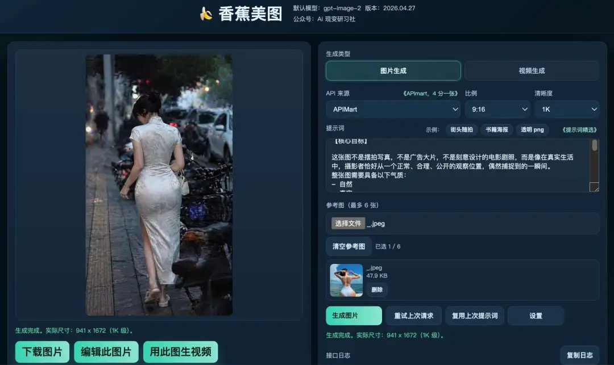
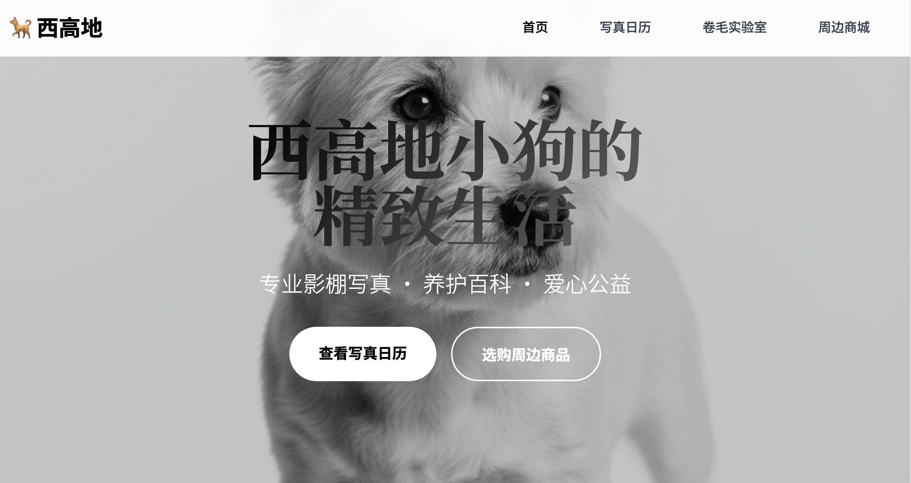
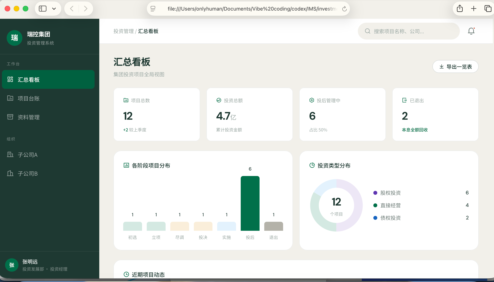

# AI编程是什么？不会写代码也能编程？

  Phase 0
  概念
  阅读约 5 分钟

## 适合谁

如果你完全没有技术背景，可以从这篇开始。

## 一句话解释

AI 编程，又称之为 Vibe Coding（氛围编程）。主要指人类协调、指挥 AI ，完成程序开发。人类负责定目标、拟规划、提要求，AI 负责代码编写代码。

你甚至能让一个AI做前端界面设计，一个AI写后端程序，再来一个 AI 审代码。

它的核心不是“学会一门编程语言”，而是“学会把需求说清楚”。

你只需要动动嘴，AI会搞定一切

比如，你不需要知道 HTML、CSS、JavaScript 怎么写，只需要能说清楚：

> 我想做一个公司官网，有首页、服务介绍、案例展示、联系方式，整体风格要简洁专业，手机上也能看。

AI 就可以根据你的描述，帮你生成代码、修改页面、运行项目，一步步构建这个网站。

越来越多的软件公司开始使用 codex 开发大型型目。

连大名鼎鼎的 龙虾 openclow，70% 的代码也是 Codex 写的。

不懂编程的技术小白，不写一行代码，就可以开发各种让人眼花缭乱的网站、各种程序工具。

下面这个本地运行 gpt-image2 和 seedance2 的网站（[www.91banana.site](https://www.91banana.site)），就是我用 Codex 半天搞定的。结合第三方APi，4分一张的gpt images，比官网便宜的Seedance2.0 真人版，完全实现了做图、做视频自由。

## 你能做出什么

对非程序员来说，AI 编程最适合从小项目开始：

- 做一个个人主页或公司介绍网站
- 做一个表格整理工具
- 做一个批量生成图片或 PPT 的流程
- 做一个自动搜集资料、整理日报的助手
- 做一个内部使用的小系统，比如招聘管理、客户管理、库存记录

重点是：你不需要一开始就懂代码，但你需要知道自己想解决什么问题。

## 一个类比

可以把 AI编程 想象成装修房子。

| 方式 | 你要做什么 | 结果 |
|------|------------|------|
| 传统编程 | 自己学水电、木工、瓦工 | 全部亲手做 |
| 找程序员 | 你写需求，别人开发 | 等别人交付 |
| AI编程 | 你说清楚想要什么，AI 帮你实现 | 边沟通边完成，你负责指挥、检验 |

你需要的不是“怎么砌墙”，而是“知道自己想住什么样的房子”。

这也是很多非程序员能开始用 AI 做项目的原因：门槛从“会不会写代码”，变成了“能不能描述清楚目标”。

你是爱狗人士，你可以对AI说：

> “用HTML+CSS+JS做一个网站，主题‘西高地白梗犬找家’，包含：①萌图轮播 ②狗狗档案（名字/年龄/疫苗）③领养按钮（跳转到表单）④主人微信二维码⑤SEO关键词‘西高地领养成都’

过10分钟，你得到一个网站：

你是投资负责人，投了很多项目，但项目资料太多太杂，你想做一个信息系统，把项目的投融管退资料都管起来，要求比Excle方便，比专业系统轻。于是你对AI说：

> 我想做一个基于web的投资管理系统，用户是投资集团及其总部和下属公司投资部人员。实现对集团下属所有投资项目的投、融、管、退的信息管理。投资项目包括股权投资、直接经营、债权投资。

发出提示的同时，你可以传一份完整的投资制度给AI，再加上一点点设计提示，你就得到这个系统：

看，只要你能说清楚你的需求，AI就可以帮你实现你的想法和目的。说不清楚也没关系，你可以告诉AI，让它一步一步帮你分析。

一句话，你有需求和想法，告诉AI，它都能帮你搞定！这就是AI编程
