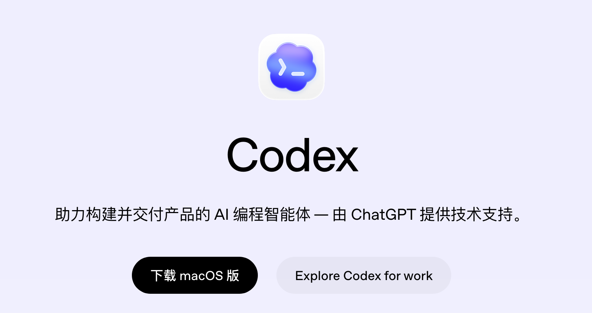
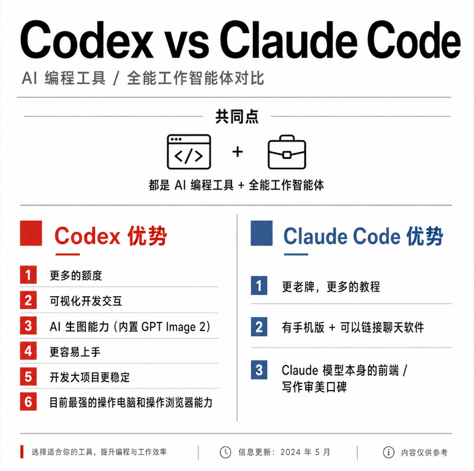
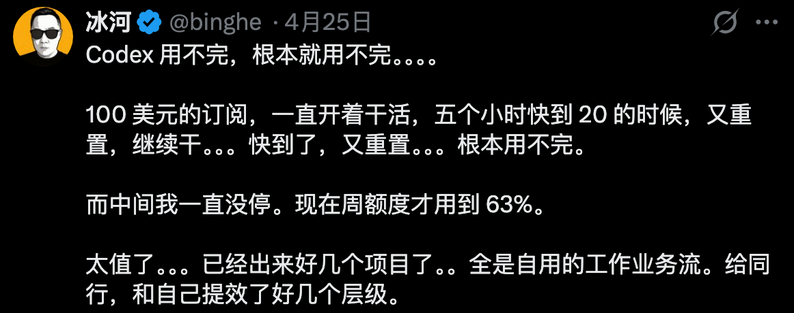
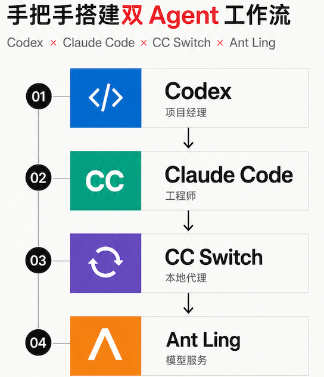
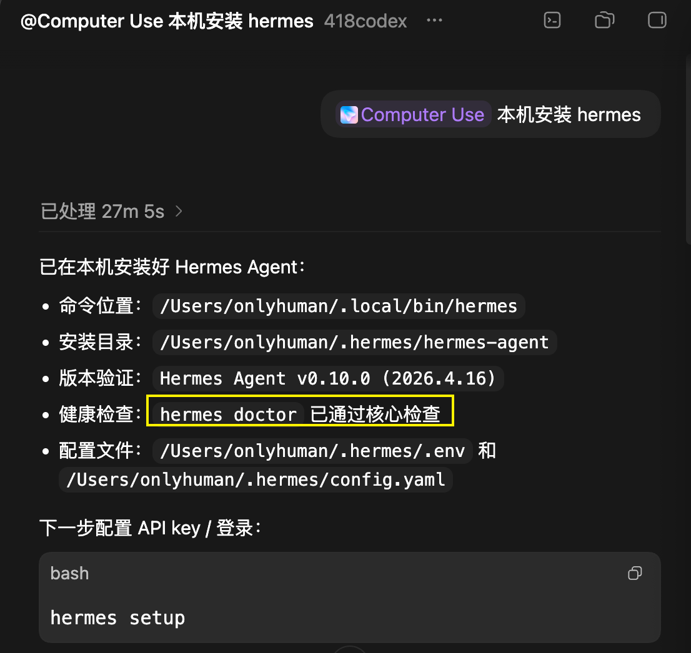
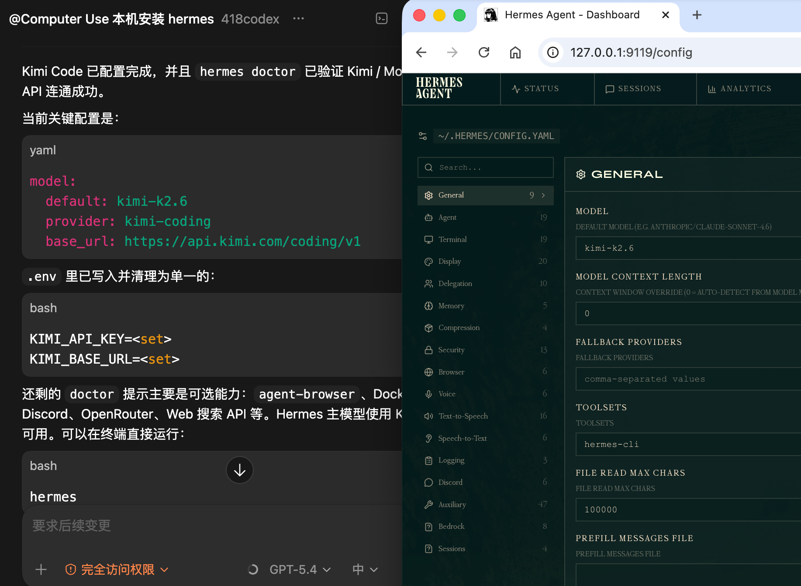
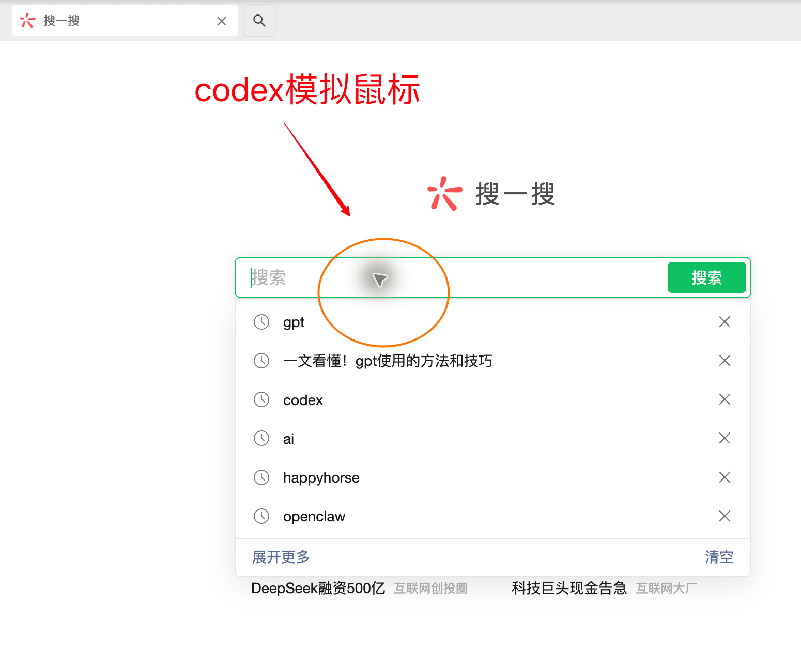
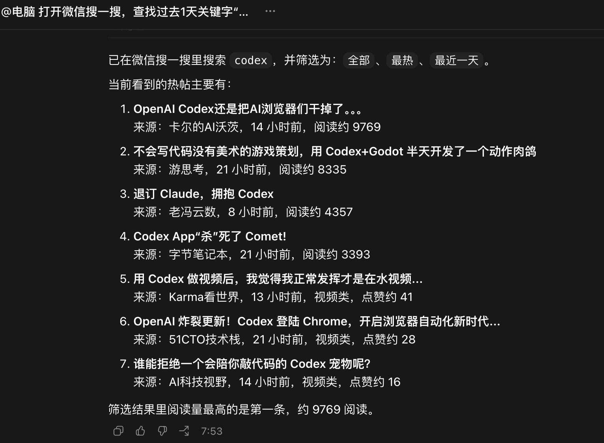

# Codex 是什么？新手能用它做什么

今天我们来聊聊 AI 编程工具 GPT-Codex，以下简称 Codex。

这篇适合作为 AI 编程的入门手册。如果你刚开始接触 Codex，可以先从这篇了解它到底是什么、能做什么，以及它和 Claude Code 这类工具有什么区别。

## 适合谁

这篇适合三类人：

- 听过 Codex，但还不知道它和 ChatGPT、Claude Code 有什么区别
- 不会编程，但想用 AI 做网站、工具、自动化流程
- 已经开始用 Codex，想快速理解它除了写代码还能做什么

## Codex 是什么

Codex 是 OpenAI 于 2025 年 10 月上线的一款 AI 助手。早期它主要定位为 AI 编程工具，现在正在往 AI 全能助手转型。

新版 Codex 正在脱离“代码生成器”的单一定位。目前，Codex 已经上线了本地电脑控制、定时任务等功能。

它的发展方向可以理解为：

- 从辅助写代码，到独立完成项目
- 从解决编程问题，到帮你处理电脑软件问题
- 从等待你下命令，到逐步具备主动探索和执行任务的能力

官方资源：

- Codex 官网：[https://openai.com/zh-Hans-CN/codex/](https://openai.com/zh-Hans-CN/codex/)
- OpenAI 对 Codex 的介绍：[《人们在工作中如何利用 Codex 协作？》](https://openai.com/codex/for-work/)

## Codex 和 Claude Code 有什么区别

Codex 和 Claude Code 都是非常优秀的 AI 编程和智能体工具。

下面这张图是一个简单对比：

原文观点认为，随着 GPT-5.5 能力超过 Opus 4.7，目前 Codex 的口碑开始超过 Claude Code。

原因不只是模型能力，也和使用体验有关。原文里提到，OpenAI 对中国用户更友好：额度经常重置，账号使用限制相对少；而 Anthropic 更贵，也更容易遇到封号、KYC 等问题。

不过很多高手会组合使用：

- Claude Code 用来做规划、做前端，因为审美和表达比较好
- Codex 用来执行任务，因为额度多、发挥稳定

## Codex 能做什么

Codex 不只是写代码。它可以帮你做编程、剪视频、操作电脑、搜索资料，也可以和自动化任务结合起来使用。

### 1. 编程

Codex 最成熟的功能还是 AI 编程。

在 Codex 里面，我们通过对话调用 GPT 完成编程工作。

下面这个网页版武侠游戏，从网站到配图、配音，都是用 Codex 做的。

点击可玩：[射雕英雄传在线小游戏](http://99game.site/)

::: tip Prompt
帮我结合射雕英雄传，生成一个基于 Web 的对话式回合制剧情闯关游戏，按照原著进程，整体风格要符合和电视剧审美。
:::

更多编程案例，详见：[什么是 AI 编程](/guide/02-what-is-vibe-coding)

### 2. 剪视频

Codex 也可以配合视频剪辑插件做视频。

比如，我们想给英伟达制作一个宣传视频。可以先安装视频剪辑插件 HyperFrames 或 Remotion，然后把需求发给 Codex。

::: tip Prompt
分析整个网站：https://www.nvidia.cn，然后制作一个 15 秒的宣传短视频，要求是中文。整体风格科技、专业，像官方品牌宣传片，融合未来科幻元素与温暖明亮的色彩，展现 NVIDIA 在 AI、游戏、自动驾驶、机器人等领域的领导力，并且配上符合场景的轻快背景音乐。
:::

Codex 会自动制作类似下面的视频：

<video controls width="100%">
  <source src="./assets/03-what-is-codex/inweida.mp4" type="video/mp4">
</video>

### 3. 操作电脑

Codex 现在可以在后台控制电脑上的应用。

比如输入：

::: tip Prompt
本机安装 hermes。
:::

Codex 用了 28 分钟完成安装。

我给了它一个 Kimi Code 的 key，Codex 直接帮我配置进去，然后打开了 Web UI 管理界面。

这类场景里，Codex 可以自动检测和修复电脑配置、网络配置，省掉很多重复操作。

### 4. 搜集公众号热帖

搜索信息时，如果直接用爬虫，容易触发风控。用 OpenClaw 操作电脑，配置又比较复杂，还容易崩。

现在可以用 Codex 来做。

打开 Codex，输入：

::: tip Prompt
打开微信搜一搜，查找过去 1 天关键字“codex”相关的热帖。
:::

Codex 会自己虚拟一个鼠标，像人一样打开微信、打开搜一搜、输入文字，然后开始搜索。

整个过程会在 Codex 界面里呈现。搜索完成后，Codex 会把结果整理给你看。

如果再结合自动定时，这个功能会非常有用。

## 常见问题

### Codex 只是写代码的吗

不是。写代码是 Codex 最成熟的能力，但现在它已经开始扩展到电脑控制、自动化任务、资料搜索、视频生成等场景。

### 不会编程能不能用 Codex

可以。你不需要一开始就懂代码，但需要把需求说清楚。比如你要做什么、给谁用、完成后长什么样、有哪些限制。

### Codex 和 Claude Code 应该选哪个

如果你刚开始，可以先用 Codex。它更适合围绕项目持续执行，也适合结合 Computer Use 和 Automations 做自动化任务。

如果你已经熟悉 AI 编程，也可以把 Claude Code 和 Codex 组合使用：一个负责规划和审美，一个负责执行和落地。

## 相关阅读

- [什么是 AI 编程](/guide/02-what-is-vibe-coding)
- [下载与安装](/guide/04-install)
- [界面全览](/guide/05-interface)
- [上手项目1：新建一个贪吃蛇游戏](/guide/06-first-project)

