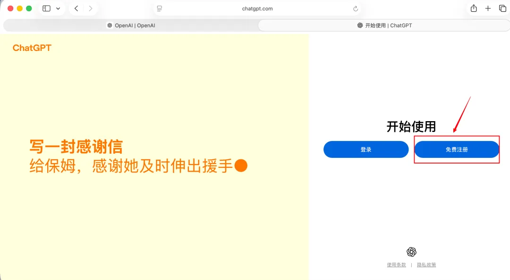
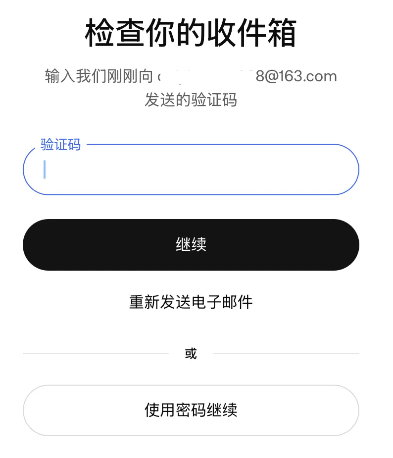
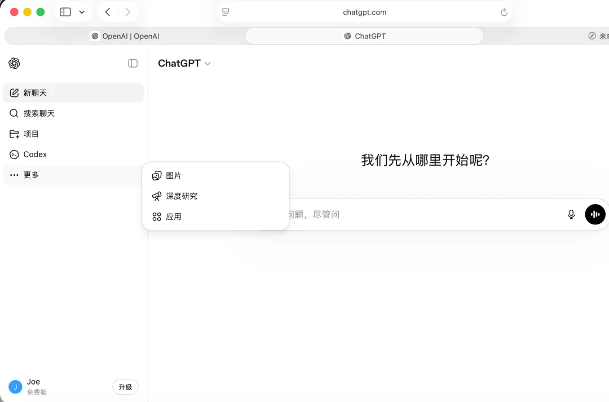
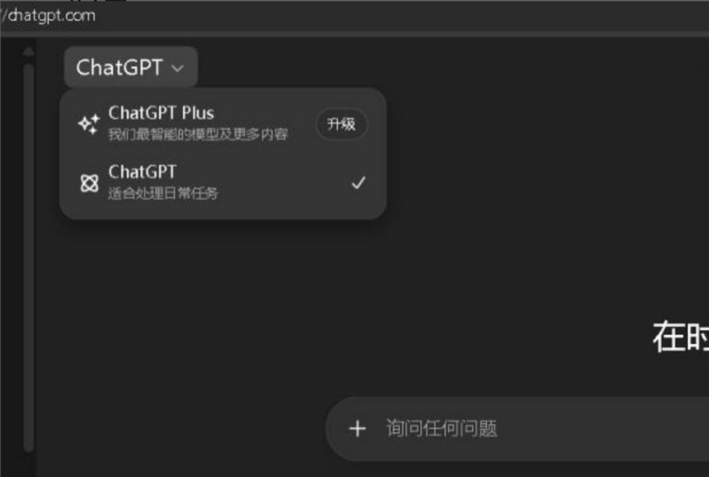
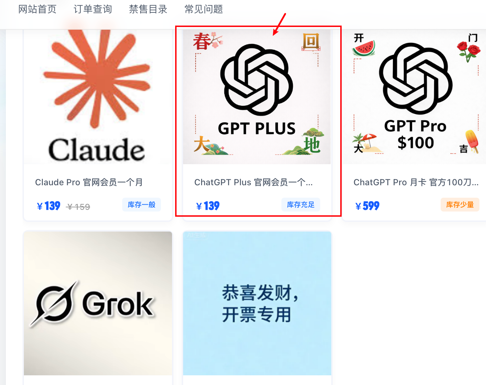
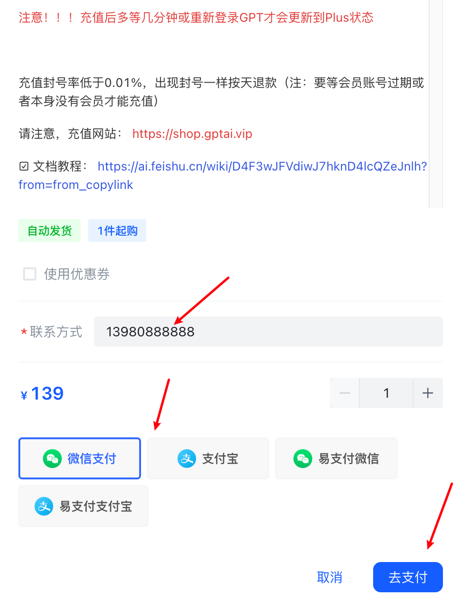
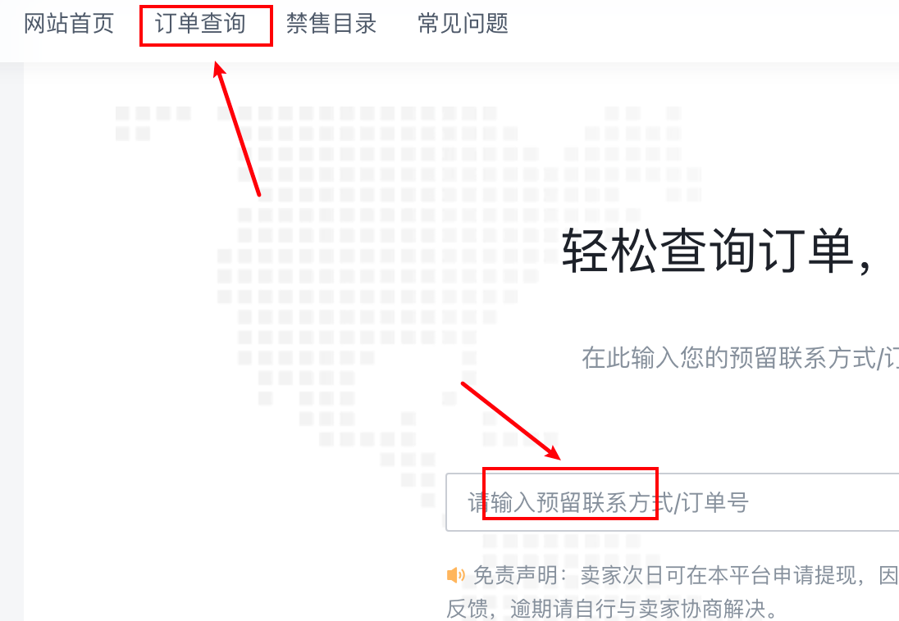

# GPT 注册与订阅：新手怎么开通 ChatGPT Plus

免费版 ChatGPT 可以体验基础对话，也可以试用 Codex，但限制比较大，用量很小，很快会达到额度上限。

如果你想稳定使用 Codex，包括桌面 App、Cloud 任务、多 Agent 并行等能力，建议至少准备一个付费套餐。

## 适合谁

这篇适合三类人：

- 还没有 ChatGPT 账号，想先完成注册
- 已经有免费账号，想升级到 Plus
- 想用 Codex 做项目，但不清楚该选哪个套餐

## 你需要先知道什么

ChatGPT 和 Codex 都属于 OpenAI 账号体系。你只要注册一个 ChatGPT 账号，就可以在同一个账号下使用相关能力。

官方入口只有一个：

[https://chatgpt.com](https://chatgpt.com)

注意：不要从不明链接登录，也不要把账号密码交给陌生人。

## GPT 套餐怎么选

套餐价格和权益会随时间变化，最终以 OpenAI 官方页面显示为准。下面是原文整理时的常见套餐对比：

| 套餐 | 月费（美元） | Codex 可用情况 |
|---|---:|---|
| Free | $0 | 可试用，额度很少 |
| Go | $8 | 可用，适合轻量任务 |
| Plus | $20 | 完整访问，适合日常开发 |
| Pro 5x | $100 | Plus 的 5 倍额度，适合较高频开发 |
| Pro 20x | $200 | Plus 的 20 倍额度，适合高强度开发 |
| Business（原 Team） | 约 $25/人/月 | 团队使用，含管理和协作功能 |
| Enterprise / Edu | 联系销售 | 企业/教育机构使用，含安全和权限管理 |

对大多数个人用户来说，Plus（$20/月）是性价比最高的起点。

如果你只是偶尔体验，Free 或 Go 可以先试试；如果你准备长期用 Codex 做项目，Plus 会更合适；如果你每天高强度开发，再考虑 Pro。

## 准备工作

注册前，先准备好：

- 一个能正常接收验证码的邮箱
- 能打开 [https://chatgpt.com](https://chatgpt.com) 的网络环境
- 如果要升级 Plus，还需要准备可用的支付方式

邮箱建议优先用 Gmail。其他邮箱也可能可以注册，比如 QQ 邮箱、163 邮箱。

不太建议使用 Outlook、Hotmail。原文经验里提到，这类邮箱容易因为批量注册账号太多，出现无法注册或后续被系统误判的情况。

## 操作步骤

### 1. 注册 ChatGPT 官网账号

打开官网：

[https://chatgpt.com](https://chatgpt.com)

点击页面上的“免费注册”按钮。

{#screenshot}

进入注册页面后，输入你的邮箱。

系统会给你的邮箱发送一封验证邮件。

{#screenshot}

取得验证码后，贴回注册页面。

接下来，OpenAI 会让你填写姓名和年龄。姓名可以正常填写，年龄需要填写成年年龄。

完成后，会进入 ChatGPT 界面。

{#screenshot}

如果注册前或使用过程中弹出手机验证，不要输入国内手机号。可以先更换网络节点，重新打开浏览器再试。

### 2. 判断自己是不是免费账号

正常登录 ChatGPT：

[https://chatgpt.com](https://chatgpt.com)

看头像附近是否显示 Free 或“免费”标志。

{#screenshot}

如果你已经是 Plus 状态，续费前要注意：有些充值方式可能不是延长会员时间，而是覆盖当前会员周期，这样不划算。

### 3. 选择订阅方式

如果你想升级到 Plus，需要支付 $20/月。

常见方式有两类：

- 直接使用官方支持的支付方式
- 使用第三方充值服务

官方支付通常需要海外信用卡或其他可用支付方式。国内双币种 Visa 卡不一定能用。

如果你不想折腾海外支付，可以选择第三方充值服务。但这里要特别注意账号安全。

### 4. 如果使用第三方充值，注意这些规则

充值平台：

- 智合智 AI：[www.91gpt.com.cn](https://www.91gpt.com.cn)
- 备用域名：[www.58ai.site](https://www.58ai.site)

所谓“代充”，就是帮你往自己的 ChatGPT 官网账号充值。

使用这类服务时，建议遵守这几条：

- 不要提交身份证、银行卡等隐私信息
- 不要把 GPT 账号密码发给任何人
- 尽量选择只使用卡密或授权流程的方式
- 充值前确认你的账号当前是否为 Free 状态
- 保存好订单信息，方便售后查询

这类平台支持微信或支付宝付款，适合没有海外支付方式的用户。

## 国内充值 Plus 的基本流程

下面是原文里的操作流程整理。

### 第一步：确认 GPT 状态为 Free

先登录 ChatGPT，确认自己是免费账号。

如果当前已经是 Plus，不建议直接叠加充值，避免会员周期被覆盖。

### 第二步：购买充值卡

打开购卡网站，选择自动代充卡，填写联系方式，确认付款。

充值入口：

- [www.91gpt.com.cn](https://www.91gpt.com.cn)
- [www.58ai.site](https://www.58ai.site)

建议复制到电脑浏览器打开。

选择商品时，找类似“ChatGPT Plus 官网会员一个月”的选项。

{#screenshot}

填好联系方式后，选择微信或支付宝付款。

{#screenshot}

### 第三步：复制卡密

付款后，系统会进入订单详情页。

点击“复制”，把卡密复制出来备用。

如果第一次没有复制，也可以点击网站左上方的“订单查询”，输入预留联系方式查询订单。

{#screenshot}

### 第四步：进入充值网站

不同渠道的充值网站网址可能不同，具体以产品下单页面显示的充值网址为准。

虽然网址不同，但充值方式大体相似：

1. 先验证你购买的卡密
2. 登录自己的 GPT 账号
3. 获取 token，常见地址是 `https://chatgpt.com/api/auth/session`
4. 将 token 粘贴到充值网站的充值框
5. 核实账号信息
6. 点击充值

充值完成后，退出 GPT 账号再重新登录，就能看到 Plus 状态更新。

下个月 Plus 到期后，再按同样方式续费即可。

## 常见问题

### 免费版能不能用 Codex

可以试用，但限制较大。如果只是体验，可以先用免费版；如果要稳定做项目，建议升级 Plus。

### Plus 够不够用

对大多数个人用户来说，Plus 是最合适的起点。它比免费版稳定很多，也不用一开始就承担 Pro 的高成本。

### 不建议用国内手机号验证

如果注册或使用时弹出手机验证，不建议输入国内手机号。可以先更换上网节点，重新打开浏览器再试。

实在绕不开，可以用接码平台：https://hero-sms.com（https://hero-sms.com）

## 相关阅读

- [什么是 AI 编程](/guide/02-what-is-vibe-coding)
- [Codex 是什么？新手能用它做什么](/guide/03-what-is-codex)
- [下载与安装](/guide/05-install)

 
