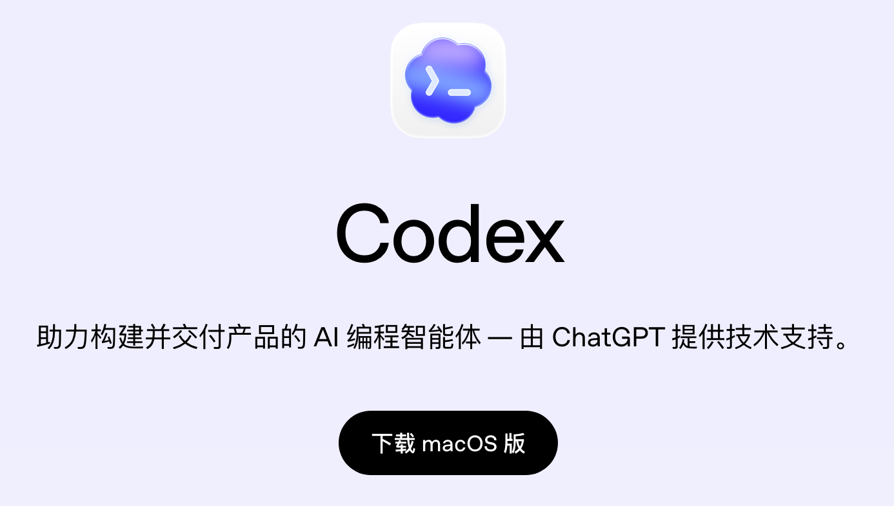

# Codex 下载安装：新手怎么安装 Codex App

这篇讲如何安装 Codex。

Codex 有多种使用方式：可以在 GPT 官网在线调用，可以用 CLI 命令行，也可以通过插件、官方桌面软件、浏览器等方式使用。

对新手来说，最推荐使用官方桌面软件，也就是大家常说的 Codex App。

## 适合谁

这篇适合三类人：

- 已经注册好 ChatGPT 账号，准备开始使用 Codex
- 不想折腾命令行，希望先用桌面 App 上手
- 想知道 Codex 有哪些使用入口，以及哪个入口最适合新手

## Codex 有哪些使用方式

Codex 常见使用方式包括：

| 使用方式 | 适合谁 | 说明 |
|---|---|---|
| GPT 官网在线调用 | 轻量体验用户 | 可以先体验基础能力，但不适合管理本地项目 |
| CLI 命令行 | 有技术基础的用户 | 更适合开发者，适合脚本、终端和工程化流程 |
| 编辑器插件 | 已经用 VS Code 等编辑器的人 | 可以在写代码时配合使用 |
| 官方桌面 App | 新手和日常用户 | 推荐入口，适合管理项目、对话和本地操作 |
| 浏览器相关能力 | 网页任务用户 | 适合搜索、查看网页、辅助自动化 |

如果你刚开始学习 Codex，建议先从官方桌面 App 开始。它最直观，也最适合跟着本站教程一步步操作。

## 准备工作

安装前先准备好：

- 一个 ChatGPT 账号
- 能打开 OpenAI 官网的网络环境
- 可用的 Codex 权限或付费套餐

如果你还没有账号，先看：[GPT 注册与订阅](/guide/04-register)。

原文提到，Codex 需要 GPT Plus 及以上付费会员才能稳定使用。免费账号可以试用部分能力，但限制比较大。

## 操作步骤

### 1. 打开 Codex 官网

先打开浏览器，访问：

[https://openai.com/codex](https://openai.com/codex)

### 2. 点击下载

在页面里找到下载入口，点击下载 Codex App。

下载完成后，按照系统提示完成安装。

如果你使用的是 Mac，通常是下载后拖入应用程序或按页面提示安装。

如果你使用的是 Windows，按照安装程序提示下一步即可。

### 3. 第一次启动 Codex

第一次启动 Codex App 时，它会弹出浏览器，让你登录 ChatGPT。

用你的 GPT 账号登录。

登录成功后，回到 Codex App，就可以进入软件界面。

### 4. 确认是否能正常使用

进入 Codex App 后，可以先做几个检查：

- 是否已经登录到正确的 GPT 账号
- 是否能新建项目或打开对话
- 是否能看到模型、工具或项目相关入口
- 如果提示权限不足，检查当前套餐是否支持 Codex

如果你还没有升级账号，可以回到：[GPT 注册与订阅](/guide/04-register)。

## 常见问题

### 新手应该用 Codex App 还是 CLI

建议先用 Codex App。CLI 更适合有命令行基础的人，新手一开始用桌面 App 更容易理解项目、对话、权限和任务执行过程。

### 免费账号能不能安装 Codex App

可以安装，但能不能稳定使用取决于你的账号权限和额度。免费账号可能只能试用，容易触发限制。

### 安装后为什么还要登录 ChatGPT

Codex 使用 OpenAI 账号体系。桌面 App 需要通过浏览器完成授权登录，确认你是谁，以及你的账号是否有可用权限。

### 下载入口打不开怎么办

先确认访问的是官方地址：[https://openai.com/codex](https://openai.com/codex)。如果打不开，通常是网络环境问题，可以换浏览器或网络节点再试。

## 相关阅读

- [GPT 注册与订阅](/guide/04-register)
- [Codex 是什么？新手能用它做什么](/guide/03-what-is-codex)
- [界面全览](/guide/06-interface)

 
