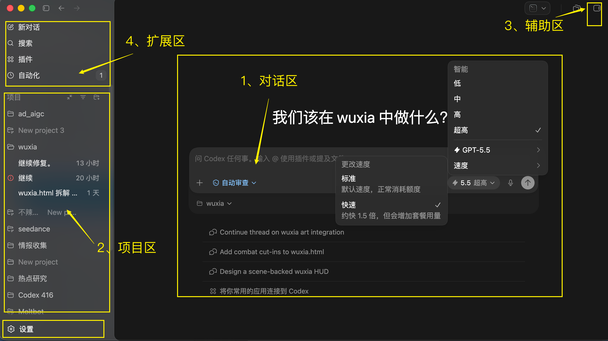
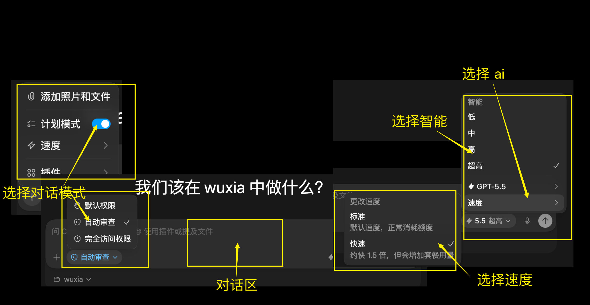
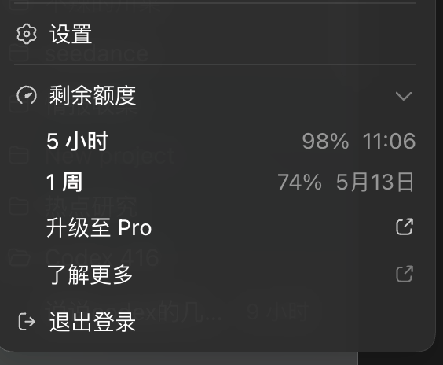
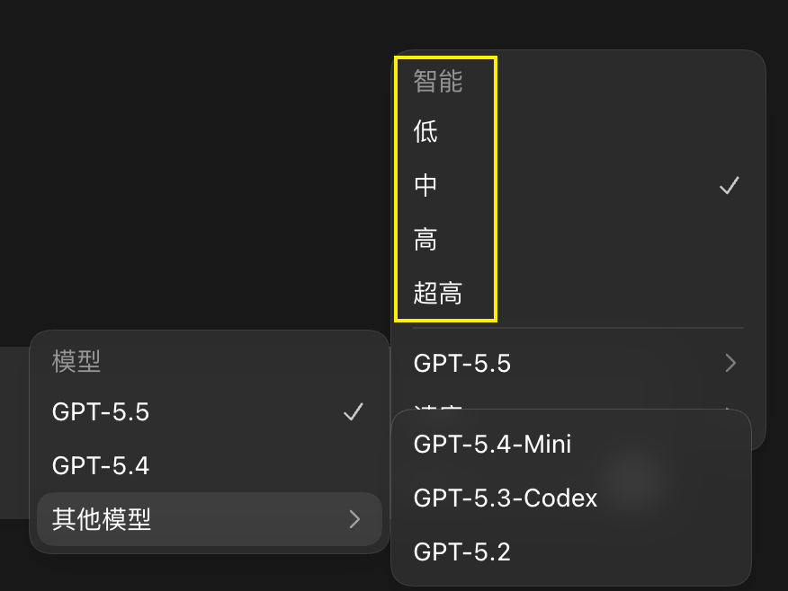

# Codex 界面全览：对话区、项目区和权限怎么用

安装好 Codex 之后，第一步不是马上让它写代码，而是先认识界面。

这篇把 Codex 界面拆成四个区域：对话区、项目区、辅助区和扩展区。新手先看懂这些入口，后面做项目时就不容易迷路。

## 适合谁

这篇适合三类人：

- 刚安装 Codex App，不知道每个区域是干什么的
- 想理解模型、额度、权限、速度这些设置
- 准备跟着后面的实战教程做第一个项目

## Codex 界面分成哪几块

我把 Codex 界面分为四个区域：

- 对话区：输入任务、选择模型、调整智能等级和速度
- 项目区：管理当前项目、文件夹和上下文
- 辅助区：查看过程、状态、提示和任务结果
- 扩展区：调用插件、Skill、Computer Use 等扩展能力

新手最常用的是对话区和项目区。你可以先把 Codex 理解成“围绕一个项目文件夹工作的 AI 助手”，而不是普通聊天窗口。

## 对话区能做什么

对话区是你和 Codex 沟通的主入口。

在这里，你可以：

- 输入任务
- 选择模型
- 设置智能水平
- 设置运行速度
- 选择权限模式

{#screenshot}

这些选项会直接影响 Codex 的能力、速度和额度消耗。

## 什么是额度

所谓额度，就是 Codex 的使用限额。

它会按一定周期计算，比如 5 小时或按周计算。你在周期内能用多少，取决于你的套餐和当前任务消耗。

额度用超后，通常有两个选择：

- 休息一下，等额度重置
- 升级到更高套餐，比如 Pro

Codex 是滚动 5 小时重置 1 次额度。同一个 GPT 账号下，ChatGPT 官网对话额度和 Codex 使用额度是分开的，互不影响。

{#screenshot}

## 额度使用小诀窍

为了不浪费额度，可以按时间段安排任务：

- 早上 7、8 点先和 Codex 说一句，启动一个额度周期
- 到中午 12 点左右，差不多是一个使用时段
- 下午 1 点到晚上 6 点，可以作为第二个时段
- 晚上再安排一个时段

原文提到，Pro 用户额度分别是 Plus 的 5 倍、10 倍。2026 年 5 月 31 日前还有过翻倍活动。类似活动以后可能变化，实际以 OpenAI 当时页面为准。

## 权限选项怎么选

Codex 的权限决定它能不能动你的文件、运行命令、操作电脑。

常见权限模式可以这样理解：

| 权限模式 | 适合场景 | 说明 |
|---|---|---|
| 计划模式 | 只想听方案 | 只说不动手，除非你明确要求执行 |
| 默认模式 | 日常项目修改 | 在沙盒环境中运行，比较稳妥 |
| 自动审查 | 需要边做边判断权限 | Codex 会根据任务判断是否需要新增权限 |
| 完全权限 | 明确要操作本机文件或软件 | 可以访问和操作电脑上的文件，使用前要确认任务边界 |

新手建议先用计划模式或默认模式。等你清楚 Codex 要做什么，再考虑更高权限。

## 速度选项怎么选

速度选项一般分为标准速度和快速模式。

快速模式大约是 1.5 倍速度，但额度消耗会更高。原文提到，快速模式额度消耗约为标准模式的两倍。

{#screenshot}

建议：

- 普通写文章、改小文件，用标准速度
- 明确的小任务、赶时间时，再用快速模式
- 大项目不要一上来就开高速，容易又快又贵

## 智能等级怎么选

智能等级通常分为低、中、高、超高。

{#screenshot}

大致可以这样选：

| 智能等级 | 适合任务 | 额度消耗 |
|---|---|---|
| 低 | 简单修改、格式调整、查找内容 | 较低 |
| 中 | 常规教程、页面调整、小功能 | 中等 |
| 高 | 多文件修改、复杂排查、项目规划 | 较高 |
| 超高 | 复杂系统设计、长任务、困难问题 | 最高 |

越高越慢，也越消耗额度。新手不用迷信最高档，很多普通任务用中等或高就够了。

## 常见问题

### 一开始应该选什么设置

建议新手先用：

- 权限：计划模式或默认模式
- 速度：标准
- 智能：中或高

等你确认 Codex 理解任务后，再让它执行。

### 完全权限安全吗

完全权限不是不能用，但要谨慎。它适合你明确知道要操作哪些文件、安装哪些软件、执行哪些命令的场景。

如果只是让 Codex 分析问题、写方案，不需要完全权限。

### 为什么智能等级越高越慢

因为 Codex 会花更多时间思考、规划和检查。复杂任务值得开高一点，简单任务就没必要。

## 相关阅读

- [Codex 下载安装：新手怎么安装 Codex App](/guide/05-install)
- [项目与对话](/guide/08-projects-and-chats)
- [上手项目1：新建一个贪吃蛇游戏](/cases/02-snake-game)

 
