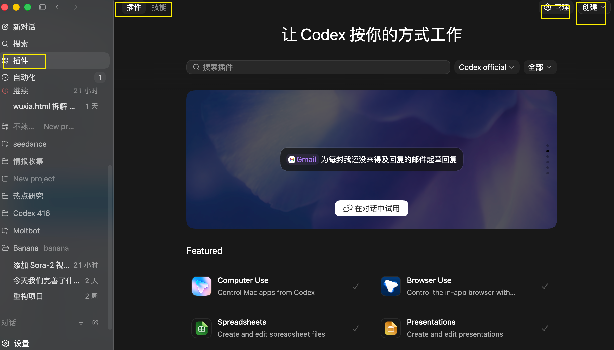
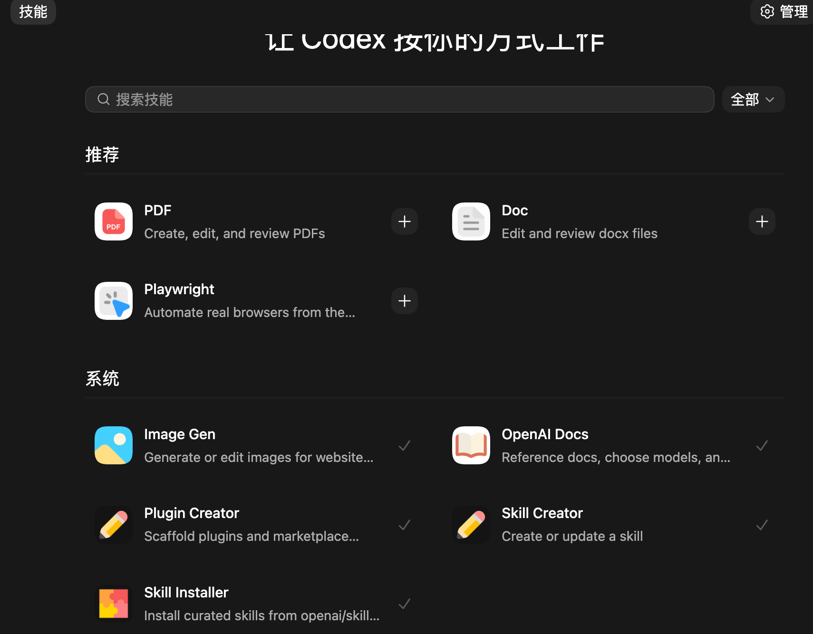
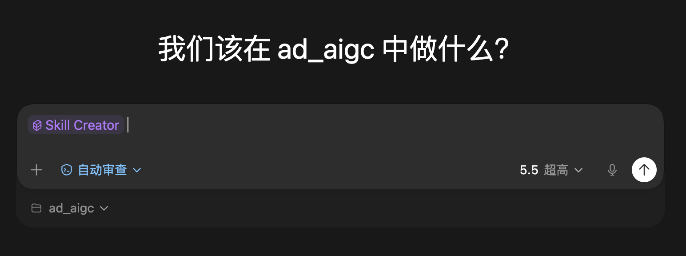

# Codex 插件与技能：插件区怎么用

现在 Codex 把技能和插件放到了同一个栏目里，统一叫“插件”。

新手一开始看到这里可能会有点混：插件是什么？Skill 又是什么？什么时候用别人做好的插件，什么时候自己创建技能？

这篇先把概念讲清楚。

## 适合谁

这篇适合三类人：

- 刚看到 Codex 插件区，不知道里面每个入口是做什么的
- 想理解插件和 Skill 的区别
- 想把自己经常重复做的任务封装成一个固定能力

## 插件和技能有什么区别

我的理解是：

插件更像第三方专业公司或工具方做好的接口。它通常连接一个成熟服务，比如浏览器、设计工具、视频工具、办公工具、自动化工具。

Skill 更像针对一个小场景的固定技能。你可以把自己经常用的一套流程、规则、提示词或操作方式整理成 Skill，放到 Codex 里反复调用。

可以简单这样区分：

| 类型 | 更像什么 | 适合做什么 |
|---|---|---|
| 插件 | 外部工具接口 | 连接浏览器、视频工具、办公平台、自动化服务 |
| Skill | 可复用工作方法 | 固定写作流程、PPT 生成流程、图片处理流程、项目检查清单 |

所以，插件解决的是“Codex 能不能调用某个外部能力”；Skill 解决的是“我能不能把一套固定做法反复复用”。

## 插件区在哪里

Codex 现在把技能和插件放在同一个插件区里。

{#screenshot}

在这里，你可以看到已经可用的插件、技能，以及一些创建或管理入口。

## 技能是什么

技能，也就是 Skill，可以理解为给 Codex 增加的一套固定工作方法。

比如你经常让 Codex 做这些事：

- 把传统 Markdown 改写成本站文章格式
- 根据一段原文生成 PPT
- 检查一篇教程有没有缺少 frontmatter
- 按固定模板整理小红书搜索结果
- 生成符合你项目规范的页面

这些都可以做成 Skill。

{#screenshot}

Skill 的好处是：你不用每次都把同一套要求重新说一遍。Codex 看到 Skill 后，会按那套规则工作。

## 什么时候用插件

如果任务需要连接外部工具，优先考虑插件。

比如：

- 让 Codex 控制浏览器
- 调用 Computer Use 操作桌面应用
- 使用视频生成或剪辑工具
- 连接 Figma、Canva、Gmail、GitHub 等服务
- 做定时任务或自动化

这类能力不是单靠一段提示词就能稳定完成的，需要插件提供外部接口。

## 什么时候用 Skill

如果任务不是连接外部工具，而是“固定流程”，就适合做成 Skill。

比如：

- 你经常用同一个格式整理文章
- 你经常用同一套标准检查网站页面
- 你经常让 Codex 按同一个结构写教程
- 你有一套固定的 Prompt 模板
- 你希望 Codex 记住某个项目的交付规范

这时 Skill 比普通提示词更省事。

## 怎么创建技能

在插件区里可以找到创建技能的入口。

{#screenshot}

创建 Skill 时，建议先写清楚四件事：

1. 这个 Skill 用来解决什么问题
2. 输入通常是什么
3. 输出应该长什么样
4. 有哪些禁止事项或固定规则

比如，你可以做一个“52codex 文章整理”Skill，专门把传统 Markdown 改成本项目可用的 VitePress Markdown。

::: tip Prompt
创建一个 Skill，用于把传统 Markdown 文档整理成 52codex.site 可直接使用的 VitePress 文章。

要求：
1. 自动补齐 frontmatter
2. 标题要适合新手搜索
3. Prompt 内容改成项目的 Prompt 容器
4. 不使用 mdnice 语法
5. 不编造原文没有的信息
6. 图片和外链保留 Markdown 写法
:::

## 常见问题

### 插件和 Skill 哪个更重要

都重要，但解决的问题不一样。

插件扩展 Codex 能连接的外部工具；Skill 固化你自己的工作方法。

新手可以先用现成插件，等重复任务变多后，再开始做自己的 Skill。

### Skill 是不是高级功能

不一定。Skill 本质上就是把一套固定要求保存下来。只要你发现自己反复复制同一段提示词，就可以考虑做成 Skill。

### 插件越多越好吗

不是。插件越多，选择也越多，反而容易乱。

建议按任务需要安装和启用：做浏览器任务就用浏览器相关插件，做视频就用视频插件，写文章就用文章整理 Skill。

## 相关阅读

- [Codex 界面全览：对话区、项目区和权限怎么用](/guide/06-interface)
- [调用 Skill 写 PPT](/cases/04-skill-ppt)
- [调用自动化插件搜索小红书](/cases/08-auto-xiaohongshu)

## 待补充

- 插件区每个入口的详细说明
- Skill 创建后的测试和调用步骤
- 常用插件推荐列表
