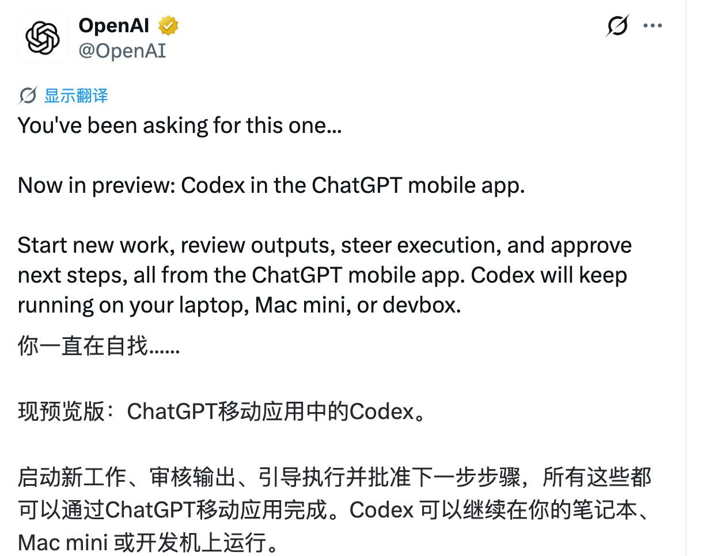
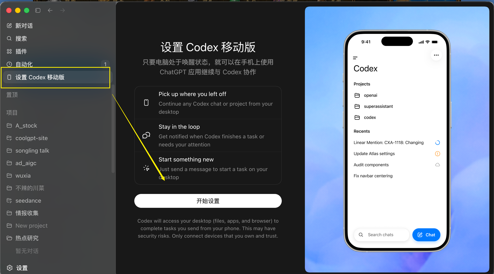
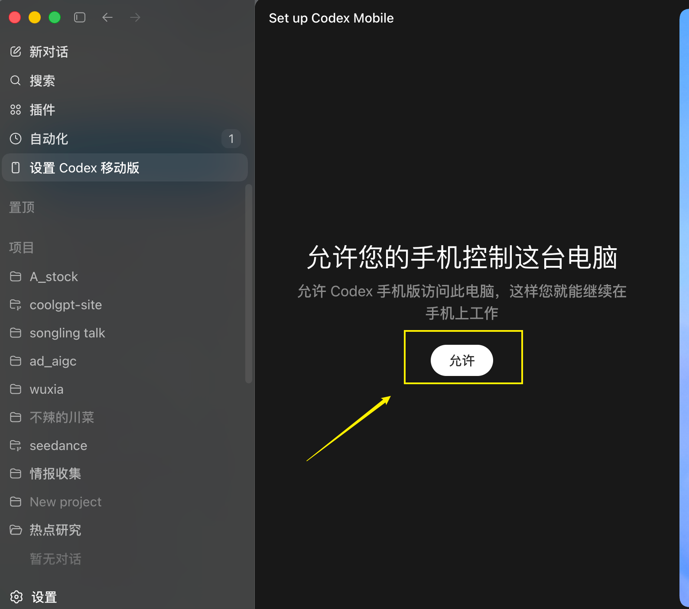
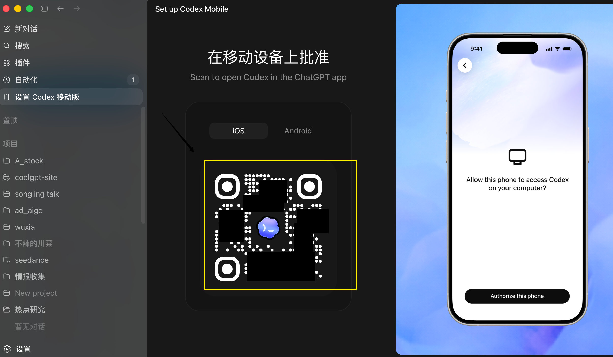
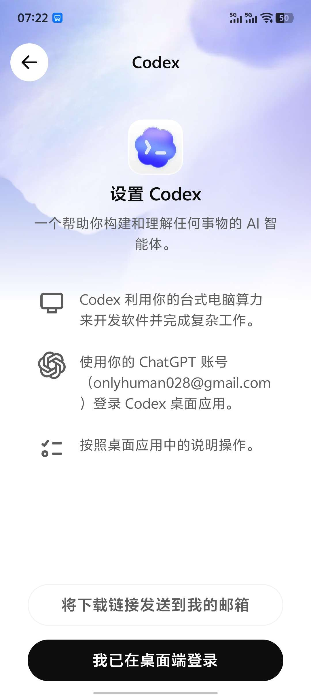
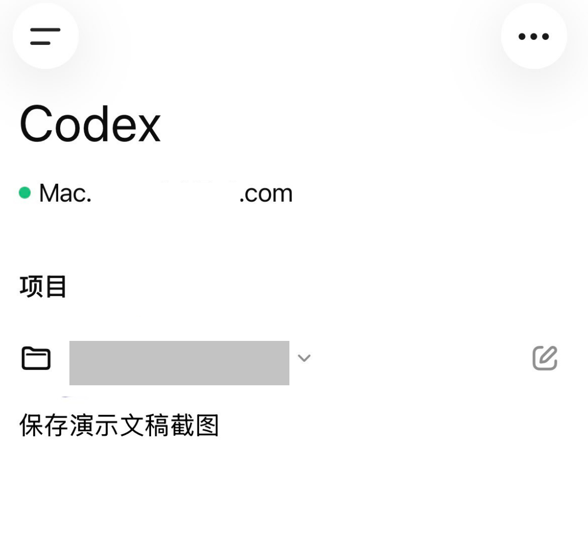

# 15 手机端操控桌面 App：用 ChatGPT 遥控 Codex

Codex 支持在手机端查看和操控桌面任务后，你不一定要一直坐在电脑前等它跑完。

它的核心不是“在手机上写代码”，而是让手机变成桌面 Codex 的遥控器。

## 适合谁

这篇适合这些用户：

- 已经在电脑上安装了 Codex 桌面 App
- 平时会让 Codex 跑较长任务
- 想在手机上查看 Codex 执行进度
- 想在外面批准 Codex 的下一步操作
- 想用手机临时调整任务方向

## 它到底是什么

Codex 手机版不是单独做一个新的 Codex 手机 App，而是放进你手机里已有的 ChatGPT App。

真正执行任务的 Codex，仍然跑在你的电脑上，比如 MacBook、Mac mini 或者 devbox。手机只是用来连接、查看和控制。

你可以在手机上做这些事：

- 看 Codex 当前跑到哪一步
- 查看它改了哪些文件
- 看测试结果或执行日志
- 批准下一步操作
- 临时补充要求，调整任务方向

{#screenshot}

## 手机端能解决什么问题

当 Codex 跑的任务越来越长，比如几十分钟甚至几小时，人一直坐在电脑前盯着并不划算。

手机端更适合做“随手看一眼、随手拍板”的事情。

比如：

- 出门路上看任务有没有卡住
- 吃饭时批准一次权限请求
- 睡前看构建有没有通过
- 发现方向不对时，马上补一句要求

文件、密码和权限仍然留在电脑上。手机端更像是一个远程控制入口，而不是把项目搬到手机上。

## 准备工作

开始前，先确认这几件事：

- 电脑上已经安装 Codex 桌面 App
- 手机上已经安装 ChatGPT App
- 手机 ChatGPT 和桌面 Codex 都更新到较新版本
- 手机和桌面端使用同一个 ChatGPT 账号
- 当前功能已在你的系统和账号上开放

原文提到：Mac 端先支持，Windows 支持会稍后跟进。实际可用情况以你当前 App 里的入口为准。

## 第 1 步：打开桌面端设置

先打开电脑上的 Codex 桌面版。

在设置里找到“设置 Codex 桌面版”相关入口。

{#screenshot}

## 第 2 步：允许连接

在客户端选择 Codex 后，系统会提示你是否允许连接。

点击“允许”。

{#screenshot}

## 第 3 步：用手机扫描二维码

允许后，桌面端会显示一个二维码。

用手机扫描这个二维码。

{#screenshot}

## 第 4 步：在 ChatGPT App 里完成连接

二维码会打开手机里的 ChatGPT App。

按照 ChatGPT App 里的提示完成连接。

{#screenshot}

## 第 5 步：在手机上查看桌面 Codex

连接成功后，你就可以在手机端查看电脑上正在运行的 Codex 任务。

{#screenshot}

以后遇到长任务，可以让 Codex 在电脑上跑，你在手机上查看进度和批准关键步骤。

## 常见问题

### 手机端是不是一个单独的 Codex App

不是。它是在 ChatGPT App 里连接桌面 Codex。

### 能不能直接在手机上写代码

不建议这样理解。手机端主要用于查看、批准和调整方向。真正的文件修改和任务执行仍然发生在桌面 Codex 上。

### 手机端支持 Windows 吗

原文提到 Mac 先支持，Windows 稍后跟进。你可以先看自己的 Codex 桌面端设置里有没有对应入口。

### 为什么我看不到连接入口

可能有几个原因：

- Codex 桌面 App 版本太旧
- ChatGPT App 版本太旧
- 当前账号还没有开放这个功能
- 当前系统暂不支持

先更新手机和桌面 App，再检查设置入口。

## 下一步推荐阅读

- [Codex 项目与对话：新手怎么管理项目和线程](/guide/08-projects-and-chats)
- [Codex 界面全览：对话区、项目区和权限怎么用](/guide/06-interface)
- [Codex 插件与技能：插件区怎么用](/guide/07-skills-and-plugins)

## 待补充

- Windows 端支持后的连接截图
- 手机端可批准操作的完整范围
- 断开连接和重新绑定的详细步骤
