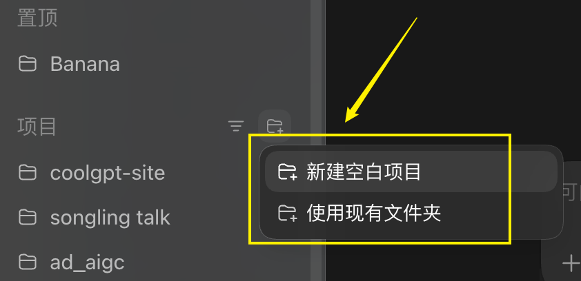
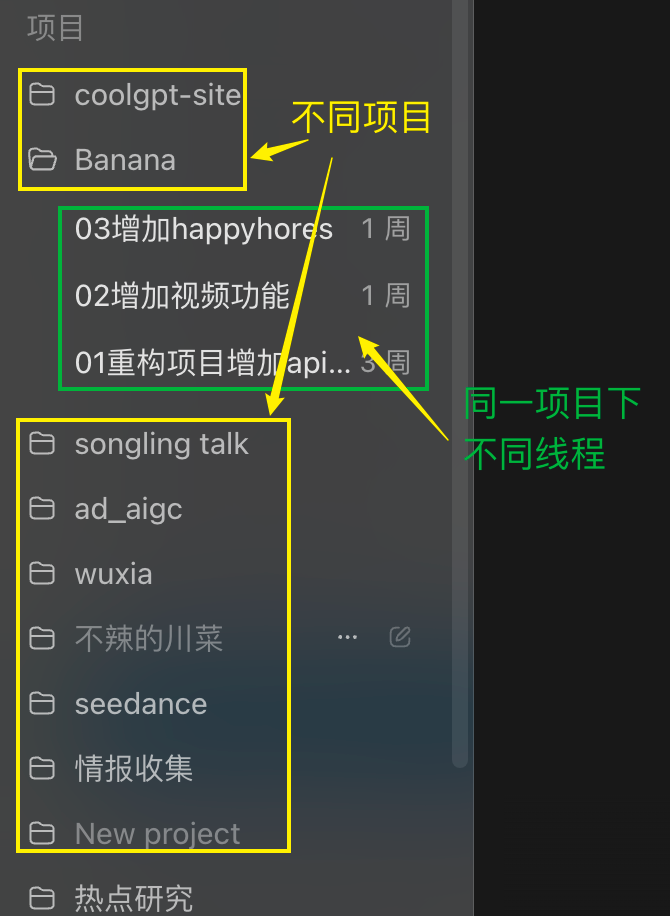
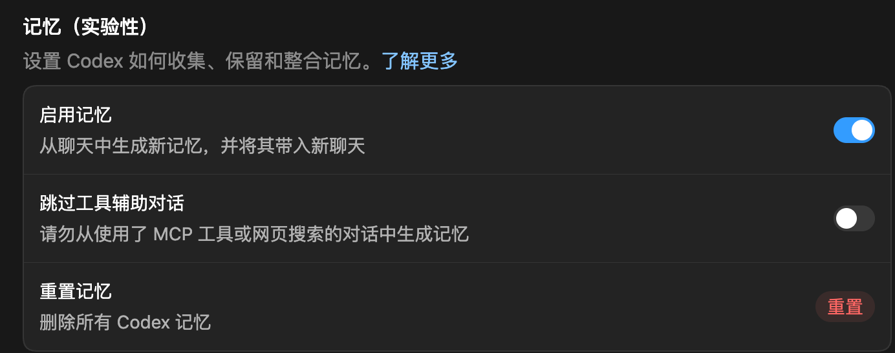

# 08 Codex 项目与对话：新手怎么管理项目和线程

刚开始用 Codex 时，很多人会把“项目”和“对话”混在一起。

项目和对话，是非常容易被人忽视，但绝对是用好codex的重要概念。


## 适合谁

这篇适合刚装好 Codex，但还不太清楚这些问题的新手：

- 新建项目时为什么要选择电脑上的文件夹
- 一个项目和一条对话有什么区别
- 同一个项目下为什么可以有多个线程
- 项目记忆在哪里打开
- 删除项目后，本地文件会不会一起消失

## 项目和对话有什么区别

Codex 的对话分两层：

| 层级 | 可以怎么理解 | 适合放什么 |
|---|---|---|
| 项目 | 一个独立的工作空间 | 一个网站、一个工具、一个软件项目 |
| 对话 | 项目下面的一次对话 | 修一个问题、加一个功能、整理一篇文章 |

简单说：**一个项目下面，可以有多个线程。**

比如你在做一个名叫 `banana` 的项目，可以开三个线程：

- 重构项目
- 增加视频模型功能
- 增加 seedance2 模型

它们都属于同一个项目，但每条线程只负责一件相对独立的事。

## 新建项目时为什么要选择文件夹

你每新建一个 Codex 项目，系统都会要求你选择电脑上的一个文件夹。

这个文件夹就是项目的本地工作区。以后所有与这个项目相关的文件、代码、图片、文档，通常都会放到这个文件夹里。

{#screenshot}

新手可以按这个原则选择文件夹：

- 一个网站，单独建一个文件夹
- 一个工具，单独建一个文件夹
- 一个自动化流程，单独建一个文件夹
- 不要把多个无关项目混在同一个文件夹里

这样做的好处是，Codex 能更容易理解当前项目的范围，也不容易误改无关文件。

## 什么时候新建项目，什么时候新开线程

判断方法很简单：

**如果你要做的是一个新的东西，就新建项目。**

比如：

- 做一个公司官网
- 做一个数据整理工具
- 做一个小游戏
- 做一个自动生成 PPT 的流程

**如果你还在同一个项目里，只是要做一件新任务，就新开线程。**

比如：

- 修改首页样式
- 增加一个按钮
- 修复一个报错
- 整理一篇新文章

{#screenshot}

这样做有一个好处：每条线程都比较干净，不会把太多无关信息塞进同一次对话里。

比如，我要给系统加一个留言功能，我可以开一个对话，专门讨论留言。在项目结束前，所有与留言有关的开发我都放在这个对话中。

## 项目记忆是什么

项目记忆可以让同一个项目下的不同线程共享一些背景信息。

比如你在一个项目里反复告诉 Codex：

- 这个网站叫 52codex
- 读者是不会编程的新手
- 文章要写得清楚、实用、教程化
- 图片要放到文章同目录的 assets 文件夹

如果打开了记忆，Codex 后面在同项目的新线程里，就更容易沿用这些规则。

设置路径是：

```text
设置 -> 个性化 -> 记忆
```

{#screenshot}

## 怎么让 Codex 更懂这个项目

项目记忆有帮助，但更稳定的方式是把项目规则写进文件。

如果是软件项目，建议准备一个 `AGENTS.md` 文件，用来告诉 Codex：

- 项目是做什么的
- 要遵守什么规范
- 哪些文件可以改，哪些文件不要动
- 构建命令是什么
- 文章、图片、代码分别放在哪里
- 输出风格有什么要求

这样 Codex 每次进入项目时，都能先读规则，再动手做事。

这个文件，可以让ai帮你写，首选claude，次选gpt，gemini，国产中推荐deepseek

::: tip Prompt
请先阅读当前项目的 AGENTS.md，理解这个项目的目录结构、文章规范、禁止事项和构建方式。

接下来只在本次任务相关文件里修改，不要重命名或删除其他文章文件。完成后运行构建命令，并告诉我是否通过。
:::

## 项目删除后，本地文件还在吗

在 Codex 里删除一个项目，并不等于把你电脑里的项目文件夹也删掉。

也就是说：

- Codex 里的项目入口会被移除，但搜索按钮能够搜索到
- 本地文件通常仍然保存在你的电脑上
- 后面仍然可以通过 Codex 的搜索找到相关文件
- 如果你想彻底删除文件，需要在电脑文件管理器里删除对应文件夹

所以，新手不用太害怕点错删除项目。真正重要的是：你要知道项目文件夹放在哪里。

## 常见问题

### 一个项目可以同时开多少个对话（线程）

可以开多条。建议一条线程只做一个相对明确的任务，比如“修改导航栏”“整理第 8 篇文章”“修复构建报错”。

### 每次都在同一个对话里聊可以吗

可以，但不建议一直这样做。任何AI在一条对话的长度是有限的，对话太长以后，历史信息会变多，Codex 更容易被旧任务干扰。

更好的方式是：一个阶段完成后，新任务开新线程。

### 项目文件夹选错了怎么办

如果还没做什么内容，可以直接新建一个项目，选择正确文件夹。

如果已经做了很多内容，先确认文件都在哪里，再决定是否迁移。不要随手删除本地文件夹。

## 下一步推荐阅读

- [Codex 界面全览：对话区、项目区和权限怎么用](/guide/06-interface)
- [AGENTS.md 怎么写？让 Codex 按你的规则做事](/tips/04-agents-md)
- [上手项目1：新建一个贪吃蛇游戏](/cases/02-snake-game)
