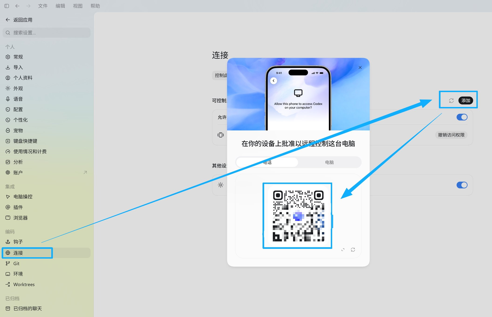

# 09 Codex 怎么连接手机？

手机远程，是把正在运行 Codex 的电脑连到手机上。

电脑跑任务、读文件；你出门后用手机看进度、审批操作。

## 操作步骤

### 1. 电脑端先准备好

打开 ChatGPT 桌面版，进入 Codex，启动一个任务。电脑不能睡眠，网络要正常，Codex 要保持运行。

项目文件、终端、插件和权限都留在电脑上，手机只是远程查看和管理，所以电脑需要保持在线。

### 2. 在电脑端开启远程

进入「设置 → 连接」，点击「添加」，按提示生成二维码，见图 1。

手机和主机需要一对一配对，登录同一账号后，也要完成配对才能接管。

{#screenshot}

### 3. 手机上扫码连接

更新 ChatGPT App，用和电脑相同的账号登录，打开「Codex」或「远程」页面，扫描电脑上的二维码，按提示完成连接。

 

看不到任务时，先检查手机和桌面 App 是否更新、账号是否一致、电脑是否在线。

### 4. 手机上能做什么？

可以看任务进度、终端输出、文件改动和测试结果；也能回复问题、补充需求、调整方向、审批操作。

 

它卡在两个方案之间时，你可以在手机上告诉它怎么继续。

### 5. 安全边界要记住

手机远程适合读资料、写文案、排查报错、整理项目和生成代码。

涉及私钥、助记词、钱包授权、转账和大额交易，回到电脑上自己逐步确认。

## 使用感受

电脑在家继续跑项目、做研究、改代码，你在外面也能跟进。

对做 Web3 和自媒体的人，这能减少守在电脑前的时间。

连接入口参考：[OpenAI 远程连接说明](https://learn.chatgpt.com/docs/remote-connections)。

 
