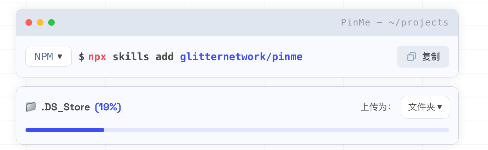
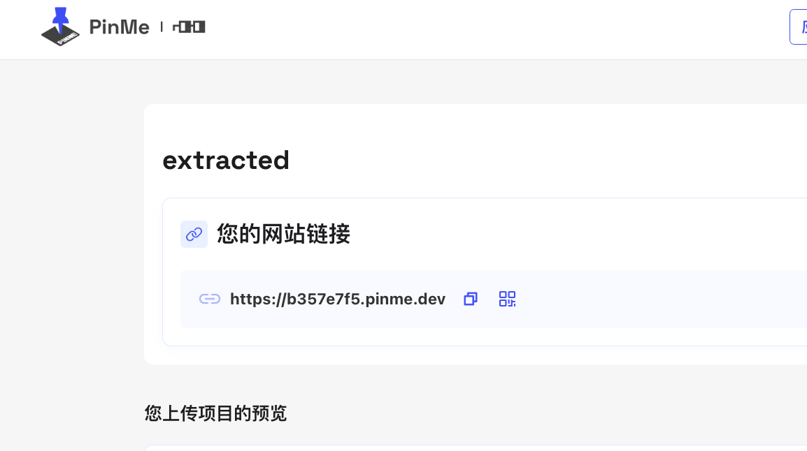

# 16 Codex 项目做完后怎么快速发布到公网

做完项目以后，最好发出来给别人试用。

如果只是本地能打开，别人看不到，也很难帮你体验和反馈。

## 准备工作

本文用到的工具是 Pinme。

简单说，Pinme 是一个静态网页发布工具。它可以把前端静态站点快速发布到公网。

只要你有一个静态站点，就可以尝试：

- 普通 HTML / Tailwind / JS 项目
- Next 导出的静态目录
- 任意构建后的 `dist` 或 `public` 目录

## 操作步骤

### 第 1 步：安装 Pinme

先打开命令行。

Windows 可以按 `Win + R`，输入 `CMD`。

Mac 可以搜索“终端”。

Windows 输入：

```bash
npm install -g pinme
```

Mac 输入：

```bash
sudo npm install -g pinme
```

一般十几秒就能装好。

### 第 2 步：打开 Pinme 网页

打开这个网址：

```text
https://pinme.eth.limo
```

页面需要登录，可以用手机、Google 或 GitHub 账号登录。

{#screenshot}

### 第 3 步：上传做好的网页游戏

Pinme 可以上传单个网页，也可以上传整个目录。

如果你做的是网页游戏，通常把整个项目目录拖到网页里上传。

从本机拖动文件夹到页面上，然后松开。

{#screenshot}

上传过程中会显示进度。

{#screenshot}

### 第 4 步：获取公网域名

上传完成后，Pinme 会分配一个二级域名。

{#screenshot}

点击这个域名，就可以打开刚才做好的游戏。

[https://b357e7f5.pinme.dev](https://b357e7f5.pinme.dev)

也可以扫描二维码，用手机打开同一个网页。

{#screenshot}

手机访问效果如下。

{#screenshot}

## 常见问题

### 上传哪个文件夹？

上传能直接访问网页入口的目录。

如果是普通网页项目，通常需要有 `index.html`。

如果是前端项目，通常上传构建后的 `dist` 或 `public` 目录。

### 为什么别人打开后看不到页面？

优先检查入口文件是不是 `index.html`。

还要确认图片、CSS、JS 路径没有指向本机绝对路径。

可以让 Codex 先帮你检查：

::: tip Prompt
请检查这个静态网页项目是否适合发布到公网。确认入口文件、图片、CSS、JS 路径是否正确，并指出需要修改的地方。
:::

### 能不能绑定自己的域名？

可以。

懂技术的话，可以申请自己的域名，再转发到 Pinme 分配的网址。

这一步涉及域名和转发设置，感兴趣可以单独研究。
