# Codex 如何接入第三方 API？手把手配置国产和中转模型

Codex 很适合让懂业务、有想法的人，把脑子里的工具做出来。

但很多新手会卡在两个问题上：

1. 没法稳定登录 GPT 官网，能不能用国内模型？
2. Plus 额度不够用，能不能用中转站里的 GPT 或 Claude？

直接手动改配置文件也能做，但对新手不友好。`config.toml` 写错一个字母就可能不生效，有些方案还会影响插件功能。

这篇讲一个更顺手的方案：用 Codex++ 做图形化配置，把第三方 API 接进 Codex。

## 适合谁

- 没法稳定登录 GPT 官网的人
- Plus 额度不够，想接中转或国内模型的人
- 不想手写配置文件的人
- 想尽量保留插件功能的人
- 能自己准备 API Key 的人

## 先说清楚风险

Codex++ 是第三方开源项目，不是 OpenAI 官方产品。接入国内模型或中转站，也会涉及第三方 API Key、模型兼容性和服务稳定性。

建议你注意三件事：

- 不要把重要账号密码发给不可信服务
- API Key 只填到你信任的工具和供应商里
- 如果项目涉及公司代码、客户数据或敏感资料，先确认公司安全要求

这篇只讲配置流程，不替任何第三方供应商背书。

## 准备工作

你需要先准备好：

- 已安装 Codex 桌面软件
- 一个可用的第三方 API Key
- 对应供应商的 Base URL
- Mac 或 Windows 电脑

Codex 官方下载入口：

[https://chatgpt.com/zh-Hans-CN/codex/get-started/](https://chatgpt.com/zh-Hans-CN/codex/get-started/)

如果你还没注册账号，可以先看：

- [GPT 注册与订阅](/guide/04-register)
- [Codex 下载安装](/guide/05-install)

## 第 1 步：安装 Codex++

Codex++ 是 BigPizzaV3 开发的开源项目，定位是 Codex App 的外部增强工具。

项目地址：

[https://github.com/BigPizzaV3/CodexPlusPlus](https://github.com/BigPizzaV3/CodexPlusPlus)

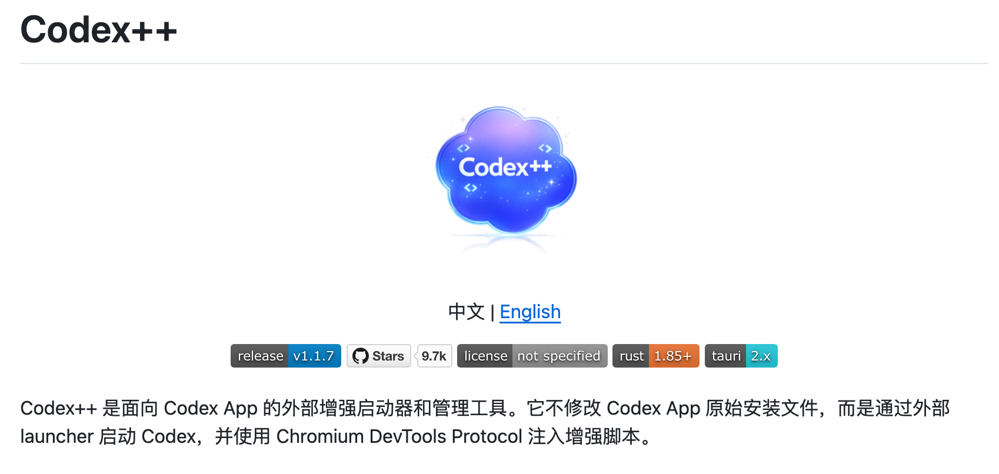{#screenshot}

进入 GitHub 项目后，打开 Releases 下载页面。

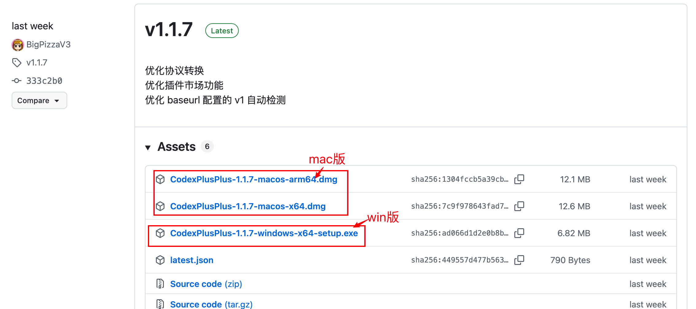{#screenshot}

选择版本时按这个规则：

| 系统 | 怎么选 |
|---|---|
| Windows | 下载 `.exe` 文件 |
| Mac，M1/M2/M3/M4 | 下载 `arm64.dmg` 文件 |
| Mac，Intel 老款 | 下载 `x64.dmg` 文件 |

如果你不确定自己的 Mac 是什么芯片，可以点左上角苹果菜单，进入“关于本机”查看。

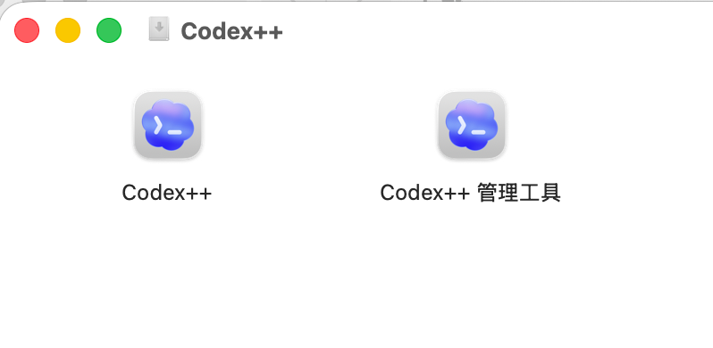{#screenshot}

Mac 用户下载 `.dmg` 后，双击打开，把里面两个 App 都拖进“应用程序”文件夹：

- Codex++
- Codex++ 管理工具

安装后，先打开“Codex++ 管理工具”。

## 第 2 步：解决 Mac 安全提示

Windows 用户可以跳过这一节。

Codex++ 是开源小众工具，如果没有经过苹果公证，Mac 第一次打开时可能会提示“无法验证开发者”。

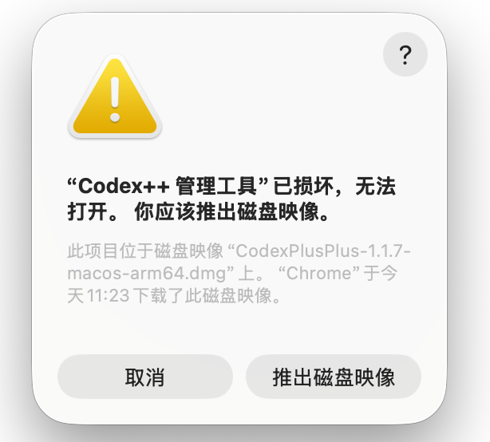{#screenshot}

### 方法 1：从系统设置里仍要打开

首次打开弹出安全提示后，进入：

```text
系统设置 -> 隐私与安全性 -> 仍要打开
```

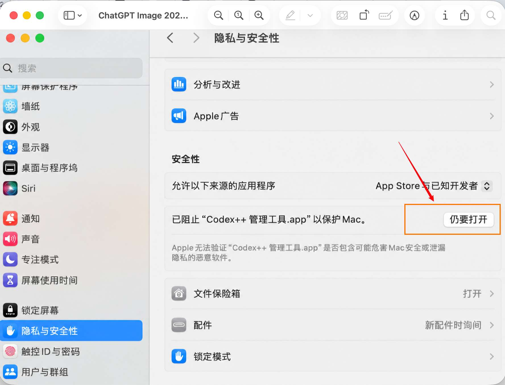{#screenshot}

### 方法 2：用命令移除隔离标记

如果方法 1 不生效，可以打开 Mac 终端，运行：

```bash
sudo xattr -rd com.apple.quarantine "/Applications/Codex++.app"
sudo xattr -rd com.apple.quarantine "/Applications/Codex++ 管理工具.app"
```

### 方法 3：让 Codex 帮你安装

如果你已经能使用 Codex，也可以把 GitHub 地址发给 Codex，让它帮你下载安装到“应用程序”里。

::: tip Prompt
安装 Codex++，项目地址是 BigPizzaV3/CodexPlusPlus。

请根据我的电脑系统下载合适版本，安装到应用程序目录，并帮我处理 Mac 安全提示。
:::

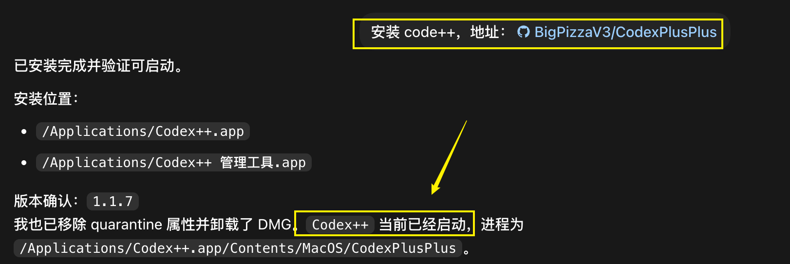{#screenshot}

装好后，在 Mac 的“应用程序”中可以看到两个新图标：

- Codex++ 管理工具：各种增强功能的管理面板
- Codex++：增强后的 Codex 启动入口

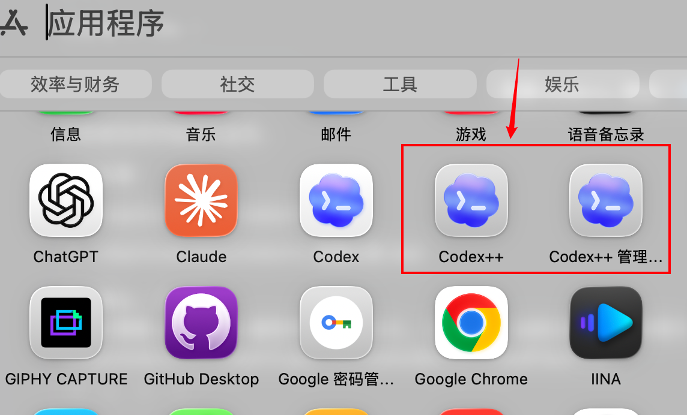{#screenshot}

进入“Codex++ 管理工具”，如果页面上都是绿色状态，说明基础环境正常。

先关闭原生 Codex，再从管理工具里启动 Codex++。

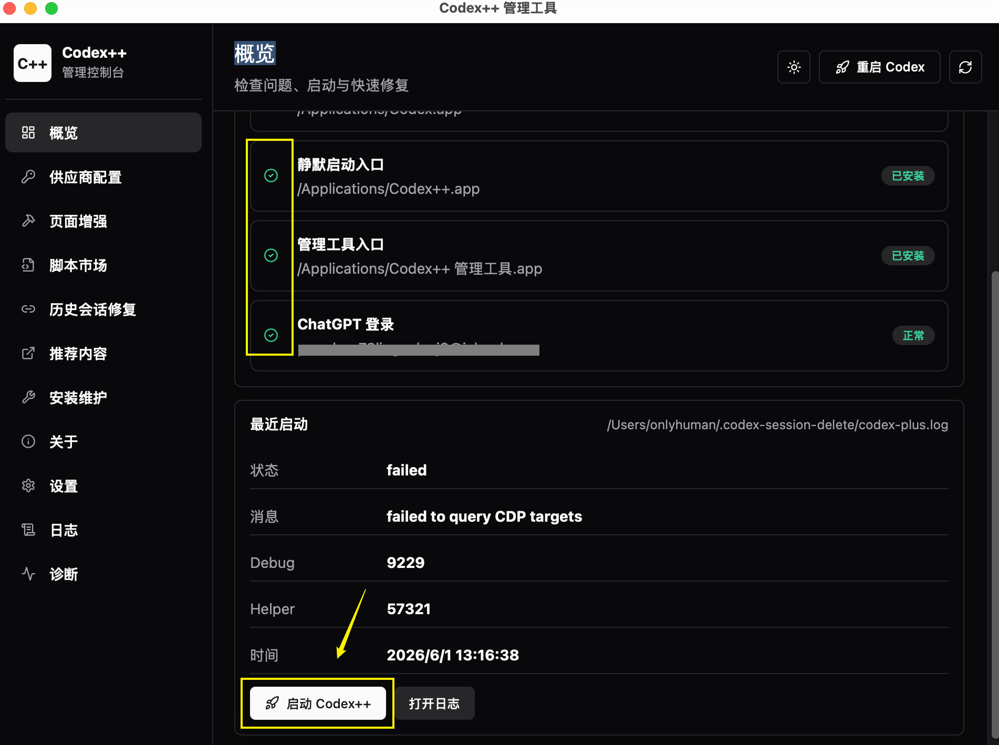{#screenshot}

## 第 3 步：添加模型供应商

在 Codex++ 管理工具里，点击“添加供应商”。

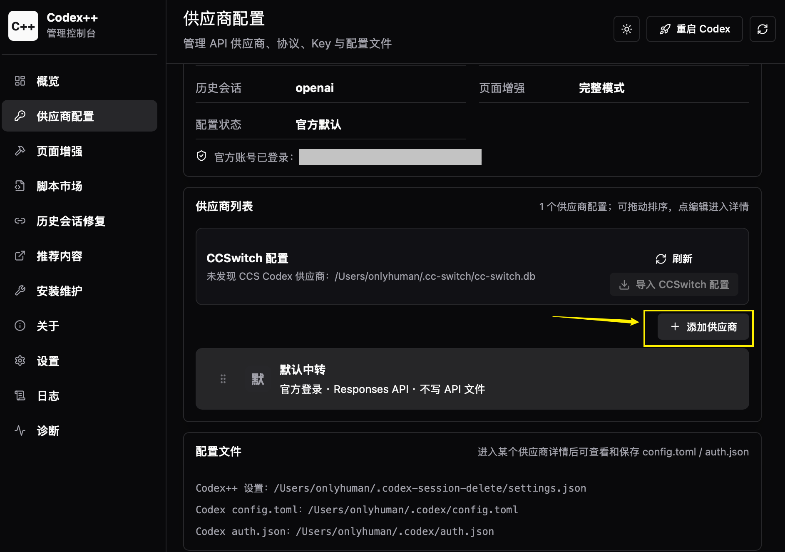{#screenshot}

在供应商页面，填写你的 Base URL 和 API Key。

注意：接入方式选择“纯 API”。

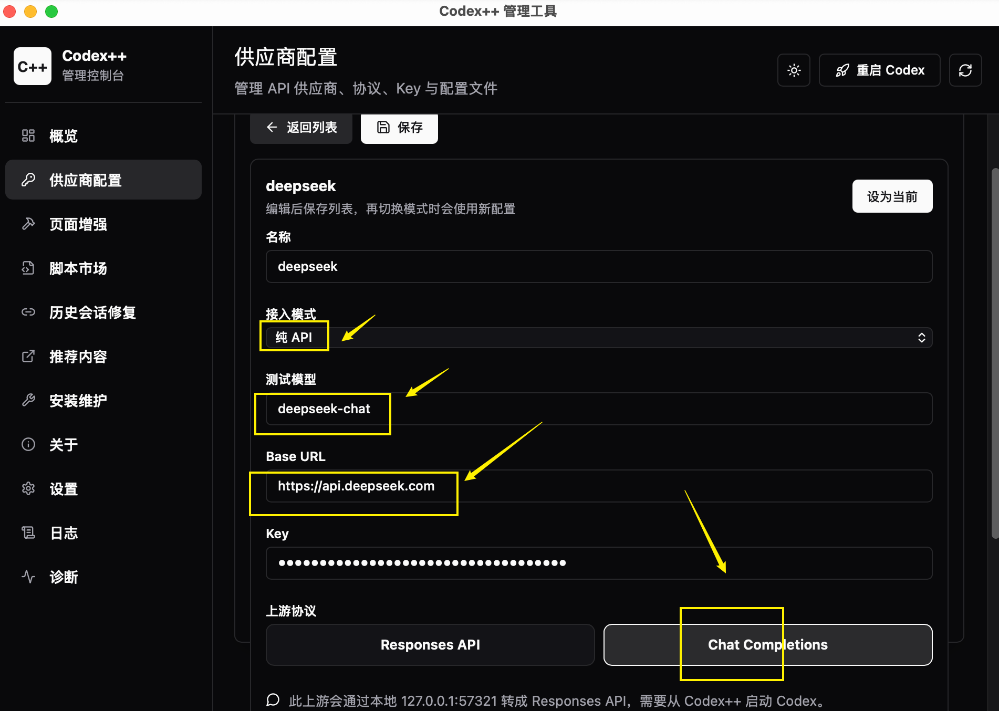{#screenshot}

可以按下面这样填：

| 字段 | 填什么 |
|---|---|
| 供应商名称 | 自己能看懂就行，比如 DeepSeek、OpenRouter、ApiMart |
| 接入方式 | 选择“纯 API” |
| API Key | 你的第三方供应商 Key |
| Base URL | 供应商给你的 API 地址 |

常见 Base URL 示例：

```text
DeepSeek 官网：https://api.deepseek.com
OpenRouter：https://openrouter.ai/api/v1
ApiMart：https://api.apimart.ai/v1
```

不同供应商的格式不完全一样，常见形式是：

```text
https://api.xxx.com
https://api.xxx.com/v1
```

如果测试不通，优先检查 Base URL 有没有多写、少写 `/v1`。

## 第 4 步：测试连通

回到首页，点击“测试”按钮。

显示成功，就说明 API Key 和 Base URL 基本可用。

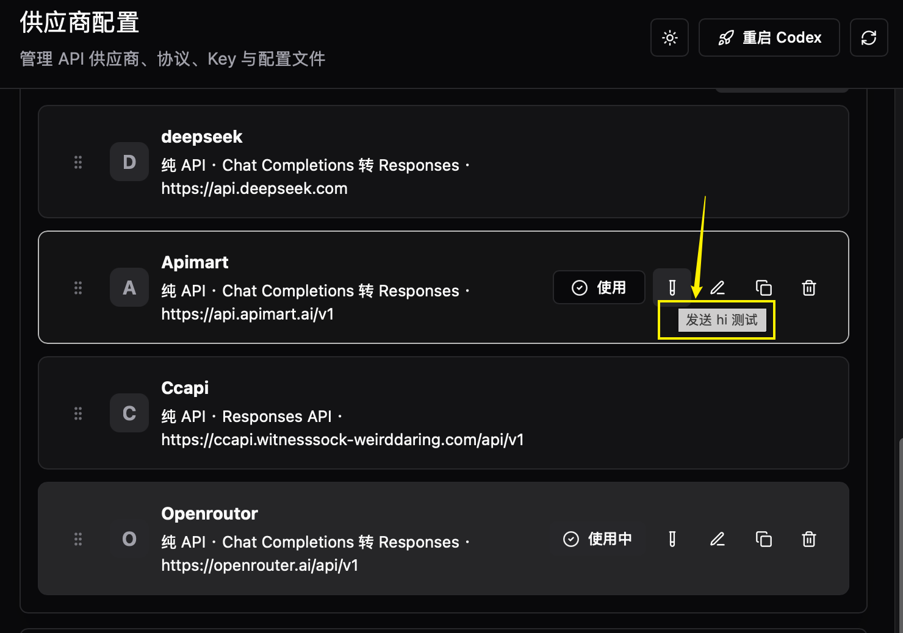{#screenshot}

如果失败，先检查这几项：

- API Key 是否复制完整
- Base URL 是否正确
- 供应商账号是否还有余额
- 当前网络是否能访问这个供应商
- 上游服务是否支持 Codex++ 需要的接口

## 第 5 步：从 Codex++ 启动 Codex

配置好供应商后，不要从原版 Codex 图标启动。

回到“Codex++ 管理工具”，点击启动按钮。

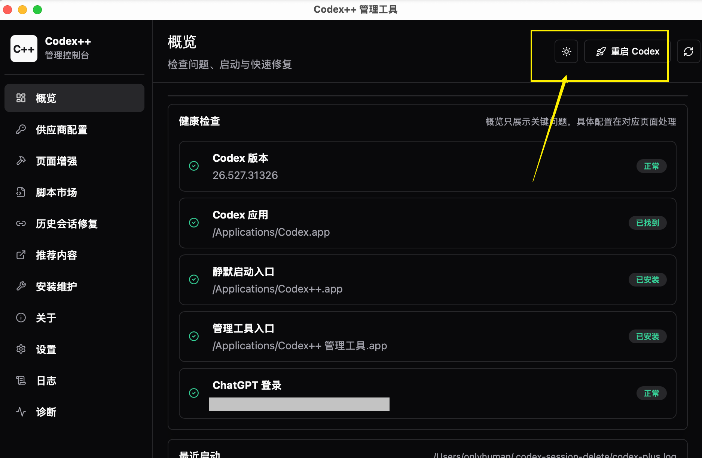{#screenshot}

如果你已经打开了原生 Codex，建议先完全退出，再从 Codex++ 管理工具启动。

## 第 6 步：验证模型是否生效

打开 Codex 后，点击模型下拉菜单。

如果配置成功，你应该能看到自定义模型供应商或对应模型。

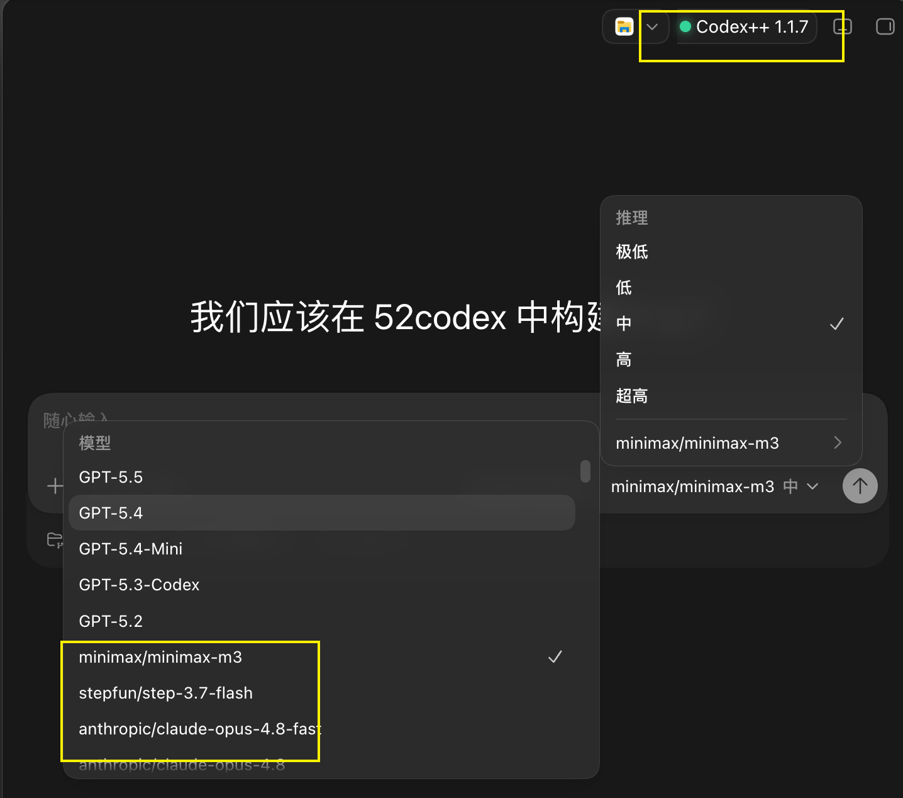{#screenshot}

发一条消息测试，能正常回复，就说明接入成功。

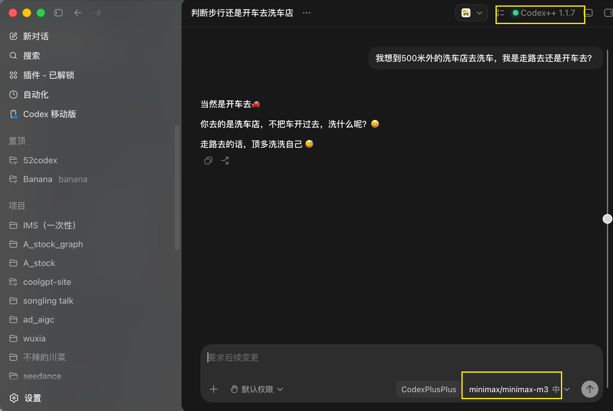{#screenshot}

## 想切回官方模型怎么办

模型配置里默认会有官方模型，接入模式是“官方登录”。

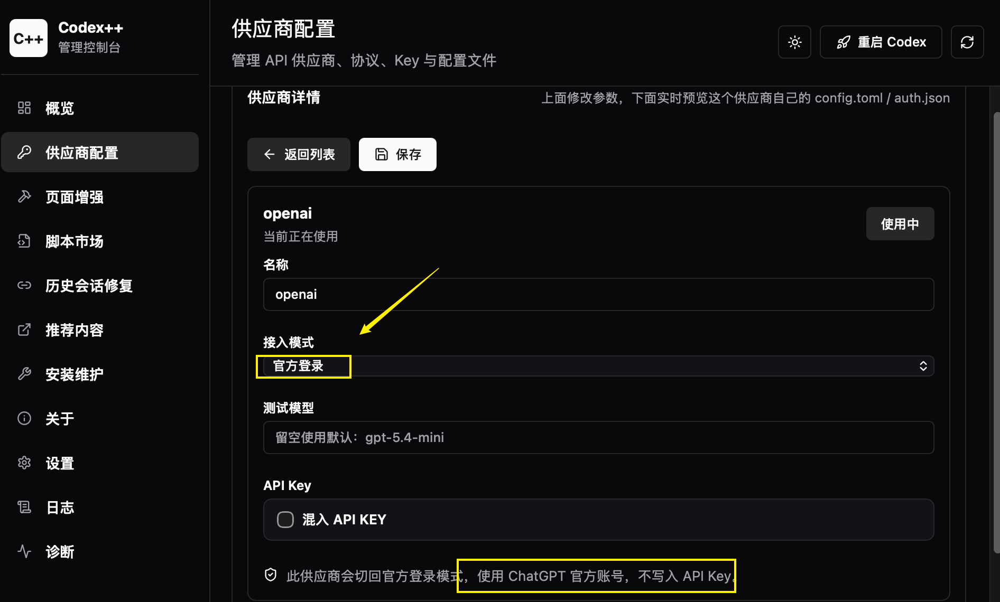{#screenshot}

在模型设置界面点击“使用”，状态变为“使用中”后，重启 Codex。

前提是：你本来就有可用的官方 Plus 或更高套餐。

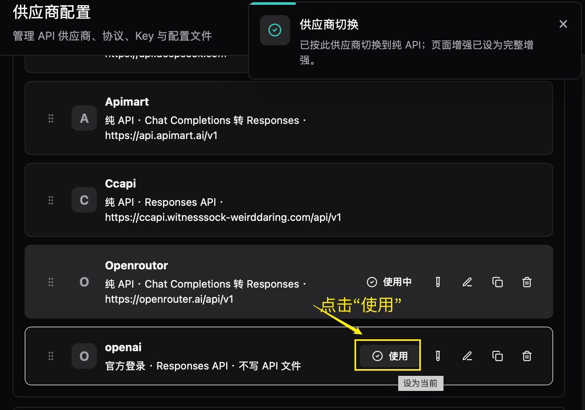{#screenshot}

官方模型和第三方模型可以来回切换，互不影响。

## 常见踩坑

### 管理工具打不开

如果是 Mac，先按第 2 步处理安全提示。

### 测试连通失败

重点检查 Base URL 和 API Key。

很多错误都出在 Base URL 上：有的供应商要 `/v1`，有的供应商不要。

### 模型列表没有变化

先确认你是不是从 Codex++ 管理工具启动的 Codex。

切换配置后，也可以等几分钟，或者完全退出 Codex 再重新打开。

### 插件用不了

检查接入方式是不是选了“纯 API”。

如果你手动改过配置文件，也建议先还原，再用管理工具重新配置。

### 国产模型无响应

确认上游服务是否支持 Codex++ 当前需要的接口。

有些模型能聊天，但不一定完整兼容 Codex 的工作流。

### 还需要稳定网络吗

通常还是需要。否则 Codex 可能无法连接，或者访问第三方供应商失败。

## 可复制检查清单

::: tip Prompt
我正在用 Codex++ 给 Codex 接入第三方 API。

请帮我检查以下内容：
1. Codex++ 是否安装到了正确位置
2. Mac 安全提示是否已经处理
3. 供应商的接入方式是否是“纯 API”
4. Base URL 格式是否正确
5. API Key 是否填写到了正确位置
6. 是否从 Codex++ 管理工具启动了 Codex

如果发现问题，请按风险从高到低列出来，并告诉我下一步怎么改。
:::

## 下一步推荐阅读

- [Codex 下载安装](/guide/05-install)
- [Codex 插件与技能：插件区怎么用](/guide/07-skills-and-plugins)
- [额度怎么省](/tips/08-save-quota)

## 待补充

- 不同中转站的模型名填写规则
- 常见错误提示对应的解决办法
- Windows 安装和安全软件拦截截图
