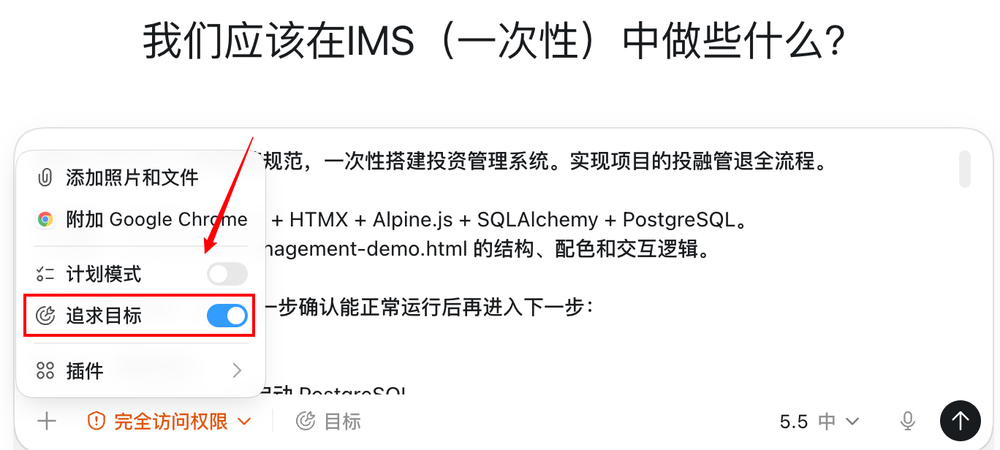

# Codex 的 /goal 怎么用？让它做完长任务

平时让 Codex 做小事，直接说一句就够了。

比如：

- 改一个按钮文案
- 修一个链接
- 写一段说明
- 给文章加一个标题

但有些任务不是一两轮能做完的。

比如：

- 修完所有报错
- 做完一个页面
- 把一批文章改成统一格式
- 给项目补一套基础测试
- 把一个旧功能整理得更清楚

这种任务中间要读文件、改代码、跑构建、再检查。你如果只说“帮我做完”，Codex 很容易做到一半就停，或者不知道什么时候才算完成。

这时可以用 `/goal`。在 Codex App 里，它也可以理解成“目标”。

## 适合谁

这篇适合：

- 经常让 Codex 做长任务的人
- 不想一直手动催“继续”的人
- 不知道怎么告诉 Codex “做到什么算完成”的人
- 想让 Codex 自己按步骤推进、检查和总结的人

如果只是一个很小的修改，不需要用 `/goal`。

## /goal 是什么

普通 Prompt 是让 Codex 做一件事。

`/goal` 是给 Codex 一个更长的目标，让它围绕这个目标持续推进。

重点不是把话写得很长，而是写清楚两件事：

1. 要完成什么。
2. 满足什么条件才可以停止。

第二点最重要。

OpenAI 官方文档也强调，`/goal` 适合围绕可验证的停止条件持续工作。

## 在哪里用

如果你在 Codex App 里，可以在对话框里选择“目标”，然后输入你的目标说明。

{#screenshot}

如果你在 Codex CLI 里，可以直接输入：

```text
/goal 你的目标
```

## 什么时候该用

适合用 `/goal` 的任务，一般有三个特点：

| 特点 | 例子 |
|---|---|
| 任务比较长 | 做完一个页面、修完一批报错 |
| 可以检查结果 | 构建成功、测试通过、页面能打开 |
| 有明确结束条件 | 所有文章都改完、所有链接都更新 |

不适合用 `/goal` 的任务：

- “帮我优化项目”
- “把网站做得更好”
- “随便看看有什么问题”

这些都太模糊。Codex 不知道该做到哪里停。

## 停止条件怎么写

停止条件就是告诉 Codex：

做到什么，才算完成。

不要这样写：

```text
/goal 把这个网站优化好。
```

这句话太空。

可以这样写：

::: tip Prompt
/goal 完成首页实用技巧模块的整理。

只有满足以下条件才停止：
1. 首页能看到所有技巧文章入口
2. 每个入口都能点开
3. 移动端不出现文字溢出
4. npm run build 成功
5. 最后写一段修改总结
:::

这就更清楚。

因为每一条都能检查。

## 一个简单例子

假设你想让 Codex 帮你做完一个“关于我们”页面。

不要只说：

```text
/goal 帮我做一个关于我们页面。
```

更好的写法是：

::: tip Prompt
/goal 完成一个“关于我们”页面。

只有满足以下条件才停止：
1. 页面地址是 /about
2. 页面包含品牌介绍、适合谁、联系方式三个部分
3. 样式和现有网站保持一致
4. 导航里能进入这个页面
5. npm run build 成功
6. 最后告诉我改了哪些文件

如果需要新增图片、改导航结构或引入新依赖，先问我。
:::

这个例子很普通，但很好用。

它告诉 Codex：

- 做什么页面
- 页面里有什么内容
- 怎么验证
- 什么情况要先问你

## 再给两个常用模板

### 修完所有报错

::: tip Prompt
/goal 修完当前项目的构建报错。

只有满足以下条件才停止：
1. npm run build 成功
2. 不删除现有页面
3. 不引入新依赖
4. 最后说明报错原因和修复方式

请先运行构建，找到第一个关键错误，再一步步修。
:::

### 整理一批文章

::: tip Prompt
/goal 把 tips 目录下的文章入口整理好。

只有满足以下条件才停止：
1. 文件名编号和导航编号一致
2. tips/01-index.md 里的链接全部正确
3. 首页实用技巧模块链接全部正确
4. npm run build 成功
5. 最后列出新增或修改的文章

不要改文章正文内容，除非链接需要同步。
:::

## 怎么写才不容易翻车

记住 4 个小原则：

1. 一个 `/goal` 只做一个主任务。
2. 停止条件写 3 到 6 条就够了。
3. 每条停止条件都要能检查。
4. 遇到产品决策、删文件、加依赖，要让 Codex 先问你。

比如这句就太大：

```text
/goal 把整个项目做完。
```

可以拆成：

```text
/goal 完成首页改版。
```

然后下一个目标再写：

```text
/goal 完成文章详情页样式整理。
```

小目标更稳，也更省额度。

## CLI 常用命令

如果你用的是 Codex CLI，常见命令是：

```text
/goal <目标>
```

查看当前目标：

```text
/goal
```

暂停：

```text
/goal pause
```

恢复：

```text
/goal resume
```

清除：

```text
/goal clear
```

如果你看不到 `/goal`，可以尝试开启 goals 功能：

```bash
codex features enable goals
```

## 可复制检查清单

::: tip Prompt
请帮我检查这个 /goal 是否写得清楚。

重点检查：
1. 目标是不是只有一个
2. 停止条件能不能验证
3. 有没有写清楚不能做什么
4. 有没有写清楚什么时候要先问我

如果不够清楚，请帮我改成更简单、更适合 Codex 执行的版本。
:::

## 常见问题

### /goal 会自动把所有事情都做完吗？

不会。

它只是让 Codex 更围绕目标持续工作。目标写得越清楚，效果越好。

### 停止条件要写很多吗？

不用。

3 到 6 条通常就够了。写太多反而会乱。

### 什么情况不要用 /goal？

小修改不要用。

比如改一个标题、补一个链接、调整一句文案，直接说就行。

## 下一步推荐阅读

- [AGENTS.md 怎么写](/tips/04-agents-md)
- [怎么防止 Codex 乱改代码](/tips/06-prevent-bad-edits)
- [Codex 额度怎么省](/tips/08-save-quota)
- [怎么让 Codex 越用越顺手](/tips/02-make-codex-better)

## 参考资料

- [Follow a goal | OpenAI Developers](https://developers.openai.com/codex/use-cases/follow-goals)
- [Slash commands in Codex CLI | OpenAI Developers](https://developers.openai.com/codex/cli/slash-commands)

## 待补充

- 需要补充当前板块的 level 规则。
