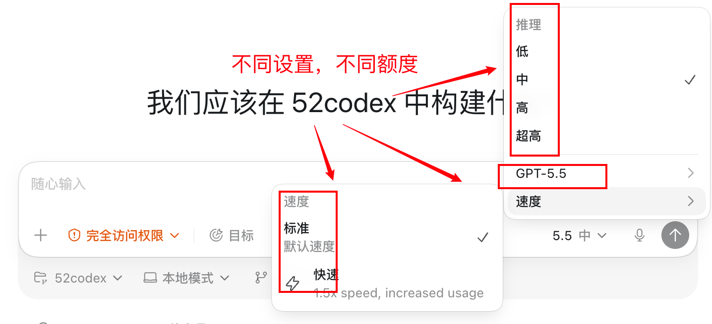

# Codex 额度怎么省？减少 token 消耗的实用方法

Codex 额度不是只看你发了几条消息。

真正影响消耗的，通常是这些因素：

- 使用的模型
- 同一模型下设置的推理能力（低、中、高、非常高）、速度（标准、快）
- 当前会话上下文有多长
- 项目文件和日志有多大
- 任务复杂度有多高
- 是否反复追问、反复试错
- 是否加载了很多 MCP、图片、网页或长输出

简单任务耗得少。大型项目、长会话、整仓库分析、大段日志、反复测试失败，都会让额度消耗变快。

省额度的核心不是少用 Codex，而是少浪费上下文和无效交互。

## 适合谁

这篇适合这几类用户：

- Plus 或 Pro 额度经常不够用
- 做大项目时很快触发用量限制
- 不知道什么时候该新建会话
- AGENTS.md 写得很长，但不确定有没有必要
- 装了很多 MCP，不知道会不会影响上下文
- 想让 Codex 少说废话，多做事情

如果你只是偶尔让 Codex 改一个小文件，不需要过度优化。

## 这篇文章解决什么问题

看完你会知道：

- 哪些行为最容易浪费额度
- Prompt 怎么写更省交互
- 什么时候该新建聊天或压缩上下文
- AGENTS.md 和 MCP 为什么会影响消耗
- 大任务怎么拆才不容易烧额度
- 怎么监控剩余额度

## 先说结论

最有效的省额度方法有 7 个：

1. 对话框设置好模型能力
2.一次把需求说清楚，减少来回确认。
3. 长会话及时压缩或新建，不让旧上下文一直膨胀。
4. AGENTS.md 只写真正必要的规则。
5. MCP 只启用当前任务需要的工具。
6. 简单任务用轻量模型，复杂任务再切强模型。
7. 大任务拆成检查点，不要一次丢给 Codex 全仓库重写。

真正的大头往往不是某一条消息，而是你让 Codex 背着太多旧上下文继续干活。

首先是APP的对话设置

{#screenshot}


## 方法一：Prompt 一次说清楚

很多额度浪费来自反复补充。

比如你先说：

```text
帮我改一下这个页面。
```

Codex 需要猜：

- 改哪个页面？
- 改什么效果？
- 能不能动样式？
- 要不要跑测试？
- 有没有设计规范？

更省额度的写法是：

::: tip Prompt
请修改首页的“实用技巧”模块。

要求：
1. 只改 .vitepress/theme/HomePage.vue 和相关 CSS
2. 不改文章正文
3. 保持 DESIGN.md 的白底、绿色 CTA、克制卡片风格
4. 移动端保持单列，不要文字溢出
5. 改完后运行 npm run build

完成后告诉我改了哪些文件，以及构建是否通过。
:::

这类 Prompt 看起来更长，但它能减少来回追问和返工，总体更省。

## 方法二：长会话及时压缩

会话越长，Codex 需要带着越多历史上下文工作。

如果同一个会话里已经聊了很多轮，尤其包含：

- 长日志
- 大段代码
- 多次失败测试输出
- 多个不相关任务
- 已经完成的旧需求

就应该考虑压缩上下文或新建会话。

可用做法：

- 用 `/compact` 总结上下文
- 开新聊天，只带当前任务需要的信息
- 把关键决定写进项目文件，比如 `AGENTS.md`、`PLAN.md`、`TODO.md`
- 不要把上一个任务的长日志继续留给下一个任务

省额度的关键是：让 Codex 只看当前任务真正需要的内容。

## 方法三：精简 AGENTS.md

AGENTS.md 会成为 Codex 的项目规则。

它很有用，但如果写得太长，也会变成上下文大头。

不建议在 AGENTS.md 里塞这些内容：

- 大段情绪化要求
- 和当前项目无关的通用鸡汤
- 重复的行为规范
- 过时的技术说明
- 很少用到的长模板

更好的写法是：

- 只保留项目结构
- 只写必须遵守的禁区
- 只写当前项目真实使用的构建命令
- 只写核心设计规范入口
- 按目录拆分规则，让 Codex 只加载相关部分

如果你不知道怎么写，可以先看：

- [AGENTS.md 怎么写](/tips/04-agents-md)

## 方法四：少挂不必要的 MCP

MCP 很强，但不是越多越好。

每个 MCP 都可能带来额外工具说明、上下文和调用成本。当前任务不需要的 MCP，可以先关掉。

例如：

| 当前任务 | 建议 |
|---|---|
| 只改 Markdown 文章 | 不需要浏览器自动化 MCP |
| 只改本地样式 | 不需要数据库 MCP |
| 只查项目文件 | 先用本地搜索和文件读取 |
| 需要验 UI | 再打开浏览器相关工具 |

原则是：

先用最小工具完成任务，需要时再打开更重的工具。

## 方法五：简单任务用轻量模型

如果 Codex 支持模型选择，简单任务可以优先使用轻量模型。

适合轻量模型的任务：

- 改标题
- 改链接
- 改少量文案
- 格式化 Markdown
- 补一个简单列表
- 做局部 CSS 调整

更适合强模型的任务：

- 架构迁移
- 大型重构
- 复杂 bug 排查
- 多文件行为保持
- 安全、支付、权限相关修改

不要所有任务都用最强模型。强模型适合难题，简单任务用轻量模型通常更划算。

## 方法六：大任务拆成检查点

大任务最费额度的地方，是 Codex 一次读太多、改太多、错了再大面积返工。

更省的方式是拆成检查点：

1. 先让 Codex 读项目并写计划。
2. 只执行第一个小步骤。
3. 跑局部验证。
4. 没问题再继续下一个步骤。

如果任务很长，可以直接用 `/goal`。

::: tip Prompt
/goal 修复当前项目中所有 failing tests。

只有满足以下条件才停止：
1. 完整测试套件通过
2. npm run build 成功
3. 不改变已有产品行为
4. 每个修复点都有简短说明

执行方式：
- 先运行测试并按根因分类
- 一次只修一个根因
- 每完成一个检查点就运行相关测试

遇到测试预期不明确、需要删除测试、需要改公开 API 时，暂停并问我。
:::

更多 `/goal` 写法可以看：

- [Codex 的 /goal 怎么用](/tips/05-goals)

## 方法七：减少无效输出

Codex 输出越长，也会消耗更多上下文。

你可以在 Prompt 里要求它：

- 简短回复
- 只汇报关键文件
- 不重复解释基础概念
- 不贴完整长日志
- 测试失败时只总结关键错误

例如：

::: tip Prompt
请用简短方式回复。

只告诉我：
1. 改了哪些文件
2. 为什么这样改
3. 验证命令是否通过
4. 还有什么风险

不要重复粘贴完整代码或完整日志。
:::

这不是为了让 Codex 变“冷淡”，而是避免把无关解释变成下一轮上下文负担。

## 方法八：日志先压缩再给 Codex

测试日志、构建日志、报错日志经常很长。

不要把几千行日志直接贴进去。更好的方式是：

- 只贴最后 50 到 100 行
- 只贴失败用例
- 只贴错误堆栈的关键部分
- 先让本地工具过滤关键词

如果你已经拿到一大段日志，可以先让 Codex 做摘要：

::: tip Prompt
请把下面的测试日志压缩成适合继续排查的摘要。

要求：
1. 只保留失败用例名称
2. 只保留关键错误信息
3. 合并重复错误
4. 按可能根因分组
5. 不要输出完整日志
:::

## 方法九：不要重复上传大文件和图片

图片、PDF、大文件、整仓库压缩包都可能增加消耗。

如果只是改一篇文章，不要上传整套截图。

如果只是查一个配置，不要把整个项目打包给 Codex。

更省的做法是：

- 指定具体文件
- 指定具体目录
- 只上传必要截图
- 让 Codex 先搜索，再决定读哪些文件

## 方法十：监控用量

不要等额度用完才看。

你可以在 Codex 设置里的 Usage 或使用量页面查看当前用量和剩余额度。CLI 用户也可以用 `/status` 查看当前状态。

额度用完时，通常有几种选择：

- 等待滚动窗口恢复
- 切换到更轻量的任务
- 购买额外点数或使用更高等级套餐
- 对本地任务使用 API Key，但这会按 API token 单独计费

不同套餐、窗口和额度策略会变化，以 OpenAI 官方帮助中心和 Codex 设置页显示为准。

## 常见问题

### 新建聊天会不会更省？

经常会。

如果旧会话里已经有很多无关上下文，新建聊天只带必要信息，通常更省。

但如果当前任务还没完成，新建聊天前要先总结关键上下文，避免 Codex 重新读一遍项目。

### /compact 什么时候用？

当会话已经很长，但你还想继续同一个任务时，可以用 `/compact`。

它适合把前面的讨论压缩成摘要，让后续上下文更轻。

### AGENTS.md 越详细越好吗？

不是。

AGENTS.md 应该写关键规则，不应该变成一本长手册。太长的 AGENTS.md 会增加上下文负担，也容易让真正重要的规则被淹没。

### Fast 模式要不要一直开？

不建议无脑一直开。

Fast 模式适合你需要更快反馈的时候。是否更耗额度、具体怎么算，要以 Codex 当前设置页和官方说明为准。日常省额度时，优先靠任务拆分、上下文管理和模型选择。

Fast 模式速度是标准的1.5倍，消耗是2倍

## 可复制检查清单

::: tip Prompt
请帮我检查这个 Codex 任务是否会浪费额度。

从以下角度分析：
1. Prompt 是否一次说清楚
2. 是否有太多无关上下文
3. 是否应该新建聊天或 /compact
4. AGENTS.md 是否可能太长
5. 是否启用了不必要的 MCP
6. 是否可以拆成更小的检查点
7. 是否可以用轻量模型完成
8. 日志或文件输入是否可以压缩

请先列出最浪费额度的 3 个点，再给我一个更省额度的执行方案。
:::

## 下一步推荐阅读

- [Codex 的 /goal 怎么用](/tips/05-goals)
- [AGENTS.md 怎么写](/tips/04-agents-md)
- [怎么防止 Codex 乱改代码](/tips/08-prevent-bad-edits)
- [Codex 如何接入第三方 API](/tips/03-codex-third-party-api)

## 参考资料

- [OpenAI Help Center: Codex usage limits](https://help.openai.com/en/articles/11369540-codex-in-chatgpt)
- [Slash commands in Codex CLI | OpenAI Developers](https://developers.openai.com/codex/cli/slash-commands)

 
