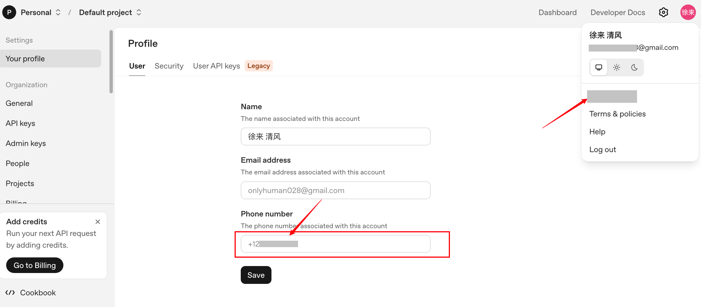

# Codex 手机验证刷屏了怎么办？SMS、WhatsApp 和长期手机号方案整理

今天 Codex 手机验证问题刷屏了。

OpenAI 突然加强风控，OAuth 登录 Codex 时，可能强制要求 SMS 或 WhatsApp 验证码。

很多以前用接码号注册的账号，直接卡住。

## 先说结论

如果是主力账号，不要再依赖一次性接码平台（帮你接各种手机短信验证的平台，会给你一个临时电话号码，用1次或者几天救回收回）。

OpenAI 目前不支持更换账号绑定手机号。一旦旧号码收不到码，Codex OAuth 很可能直接卡死。

官方帮助页也说明，账号绑定手机号不能自行更换。

更稳妥的长期方案是：

**可长期接码的真实海外手机号**

一次性接码平台可以救急，但不适合主力号。

已经绑定失效号码的老号，风险最大。

## 适合谁

这篇适合这几类人：

- Codex 登录时被要求 SMS 验证
- Codex 登录时被要求 WhatsApp 验证
- 以前用过接码平台注册 OpenAI 账号
- 账号已经有 Plus、Pro、Team 或重要项目
- 想提前给主力账号准备长期可用手机号

如果你还没遇到验证，也建议先看一遍风险。

## 先检查账号绑定手机号

你可以先去 [OpenAI Platform](https://platform.openai.com) 的 profile 页面检查账号是否绑定了旧手机号。

{#screenshot}

如果绑定号码已经无法收码，不建议继续给这个账号开 Plus、Pro 或 Team。

原因很简单：

账号越重要，旧手机号失效带来的风险越大。

如果旧号已经无法控制，后续一旦触发二次验证，可能很难补救。

来源：

- [Vincent Yang](https://x.com/m1ssuo/status/2061757466770370594)
- [0xFun](https://x.com/0xFunX/status/2061760118656844247)

## 方案一：准备长期可用的海外真实运营商手机号

长期最稳的方案，是准备真实运营商手机号。

到京东买，关键字 英国卡，gg卡等。gifgaff已经被屏蔽。

例如：

- 英国 Giffgaff
- 美国 Ultra Mobile 紫卡

重点不是这一次接到码，而是未来二次验证还能继续收到码。

适合：

- 主力账号
- Plus / Pro 账号
- API 账号
- 长期使用 Codex 的账号

不适合：

- 只想临时测试的小号
- 不愿意维护实体卡的人

来源：

- [0xFun](https://x.com/0xFunX/status/2061736995035250923)
- [离谱](https://x.com/LipuAIX/status/2051970463405089273)

## 方案二：Giffgaff + WhatsApp 接码

另一种做法是用 Giffgaff 号码注册 WhatsApp。

然后在 OpenAI 安全设置里开启 Text Message。

之后 Codex 验证时，选择 WhatsApp 接收 6 位验证码。

基本流程是：

1. 准备 Giffgaff 号码。
2. 用这个号码注册 WhatsApp。
3. 进入 OpenAI 安全设置。
4. 开启 Text Message。
5. Codex 验证时选择 WhatsApp。
6. 在 WhatsApp 里收 6 位验证码。

来源：

- [算岛](https://x.com/suandao_island/status/2061762804752023694)
- [S.dvucii](https://x.com/sdvucii/status/2045015048675074513)

## 方案三：接码平台Hero-SMS 选择 WhatsApp 服务

如果用 接码平台Hero-SMS（https://hero-sms.com），不要只盯着 OpenAI 服务。

原帖里提到，有人建议选择 WhatsApp 服务。

原因是：Codex 验证码可能通过 WhatsApp 发送。

大致流程是：

1. 在 Hero-SMS 选择 WhatsApp 服务。
2. 购买可用号码。
3. 用接到码的号码注册或登录 WhatsApp。
4. 回到 Codex 验证。
5. 选择 WhatsApp 收码。

这个方案仍然偏临时。

如果是主力账号，不建议长期依赖。

来源：

- [sui yi](https://x.com/suiyi929580/status/2056288539688808893)
- [贝贝](https://x.com/sankenainai/status/2056993844470890498)

## 方案四：开启 Google Authenticator 或二步验证

有人反馈，开启 Authenticator 后可以减少手机号验证。

但这个方法有争议。

需要注意：Codex OAuth 的 SMS / WhatsApp 验证，不一定能被 Authenticator 或高级安全设置绕过。

也就是说，Authenticator 可以增强账号安全，但不要把它当成万能解法。

更稳的做法是同时准备：

- Authenticator
- Passkey
- Recovery Codes
- 可长期接码的真实手机号

来源：

- [贝贝](https://x.com/sankenainai/status/2056993844470890498)
- [Jason Young](https://x.com/Jason_Young1231/status/2061709730792575266)
- [Vincent Yang](https://x.com/m1ssuo/status/2061757466770370594)

## 方案五：优化 IP 画像

原帖整理到一个判断：触发验证可能和 IP 画像有关。

常见风险包括：

- 数据中心 IP
- 共享代理
- 频繁跨区
- 请求密度异常

可以尝试固定干净出口。

但这不是保证通过验证的办法，只是降低触发风控的概率。

来源：

- [skyvpn](https://x.com/skyvpn_me/status/2051972198827712964)

## 方案六：准备 API Key 作为备份

API Key 登录可以作为紧急备份。

但要注意：走 API Key 通常是 API 计费，不共享 Plus / Pro 的消息额度。

它更适合临时救急，不适合替代正常账号登录。

适合：

- 临时恢复工作
- 需要继续跑项目
- Codex OAuth 暂时卡住

不适合：

- 想继续使用 Plus / Pro 额度的人
- 不清楚 API 计费方式的人

## 操作注意事项

### 不要把主力号绑到一次性号码

一次性接码平台最大的问题，不是能不能收到第一次验证码。

真正的问题是：以后还能不能收到第二次。

如果已经绑定了，按方法二准备后手

### 不要频繁切换网络和地区

频繁跨区、共享代理、数据中心 IP，都可能让账号画像变差。

如果账号重要，尽量使用稳定、干净的网络出口。

### 不要继续给高风险老号充值

如果旧手机号已经失效，不建议继续给这个账号开 Plus、Pro 或 Team。

先解决账号可恢复性，再继续投入。

### 不要在对话里泄露敏感信息

不要把 API Key、密码、恢复码、验证码发给别人。

让 Codex 帮你分析方案可以，但不要贴完整密钥。

## 可复制检查清单

::: tip Prompt
我现在的 Codex/OpenAI 账号可能会遇到 SMS 或 WhatsApp 二次验证。

请帮我按风险从高到低检查：
1. 这个账号是否是主力账号
2. 当前绑定手机号是否还能长期收码
3. 是否已经开启 Authenticator、Passkey 和 Recovery Codes
4. 当前网络是否可能触发风控
5. 是否需要准备真实海外运营商手机号
6. API Key 是否只能作为临时备份

请先判断风险，再给出处理顺序。
:::

## 常见问题

### 接码平台还能不能用？

可以救急，但不适合主力账号。

它最大的问题是号码不可长期控制。

### Giffgaff 一定能解决吗？

不一定。

Giffgaff 的优势是号码可以长期控制，但是否触发验证、是否通过验证，还会受账号状态和风控影响。

### Authenticator 能绕过手机号验证吗？

不一定。

它能提升账号安全，但 Codex OAuth 的 SMS / WhatsApp 验证不一定会因此消失。

### 已经绑定失效手机号怎么办？

先检查账号安全设置和 OpenAI Platform profile。

如果号码无法收码，不建议继续把这个账号当主力投入。

已经投入按照方法一、方法二做准备

## 下一步推荐阅读

- [ChatGPT/Codex 手机号二次验证怎么办](/tips/07-chatgpt-codex-phone-verification)
- [Giffgaff 境外卡激活教程](/tips/11-giffgaff-activation)
- [Codex 如何接入第三方 API](/tips/03-codex-third-party-api)
- [额度怎么省](/tips/06-save-quota)

## 参考资料

- 原帖：[蓝天 | bluesky：Codex 手机验证问题整理](https://x.com/blueskylh1/status/2061767233974726673)
- OpenAI 帮助中心：[Phone number verification](https://help.openai.com/en/articles/8983040)
