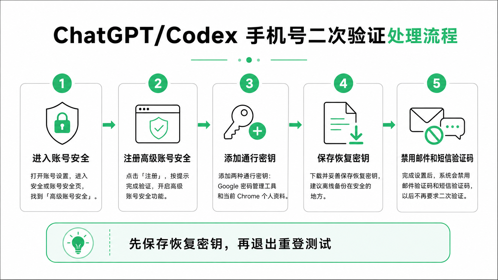

# ChatGPT/Codex 手机号二次验证怎么办？用高级账号安全减少短信依赖

有些用户用 ChatGPT 或 Codex 时，会遇到一个麻烦：

登录时突然要求手机号验证。以前用接码平台验证过，后面又被要求二次验证，但原来的手机号已经找不回来了。

这时不要急着注销账号，也不要继续随便买接码号。可以先了解一个官方设置：高级账号安全。

OpenAI 帮助中心说明，高级账号安全开启后，会使用通行密钥或安全密钥登录，并禁用邮件和短信登录验证码。但它也有更严格的恢复要求，如果恢复密钥和登录方法都丢了，账号可能无法恢复。

{#screenshot}

## 适合谁

这篇适合这几类人：

- ChatGPT 或 Codex 登录时反复要求手机号验证
- 以前用过临时手机号，现在手机号找不回来了
- 想减少邮件验证码、短信验证码的登录依赖
- 愿意使用通行密钥或硬件安全密钥
- 能认真保存恢复密钥

如果你只是偶尔收到一次验证码，不一定需要马上开启高级账号安全。

## 这篇文章解决什么问题

看完你会知道：

- 高级账号安全大概是什么
- 它为什么能减少短信验证码依赖
- 开启前必须注意哪些风险
- 设置时大概会经历哪些步骤
- 恢复密钥为什么一定要保存好

这不是绕过验证的办法，而是把账号登录方式升级为更强的安全方式。

## 先说清楚风险

高级账号安全不是普通开关。

开启以后，账号登录和恢复方式都会变化。根据 OpenAI 帮助中心说明，开启高级账号安全后：

- 通行密钥或安全密钥会用于登录
- 密码登录会被禁用
- 邮件和短信登录验证码会被禁用
- 邮件账号恢复会被禁用
- 初始设置后会退出所有设备，需要重新登录
- 活跃会话时间可能变短，之后可能更频繁地重新登录

最重要的是：恢复密钥一定要保存好。

如果你丢了所有通行密钥、安全密钥和恢复密钥，账号可能无法恢复。OpenAI Support 可以解释可用选项，但在高级账号安全开启时，不能像普通账号那样直接帮你重置密码或移除高级账号安全。

## 准备工作

开始前，建议准备好：

- 一个可以正常登录的 ChatGPT 账号
- 至少两种安全登录方式
- 其中至少一种能跨设备使用的登录方式
- 一个安全保存恢复密钥的位置

安全登录方式可以包括：

- 通行密钥
- FIDO 兼容安全密钥
- 硬件安全密钥

如果你只在一台设备上保存了一个通行密钥，可能不满足要求。设置页面会提示你是否需要继续添加。

## 操作步骤

### 第 1 步：进入安全设置

打开 ChatGPT 网页端，进入账号设置。

一般路径是：

1. 打开 ChatGPT。
2. 进入 Settings。
3. 选择 Security。
4. 找到 Advanced Account Security。

如果你在 Security 里看不到 Advanced Account Security，说明这个功能当前可能不适用于你的账号或地区。

### 第 2 步：注册高级账号安全

在 Advanced Account Security 里点击 Enroll 或 Register。

移动端用户可能会被引导到浏览器里完成设置。按页面提示继续。

### 第 3 步：完成身份验证

系统可能会要求你重新验证当前账号。

你可以根据页面提供的方式完成验证，比如：

- 邮件验证码
- 已有验证器
- 已有通行密钥

不同账号看到的验证方式可能不一样，以页面实际显示为准。

### 第 4 步：添加第一种安全登录方式

进入设置页后，先添加第一种安全登录方式。

原帖里选择的是通行密钥，并使用 Google 密码管理工具创建。你也可以根据自己的设备选择其他支持的方式。

这里不要随便点过。

确认你知道这个通行密钥保存在哪里，也确认以后换设备时还能使用。

### 第 5 步：添加第二种安全登录方式

高级账号安全通常要求至少两种安全登录方式，并且至少一种要能跨设备使用。

原帖里添加了两种通行密钥：

- Google 密码管理工具
- 当前 Chrome 个人资料

你也可以选择安全密钥、另一个设备上的通行密钥，或者页面支持的其他方式。

### 第 6 步：保存恢复密钥

这是最重要的一步。

页面会让你下载或保存恢复密钥。不要只点继续，一定要确认自己真的保存了。

建议至少保存到两个安全位置：

- 一个密码管理器
- 一个离线备份位置

不要把恢复密钥随手发到聊天软件，也不要放在别人能访问的共享文档里。

### 第 7 步：完成设置并重新登录测试

确认恢复密钥已经保存后，再继续完成设置。

完成后，高级账号安全会生效。根据官方说明，初始设置后账号会退出所有设备，你需要用通行密钥或安全密钥重新登录。

建议立刻测试一次：

1. 退出当前账号。
2. 重新登录 ChatGPT。
3. 确认可以用通行密钥或安全密钥登录。
4. 确认不再依赖原来的短信验证码。

如果测试失败，不要急着删除旧登录方式，先回到安全设置里检查。

## 可复制检查清单

::: tip Prompt
我准备给 ChatGPT/Codex 账号开启高级账号安全。

请帮我按风险从高到低检查：
1. 我是否准备了至少两种安全登录方式
2. 是否至少有一种登录方式可以跨设备使用
3. 恢复密钥是否已经保存到安全位置
4. 开启后邮件和短信验证码被禁用会带来什么影响
5. 如果我换电脑或手机，是否还能登录
6. 如果我丢失通行密钥，是否还能用恢复密钥找回

请不要直接让我操作，先列出我需要确认的事项。
:::

## 常见问题

### 这是不是绕过手机号验证？

不是。

这是把账号登录方式升级为高级账号安全。开启后，账号会改用通行密钥或安全密钥登录，并禁用邮件和短信登录验证码。

### 所有账号都能开启吗？

不一定。

OpenAI 帮助中心说明，高级账号安全适用于符合条件的个人 ChatGPT 账号。如果你在 Settings > Security 里看不到这个选项，说明当前账号可能暂不可用。

企业账号、企业托管账号或企业托管域名关联账号可能不支持。

### 开启后还能用密码登录吗？

高级账号安全开启期间，密码登录会被禁用。

你需要使用通行密钥或安全密钥登录。

### 恢复密钥有什么用？

如果你丢失通行密钥或安全密钥，恢复密钥可以帮助你启动账号恢复。

但恢复密钥不是无限次使用。官方说明中提到，每个恢复密钥只能使用一次。如果恢复密钥丢失，或者怀疑别人拿到了，需要及时替换。

### 开启后可以关闭吗？

可以。

OpenAI 帮助中心说明，高级账号安全可以在 Settings > Security > Advanced Account Security 中关闭。关闭后，账号会恢复标准登录和恢复设置。

## 下一步推荐阅读

- [GPT 注册与订阅](/guide/04-register)
- [Codex 下载安装](/guide/05-install)
- [Codex 如何接入第三方 API](/tips/03-codex-third-party-api)
- [额度怎么省](/tips/08-save-quota)

## 参考资料

- [Advanced Account Security | OpenAI Help Center](https://help.openai.com/nl-nl/articles/20001221-advanced-account-security)
- [Passkeys to Secure Your OpenAI Account | OpenAI Help Center](https://help.openai.com/en/articles/20001039-passkeys-to-secure-your-openai-account)

