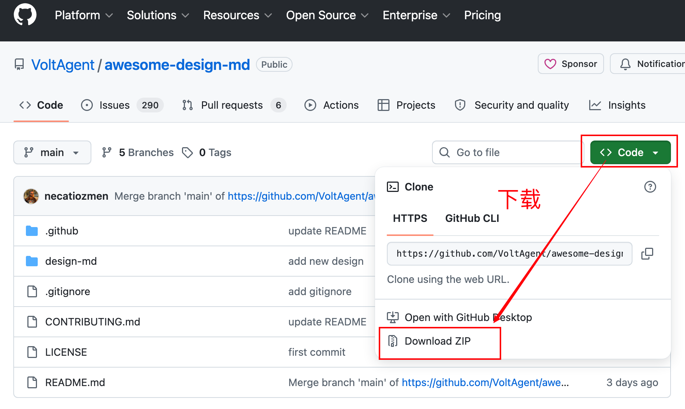
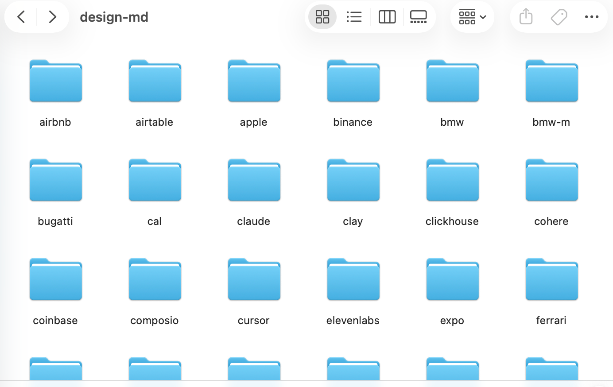
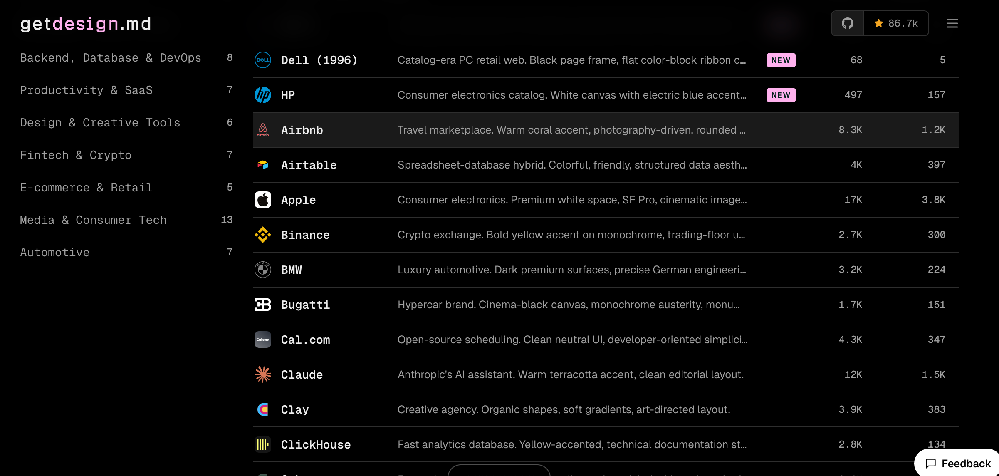
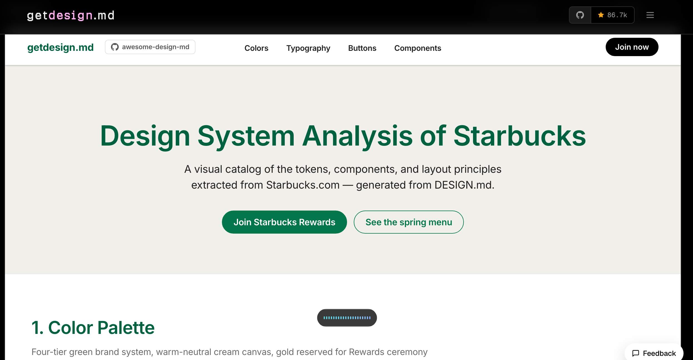
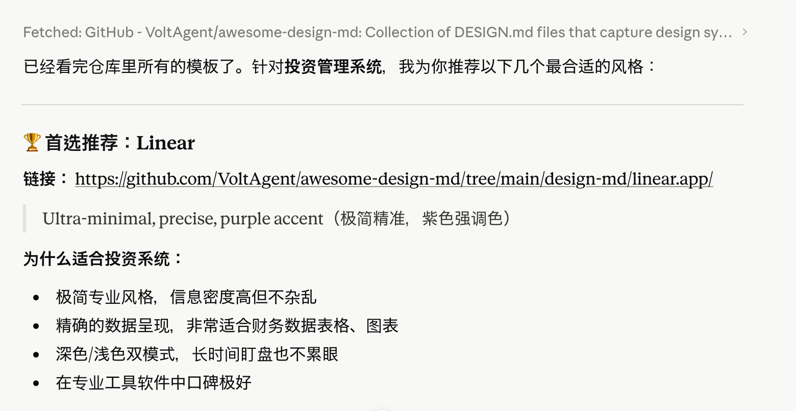
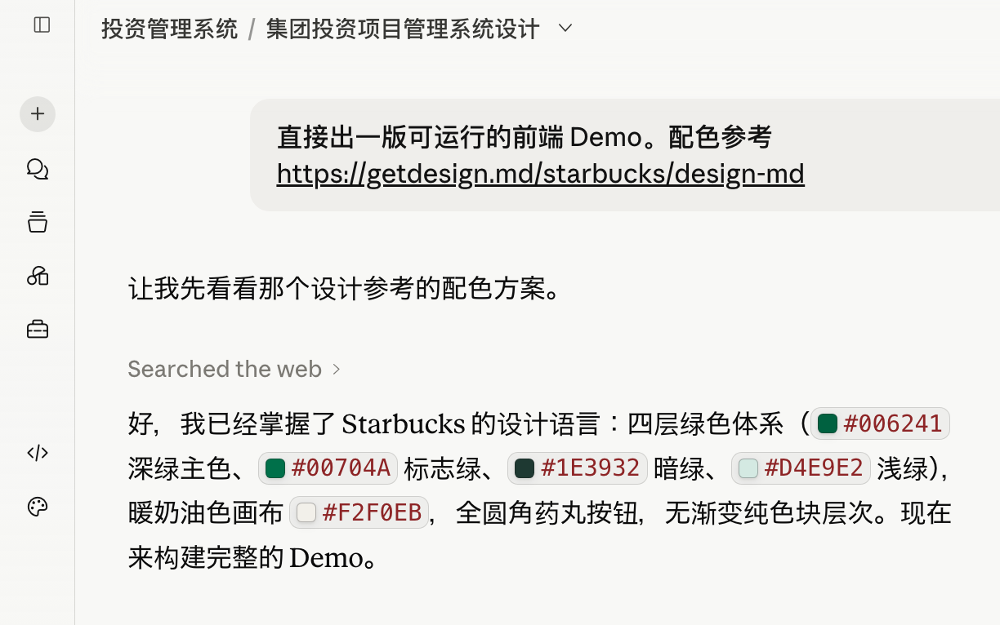
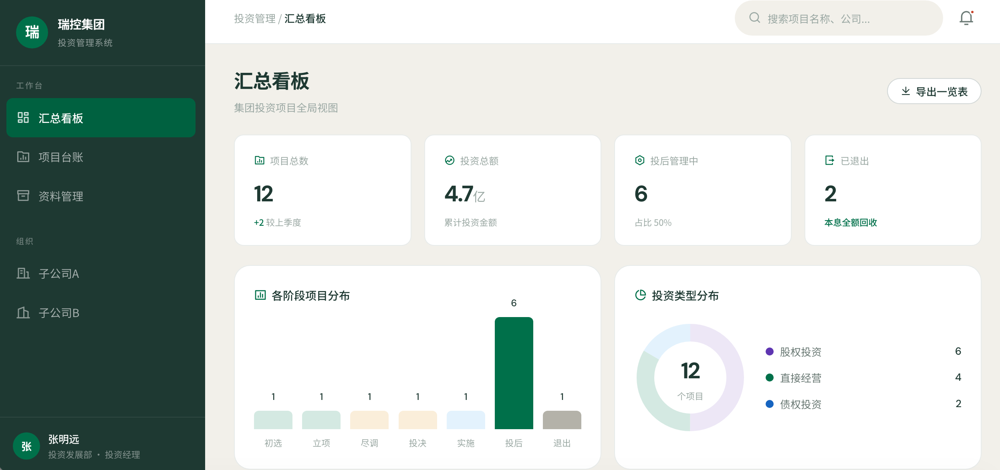
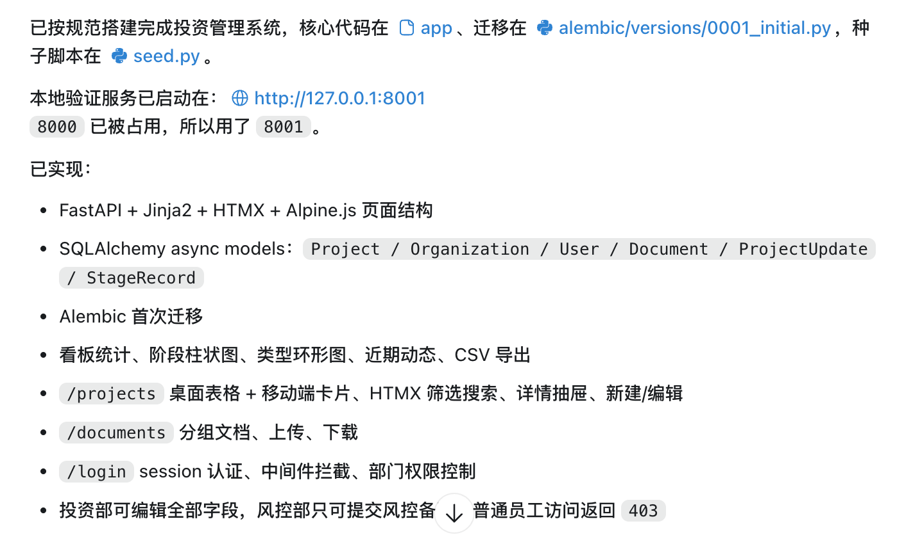
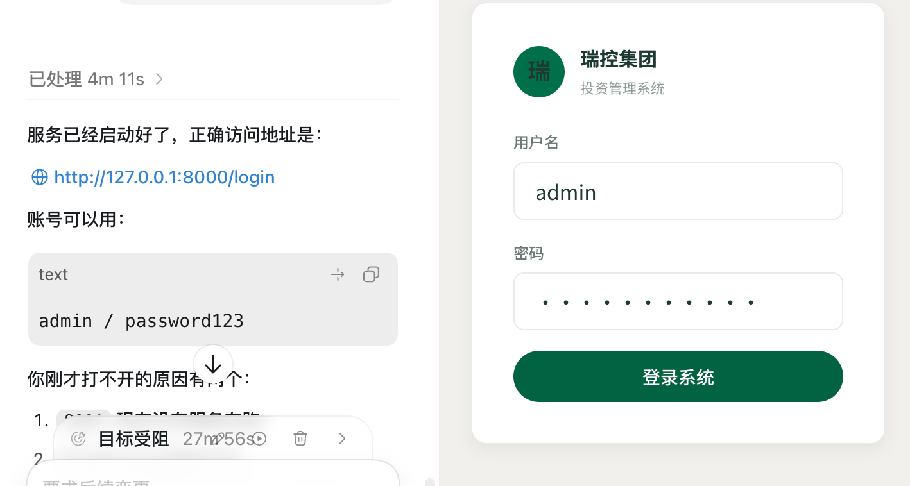
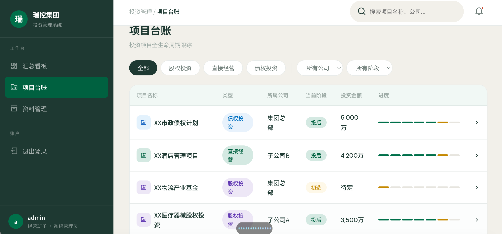

# 如何提升 Codex 的设计美感？

Codex 气质偏理科，做页面时，最常见的问题不是“完全做不出来”，而是“能用，但不好看”，钢铁直男风格。

**情况：有对标网站/产品**

最简单，把产品界面或链接发给codex，让它复刻即可。

**情况：无对标**

办法有两个：

第一，找一个有设计感的AI如claude 做前端，做好后丢给codex做后端

第二，DESIGN.md 管住界面风格


两种方法可以混用，把DESIGN.md先给claude，然后前端成果丢给codex

**为什么说“高级一点的风格”提示词无效?**

这类问题，很多时候不是 Codex 不会设计，而是你只告诉它“做得高级一点”“参考某某风格”，却没有告诉它具体规则。

更稳定的做法，是给项目准备一份 `DESIGN.md`。

核心思路是：把成熟品牌的设计系统整理成 Markdown 文件，放进项目根目录，让 AI 按明确的配色、字体、组件、间距和设计语言生成界面。

坏消息，做起来很麻烦，好消息，已经有人帮大家做过整理了！

相关项目可以参考 [VoltAgent/awesome-design-md](https://github.com/VoltAgent/awesome-design-md)。截至 2026-06-02，该仓库页面显示约 86.6k stars，里面收集了多种品牌风格的 DESIGN.md 示例。

## 适合谁

这篇文章适合：

- 用 Codex 做网站、后台、工具页面，但总觉得界面不够好看的人
- 不会设计，又想让页面有统一视觉风格的人
- 已经有参考网站，但不知道怎么让 Codex 稳定复刻感觉的人
- 经常让 Codex 改 UI，却越改越乱的人
- 想把个人审美沉淀成长期项目规则的人

 
## 一、DESIGN.md 是什么

`DESIGN.md` 可以理解为写给 AI 看的设计说明书。

它不负责告诉 Codex 怎么写代码，而是告诉 Codex：

- 页面应该给人什么感觉
- 主色、辅助色、背景色怎么用
- 标题、正文、按钮文字分别多大
- 卡片、按钮、输入框、导航应该长什么样
- 间距、圆角、阴影、分割线怎么控制
- 移动端应该如何收缩
- 哪些设计做法不能出现

简单说：

```text
AGENTS.md = 告诉 Codex 怎么工作
DESIGN.md = 告诉 Codex 页面应该长什么样
```

如果你只写 AGENTS.md，Codex 可能知道不要乱改文件，但不一定知道你的审美。

如果你补一份 DESIGN.md，它就有机会在每次改 UI 时保持同一套视觉规则。

## 二、为什么一句“做得高级点”不够

“高级”“简洁”“有设计感”这类词，对人有感觉，对 AI 太模糊。

Codex 可能会把它理解成：

- 加渐变
- 加大圆角
- 加很多卡片
- 加阴影
- 加动效
- 用大标题撑场面

结果页面看起来热闹了，但不一定更专业。

更好的描述方式是把审美拆成具体规则。


## 三、如何使用现成的 DESIGN.md

如果你不知道从哪里开始，可以先参考现成设计系统。

例如 `awesome-design-md` 这类集合会把一些成熟网站的风格拆成 DESIGN.md，包括颜色、字体、组件、布局和 Prompt 指引。

下载模板地址：https://github.com/VoltAgent/awesome-design-md




下载到本机如下：


每个文件夹就是一个设计风格，想用哪个拷贝到codex项目根目录即可

风格参考地址：https://getdesign.md



想看哪个点哪个，点开星巴克风格，如下：





使用时建议分三步。

### 第 1 步：先选接近业务的风格

不要只看品牌名。

更重要的是看你的项目类型：

- 做支付、SaaS、开发者工具，可以参考 Stripe、Linear、Vercel、Supabase 这类风格
- 做内容站，可以参考更阅读友好的文档、媒体、知识库风格
- 做后台管理，不要套用过于营销化的首页风格
- 做个人作品集，可以参考更轻量、更有展示感的风格

风格要服务业务，而不是为了“像某个大牌”。

搞不懂可以让AI推荐





### 第 2 步：让AI复刻前端


提示词：直接出一版可运行的前端 Demo。配色参考 https://getdesign.md/starbucks/design-md



claude做了出来





### 第 3 步：让 Codex 完善后端

把claued 做的前端，angent.md,design.md 一起发给codex。

用了30分钟，codex完成编写



运行在本地看看，第一个就是登陆




可以看到，所有界面，保持了风格的统一




 

## 常见问题

### DESIGN.md 能不能替代设计师？

不能简单这么理解。

DESIGN.md 更像一份设计规则说明，可以让 Codex 少犯低级视觉错误，让页面更统一。

但真正的产品判断、信息架构、业务优先级、用户体验取舍，仍然需要人来决定。

### 可以直接照搬大品牌 DESIGN.md 吗？

可以

更合理的做法是学习它的设计秩序，再改成自己的项目规则。尤其不要照搬品牌名称、商标、专属文案和强识别视觉元素。

### 为什么我用了 DESIGN.md，页面还是不好看？

常见原因有三个：

- DESIGN.md 太空泛，只写了“高级、简洁、有质感”
- 页面本身信息结构混乱，样式救不了内容
- 每次修改只改局部，没有检查全局一致性

可以先让 Codex 做一次设计审查，再集中修。

::: tip Prompt
请基于 DESIGN.md 对当前页面做一次设计审查。重点找出影响美感的前 10 个问题，并按“必须修改 / 建议修改 / 可以暂缓”分类。
:::

## 下一步推荐阅读

- [如何让 Codex 越用越顺手](/tips/02-make-codex-better)
- [AGENTS.md 怎么写](/tips/04-agents-md)
- [Codex 的 /goal 怎么用](/tips/05-goals)
- [如何让 Codex 不断进化](/tips/09-self-evolution)
