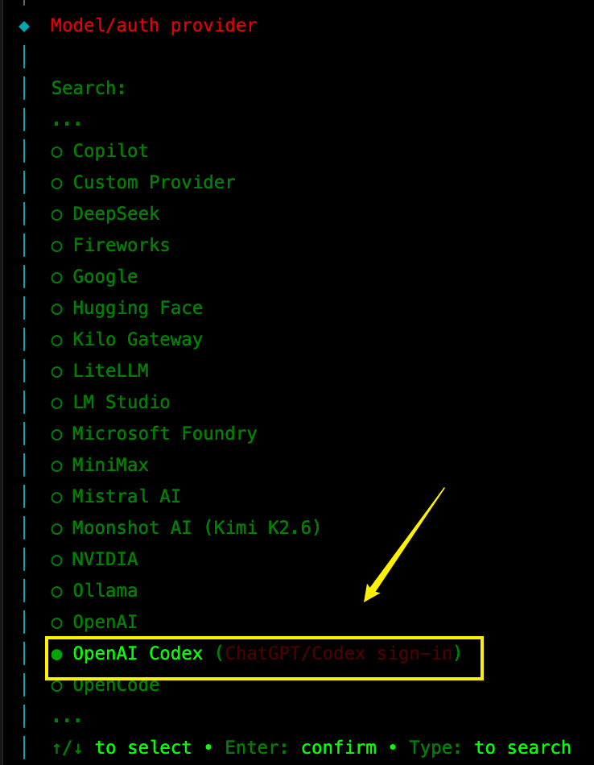
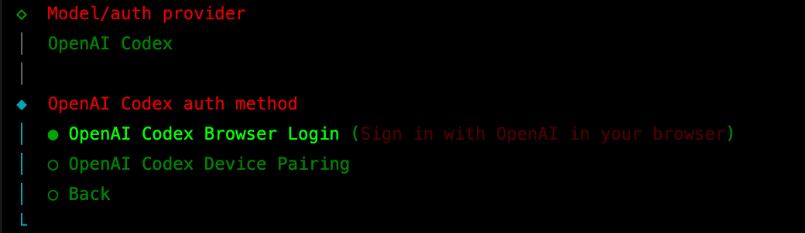
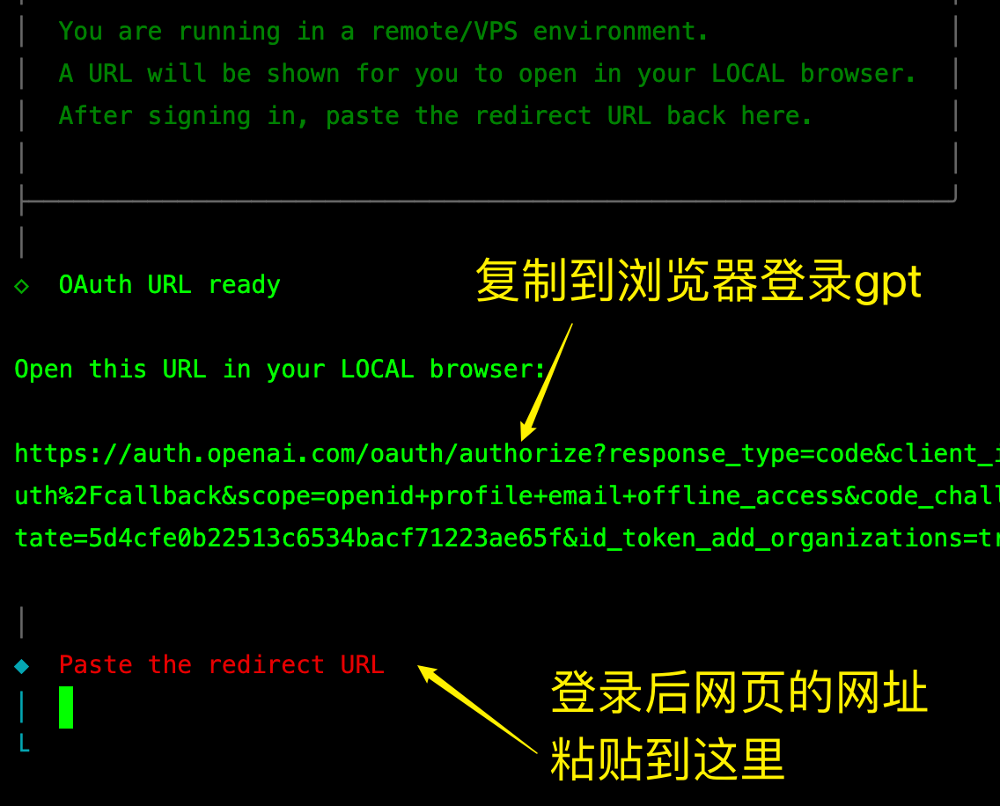
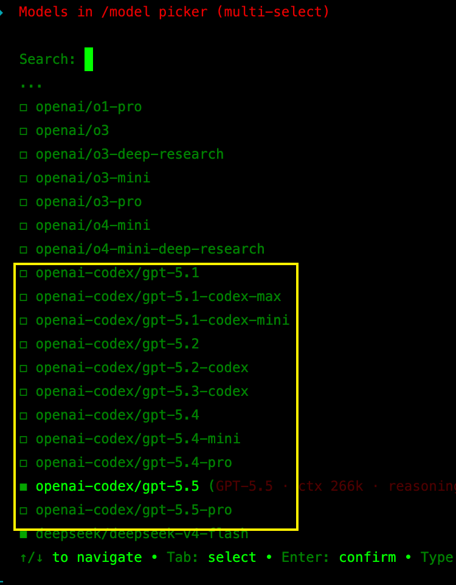
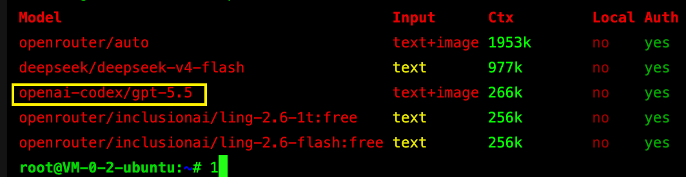
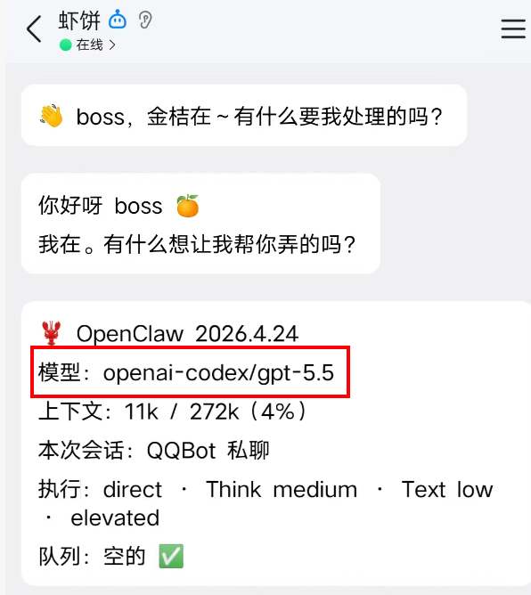
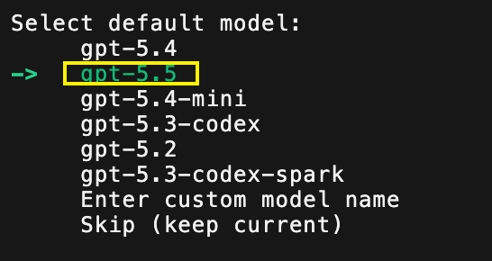

# 怎么用Codex养龙虾(OpenClaw)

老虾农都知道，OpenClaw 要发挥好，作为大脑的AI大模型很重要。

模型选得好，效果就像澳洲大龙虾；模型选得差，就容易变成地沟小龙虾。

但顶级模型通常不便宜。

就算使用一些常见模型，每天也可能产生几十到上百元成本。长期使用时，模型费用会变成主要开销。

现在有一个更省钱的办法：把你的 ChatGPT Plus 或 Pro 账号，通过 OpenClaw 自带的验证流程，接入为 OpenClaw 可用的 Codex 模型。

首先声明，openai公司官方允许将codex 转成openclaw的 底座模型

## 准备工作

你需要先准备：

- 已安装 OpenClaw
- 一个可正常登录的 ChatGPT Plus 或 Pro 账号
- 能打开 OpenClaw 终端
- 已经了解 OpenClaw 的基础安装流程

## 第 1 步：进入模型配置

在已经安装好的 OpenClaw 终端里输入：

```bash
openclaw config
```

进入配置后，选择：

```text
local -> model
```

也可以理解为：进入 OpenClaw 的模型配置页面。

## 第 2 步：选择 ChatGPT OAuth

在模型配置里，找到 OpenAI 相关选项。

选择：

```text
OpenAI Codex (ChatGPT OAuth)
```

{#screenshot}

接着选择第一个：

```text
OpenAI Codex Browser Login
```

{#screenshot}

## 第 3 步：用 ChatGPT 账号验证

OpenClaw 会弹出一个网址。

打开这个网址，用你的 ChatGPT 账号完成验证。

验证完成后，把验证后的页面内容贴回 OpenClaw。

如果中途出现报错，但页面已经给出验证结果，可以按原流程继续粘贴回去。

{#screenshot}

注意：只走 OpenClaw 自带的 OAuth 流程，不要把账号密码交给不明页面。

## 第 4 步：查看可用模型

回到 OpenClaw 命令行，输入：

```bash
openclaw models list
```

如果验证成功，可以看到一批 Codex 相关模型。

{#screenshot}

再输入一次模型列表命令，确认当前已有模型：

```bash
openclaw models list
```

{#screenshot}

## 第 5 步：设置默认模型

如果 GPT 不是当前默认模型，可以用下面命令设置：

```bash
openclaw models set <提供商/模型 ID>
```

把 `<提供商/模型 ID>` 换成模型列表里显示的实际 ID。

设置完成后，回到和 OpenClaw 打通的手机 App，输入：

```text
/status
```

查看当前状态。

{#screenshot}

如果状态里显示当前模型是 GPT 相关模型，说明配置已经生效。

## 额度怎么理解

ChatGPT 的普通对话额度和 Codex 额度通常不是一回事。

用 OpenClaw 养龙虾时，消耗的是 Codex 相关额度。重度使用时，可能会影响你在 Codex 里的编程额度。

如果你每天都高频使用，可以考虑单独准备一个 ChatGPT Plus 账号专门给 OpenClaw 用。

一个月百元左右的订阅成本，通常会比额外购买大量模型算力更可控。

## Hermes 也可以类似配置

另一个智能体 Hermes 也支持调用 GPT Codex。

安装 Hermes 后，进入：

```bash
hermes setup
```

在模型列表里可以看到 GPT 相关模型。

{#screenshot}

后面的流程和 OpenClaw 类似，不再展开。

## 常见问题

### 这样会不会封号？

这篇只整理 OpenClaw 自带的 ChatGPT OAuth 配置流程。

是否长期稳定，取决于 OpenClaw 当前版本、ChatGPT 账号状态和 OpenAI 规则变化。

不要把账号密码交给不可信页面，也不要用于违反服务条款的用途。

### 为什么看不到模型？

先检查三件事：

- ChatGPT 账号是否完成验证
- `openclaw models list` 是否能列出模型
- 默认模型是否已经设置到 GPT 相关模型

### 用 Plus 还是 Pro？

轻度使用可以先用 Plus。

如果 OpenClaw 使用频率很高，再考虑 Pro 或单独账号。

不过话说回来，codex 现在功能很强，算力珍贵啊，用来养龙虾，有钱！用mimo它不香吗？