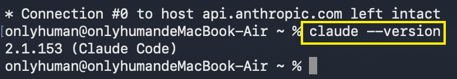
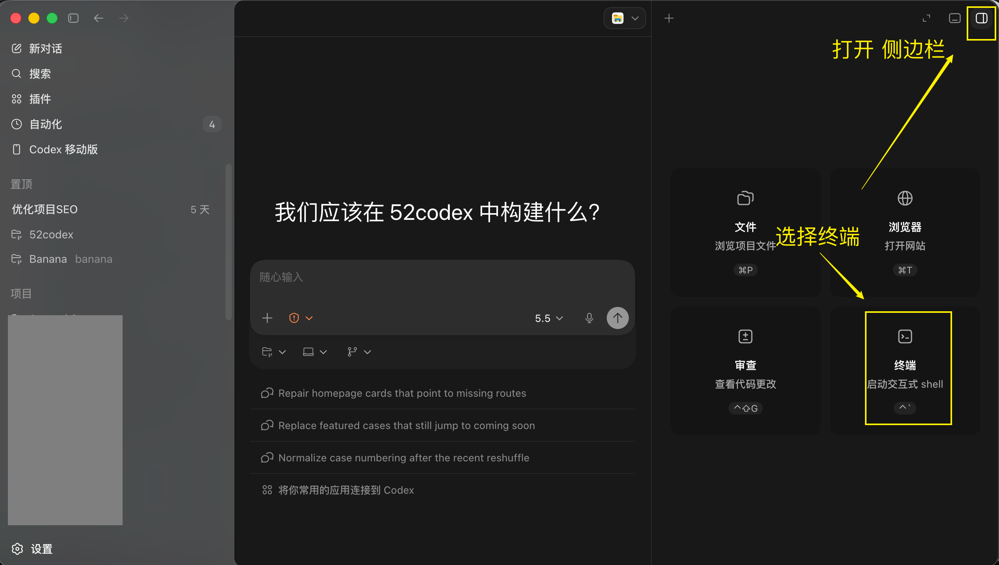
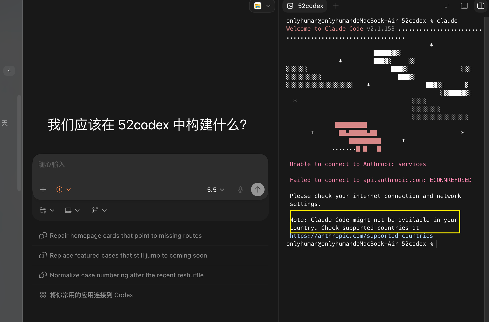
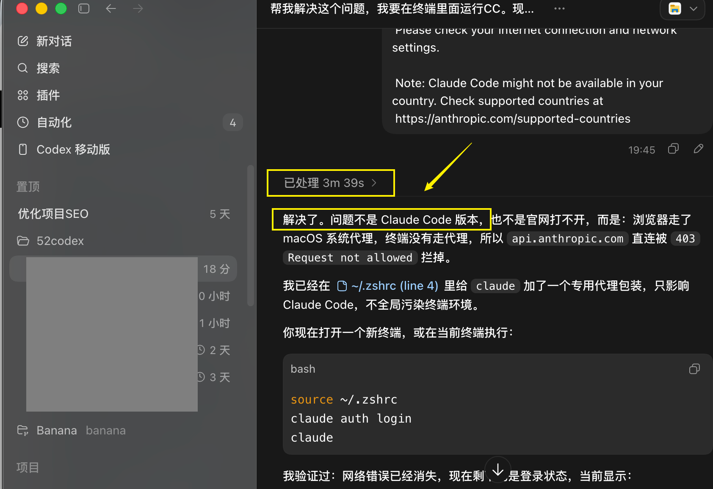
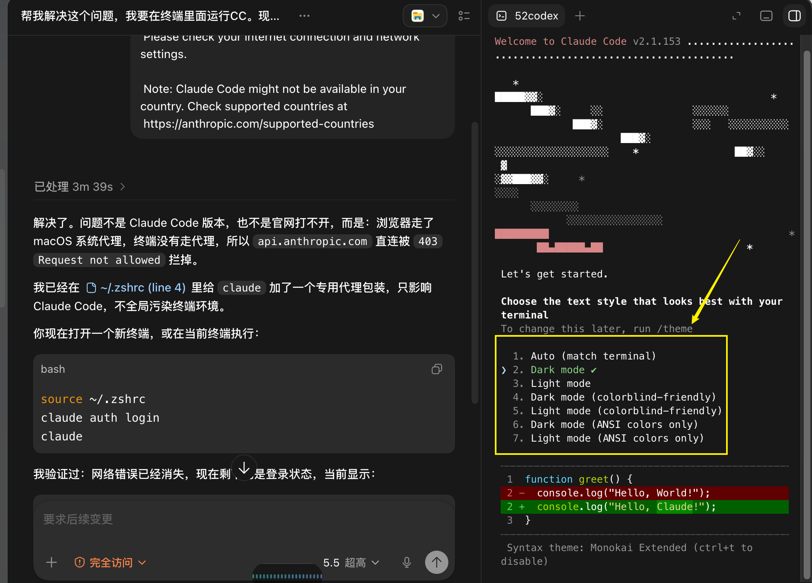

# 13 怎么在Codex里运行Claude Code

AI 编程工具越来越多。

以前写代码靠手搓，考验的是经验和耐心。现在很多人已经习惯把需求交给 AI，让 AI 帮自己写代码、改 bug、跑项目。

{#screenshot}

最近技术群经常讨论一个问题：

Claude Code 强，还是 Codex 更好用？

我的实际感受是：

- Codex 上手顺滑、额度相对充足、价格更友好，对普通人更友好
- Claude Code 能力上限高，处理复杂任务、杂任务、前端规划时表现很强

Codex 官网：

[https://openai.com/codex/](https://openai.com/codex/)

Claude Code 官网：

[https://claude.ai/code](https://claude.ai/code)

如果刚开始学 AI 编程，先用 Codex 入门会舒服很多。

Claude Code 也值得用，但门槛略高，可能遇到网络、账号或区域支持问题。

所以更实用的做法不是二选一，而是组合使用。

{#screenshot}

很多人的实际工作流是：

- Codex 为主
- Claude Code 为辅

比如：

- 用 Claude Code 做规划、拆需求、搭前端
- 用 Codex 具体编码、改 bug、跑项目、做落地

但两个工具来回切换很麻烦。

一会儿打开 Codex，一会儿打开 Claude Code，一会儿复制需求，一会儿同步上下文，时间都浪费在工具切换上。

更简单的办法是：

直接在 Codex 里运行 Claude Code。

这样你可以在一个工作环境里，同时用上 Codex 和 Claude Code。

## 准备工作

你需要先准备：

- 已安装 Codex 桌面 App
- 已有可使用 Claude Code 的 Claude 账号或 API 访问方式
- 电脑能打开终端
- Mac、Linux、WSL 或 Windows 环境

Claude Code 需要支持 Claude Code 的账号或团队环境。免费 Claude.ai 账号不一定包含 Claude Code 权限。

如果还没安装 Codex，可以先看：

- [Codex 下载安装](/guide/05-install)
- [Codex 界面全览](/guide/06-interface)

## 第 1 步：安装 Codex

先把 Codex 桌面 App 跑起来。

Codex 官方入口：

[https://openai.com/codex/get-started/](https://openai.com/codex/get-started/)

安装后，用 ChatGPT 账号登录，并选择一个项目文件夹。

这一步的核心不是写代码，而是确认 Codex 能正常打开项目和终端。

## 第 2 步：安装 Claude Code

Claude Code 常简称 CC。

截至 2026-06-07，Claude Code 官方文档推荐的原生安装方式如下。后续如有变化，以官方文档为准：

[https://docs.anthropic.com/en/docs/claude-code/getting-started](https://docs.anthropic.com/en/docs/claude-code/getting-started)

### Mac、Linux 或 WSL

打开终端，输入：

```bash
curl -fsSL https://claude.ai/install.sh | bash
```

安装完成后，重新打开终端，输入：

```bash
claude --version
```

能看到版本号，就说明安装成功。

{#screenshot}

### Windows PowerShell

打开 PowerShell，输入：

```powershell
irm https://claude.ai/install.ps1 | iex
```

安装完成后，重新打开终端，输入：

```powershell
claude --version
```

### Windows CMD

如果你用的是 CMD，输入：

```cmd
curl -fsSL https://claude.ai/install.cmd -o install.cmd && install.cmd && del install.cmd
```

也可以使用 WinGet：

```powershell
winget install Anthropic.ClaudeCode
```

Windows 原生运行 Claude Code 时，Git for Windows 是可选项。安装后，Claude Code 可以使用 Git Bash；不安装时，会用 PowerShell 作为 shell 工具。

Git for Windows 地址：

[https://git-scm.com/](https://git-scm.com/)

## 第 3 步：在 Codex 里打开 Claude Code

打开 Codex。

在侧边栏进入终端。

然后输入：

```bash
claude
```

{#screenshot}

正常情况下，Claude Code 会直接在 Codex 的终端里启动。

这时，你相当于把 Claude Code 接进了 Codex 的工作环境。

## 常见问题

### 网页能打开 Claude，终端却用不了 CC

有些人会遇到这个问题：

网页版 Claude 可以正常登录，但同一台电脑、同一个网络环境下，在终端或 Codex 里运行 Claude Code，却提示当前区域不支持。

{#screenshot}

如果账号或所在地本身不在 Claude Code 支持范围内，应以 Anthropic 官方规则为准。

如果网页能用，只有终端不能用，通常是终端环境没有正确继承网络配置。

可以让 Codex 帮你检查终端环境、网络配置和相关路径。

::: tip Prompt
帮我解决这个问题，我要在终端里面运行 Claude Code。现在网页能够打开 Claude 官网，但终端运行 `claude` 不通。请检查终端环境、网络配置、代理变量和相关路径，不要写死账号密码或密钥。
:::

操作时可以打开 Codex 的“完全访问”模式，让它检查本机终端环境。

我这边实测，大概几分钟后，Codex 提示已经处理完成。

{#screenshot}

然后重新运行：

```bash
claude
```

{#screenshot}

如果能进入 Claude Code，就说明已经配置好了。

### `claude --version` 能用，`claude` 启动失败怎么办？

先检查三件事：

- Claude 账号是否能正常登录
- 当前终端是否能访问 Claude Code 所需网络
- 是否在正确的终端里运行命令

如果是 Windows，还要确认自己用的是 PowerShell、CMD 还是 WSL。

不同终端对应的安装命令不一样。

### Windows 一定要装 Git for Windows 吗？

不一定。

官方文档说明，Windows 原生环境可以使用 PowerShell 或 CMD 运行 Claude Code。

但安装 Git for Windows 后，Claude Code 可以使用 Git Bash。对经常做项目的人来说，这会更顺手。

## 这套组合怎么用

建议分工很简单：

Claude Code 负责规划，Codex 负责干活。

比如你要做一个网站、小工具、后台系统或数据看板，可以这样做：

1. 先让 Claude Code 拆需求、定结构、设计页面、规划文件目录。
2. 再让 Codex 进入项目，按任务一步一步写代码、改 bug、跑起来。
3. 最后继续用 Codex 调试、优化、部署和整理文档。

Claude Code 的规划能力，加上 Codex 的执行体验，适合普通人把想法一步一步做成能运行的项目。

## 适合谁

这篇适合：

- 刚开始学 AI 编程的人
- 已经在用 Codex，但想试 Claude Code 的人
- 不想在两个工具之间反复复制上下文的人
- 想把规划和执行分开的人

如果你完全没用过 AI 编程，建议先从 Codex 入手。

原因很简单：

门槛低，上手快，普通人更容易跑通第一个项目。

等你有了一点基础，再试 Claude Code。

两个工具都值得用。

关键不是纠结哪个更强，而是把它们组合成自己的工作流。

未来的 AI 编程，不只是比谁会写代码，而是比谁更会调度 AI。

谁能把需求拆清楚，谁能让 AI 持续执行，谁就能更快把想法变成产品。

## 下一步推荐阅读

- [Codex 下载安装](/guide/05-install)
- [Codex 界面全览](/guide/06-interface)
- [Codex 如何接入第三方 API](/tips/03-codex-third-party-api)
- [Codex 的 /goal 怎么用](/tips/05-goals)

## 参考链接

- [OpenAI Codex](https://openai.com/codex/)
- [Codex Get Started](https://openai.com/codex/get-started/)
- [Claude Code Getting Started](https://docs.anthropic.com/en/docs/claude-code/getting-started)
