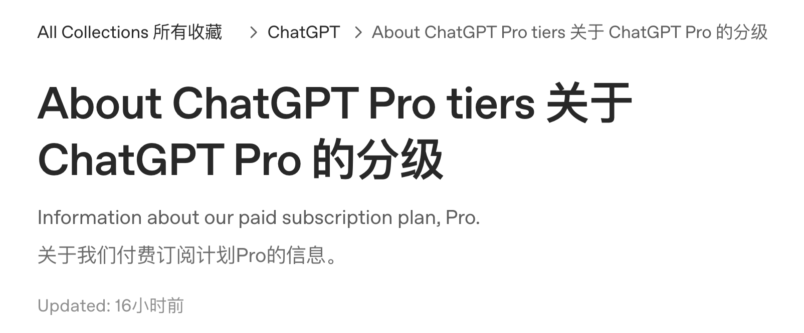
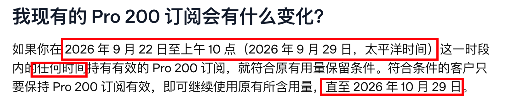
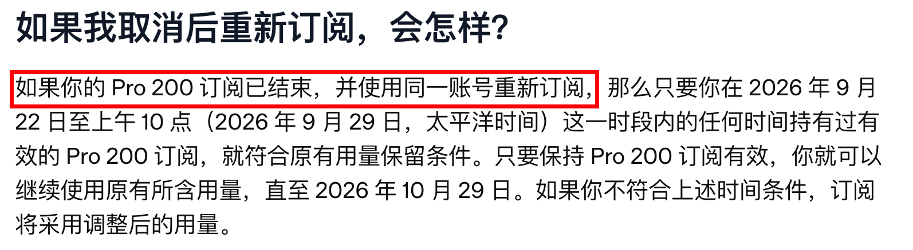

# 16 这些Pro用户还能享受20x Plus

符合条件的 Pro 200 老用户，可保留旧额度至 **2026 年 10 月 29 日**。

原文称这份 Codex 额度为 **20x Plus**。

不符合资格的新订阅，按 **10x Plus** 额度执行。

即使有 28 天更新活动和额度重置，部分深度用户仍觉得额度不够。

本文根据 [2026 年 10 月 8 日的原文](https://blog-er7.pages.dev/posts/20261008-oldgptpro/) 整理。

政策依据：[OpenAI 官方 Pro 套餐说明](https://help.openai.com/en/articles/9793128-about-chatgpt-pro-tiers)。

{#screenshot}

## Pro 套餐这次改了什么

ChatGPT Pro 包含专业模型、Codex、深度研究和图像创建。

也包含记忆和文件上传功能。

这次调整有两件事：

1. **Pro 200 重新开放新订阅**：月费仍是 200 美元。不符合老用户保留条件的新订阅，包含的额度更低。官方解释是模型效率提高后，调整了套餐用量。
2. **新增 Pro 500**：月费 500 美元，包含 Ultrafast（极速模式），支持 GPT-6 Astra Ultrafast 和 GPT-6.1 Sol Ultrafast。

## 三档 Pro 怎么比较

原文以 Plus 额度为基准，整理如下：

| 套餐 | 月费（美元） | Codex 额度 | Ultrafast |
| --- | --- | --- | --- |
| Pro 100 | 100 | 5x Plus | 不含 |
| Pro 200 | 200 | 新订阅 10x Plus；符合条件的老用户，旧额度 20x Plus 保留至 10 月 29 日 | 不含 |
| Pro 500 | 500 | 25x Plus | 包含 |

倍数按原文整理，实际额度以账号后台显示为准。

套餐功能可查看 [ChatGPT 官方定价页](https://chatgpt.com/pricing/)。

## 谁能保留 20x Plus

资格窗口是：

**2026 年 9 月 22 日至 9 月 29 日上午 10 点（太平洋时间）。**

这段时间内，任意时刻有过有效的 Pro 200 订阅，即符合资格。

不要求连续订阅；中途结束后用同一账号重订也符合条件。

保持 Pro 200 订阅有效，旧额度可用至 **2026 年 10 月 29 日**。

{#screenshot}

之后会转为较低的新额度，月费仍是 200 美元。

官方说明，只有受这次调整影响的用户会收到相关邮件。

## 保留旧额度，能用 Ultrafast 吗

**不能。** 套餐仍是 Pro 200，没有升级到 Pro 500。

保留旧额度不会附带 Ultrafast。

## 取消后重新订阅，还能保留吗

**可以，前提是同一账号符合上面的资格窗口。**

重新订阅后，只要 Pro 200 有效，仍可使用旧额度至 10 月 29 日。

不符合窗口条件的账号，重订后采用新额度。

排定取消不会立刻结束服务，可用至当前计费周期结束。

周期结束前，也可以撤销取消。

{#screenshot}

例如，10 月 6 日到期、10 月 10 日重订：

只要同一账号在资格窗口内有过有效订阅，仍符合保留条件。

订阅因系统或支付错误结束，可联系官方 Support 复核。

## Fast 和 Ultrafast 怎么消耗额度

相对同一模型的 Standard 模式：

- **Fast**：按 2.5 倍速率消耗套餐额度。
- **Ultrafast**：按 8 倍速率消耗套餐额度。

这里说的是额度消耗，不能理解成对应倍数的运行速度。

Ultrafast 消耗更快，选模式时要留意剩余额度。

## 不同用户怎么安排

- **符合资格的 Pro 200 老用户**：保持订阅有效，用旧额度至 10 月 29 日。之后若新额度不够，再评估 Pro 500。
- **新 Pro 200 用户**：按新额度规划用量，不要拿老帖子里的额度作对照。原文将此前的 20x 称为活动额度。
- **Pro 100 用户**：在 Pro 套餐中，要用 Ultrafast 需升级到 Pro 500；当前买 credits 不能解锁。
- **观望用户**：原文的判断是，更高额度正在向更贵的套餐集中。订阅前先核对当前套餐权益。

::: info 说明
资格窗口和保留政策以 OpenAI 官方帮助中心为依据，额度倍数按原文整理。具体用量以账号后台实际显示为准。
:::
